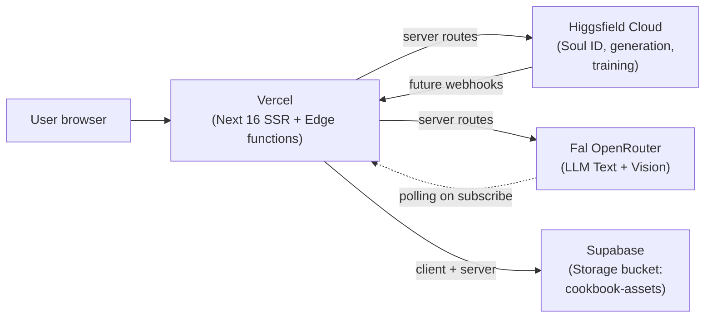

# Architectural decisions (ADRs)

Each entry: **context** (what's the situation), **options considered**, **decision**, **consequences** (what changes because of this).

Append-only. Don't edit past entries — supersede with a new entry if needed.

---

## ADR-0001 — Greenfield project, sibling to `prism/`

- **Date**: 2026-05-12
- **Context**: The previous `prism/` project accumulated complexity that conflicted with the simplicity the user wants. A pivot inside `prism/` would inherit too much baggage.
- **Options**: (a) rewrite inside `prism/`, (b) new folder sibling to `prism/`, (c) fork-and-strip.
- **Decision**: (b) — `cookbook/` lives at `/Users/morpheus/Documents/Apps/cookbook/`, new git repo, no shared deps with `prism/`.
- **Consequences**: Clean slate. Reuse from Prism is explicit copy-and-adapt only (see PRISM-REUSE-LOG.md). No accidental coupling.

## ADR-0002 — Single-vendor LLM routing via Fal OpenRouter

- **Date**: 2026-05-12
- **Context**: User has Fal and Higgsfield API keys and doesn't want to manage multiple LLM providers separately.
- **Options**: (a) Fal OpenRouter for everything, (b) Anthropic + OpenAI + Fal split by task type.
- **Decision**: (a). Text generation, vision, and assistant orchestration all go through Fal OpenRouter. Higgsfield is only for Soul ID training + Higgsfield image generation. Image/video model APIs go direct to Fal.
- **Consequences**: One auth, one billing surface, one rate-limit story. Trade-off: we are tied to whichever models Fal OpenRouter exposes. Acceptable for personal use.

## ADR-0003 — Schema-driven node engine with strict state separation

- **Date**: 2026-05-12
- **Context**: The `GUIA_NODES_PARA_OUTRO_DEV.md` brief surfaced thirteen patterns from a previous mature node-based tool. The most important: define nodes by schema (not class), separate persistent config from runtime results, standardize outputs.
- **Options**: (a) class-per-node OOP, (b) schema-driven `defineNode` registry.
- **Decision**: (b). Every node is `{ id, inputs, outputs, config, execute }`. Persistent state lives in `workflow-store` (Zustand) under `node.data.config`. Runtime results live in `execution-store` keyed by `(nodeId, runId)`. Outputs follow the universal `{ type, format, data, metadata }` shape so downstream consumption is generic.
- **Consequences**: Adding a new node = registering a schema + a pure execute function. The engine handles UI rendering, history, cache, run lifecycle. Significantly less boilerplate, way easier for the assistant to author nodes via DSL.

## ADR-0004 — Reactive vs Executable node distinction

- **Date**: 2026-05-12
- **Context**: Some nodes are instantaneous (text concat, array split) and should auto-update on input change. Others are costly (LLM, image gen) and must only run when explicitly requested. Mixing them naively causes accidental bills.
- **Options**: (a) all nodes manual-run, (b) all nodes auto-run, (c) per-node category flag.
- **Decision**: (c). Each node declares `runtime: "reactive" | "executable"`. The engine re-runs reactive nodes automatically on upstream change; executable nodes only run on explicit request (user click, assistant tool call, or scheduled retry).
- **Consequences**: Predictable cost. The run engine intelligently re-runs only necessary reactive nodes between the target executable node and its upstream changes.

## ADR-0005 — Local-first, cloud-ready architecture

- **Date**: 2026-05-12
- **Context**: User wants to start local but eventually move to Supabase + Vercel + GitHub auth.
- **Options**: (a) local-only now, refactor later; (b) cloud from day one; (c) local-first with abstractions that map cleanly to cloud.
- **Decision**: (c). Use a `Repository` interface for all persistence. The local implementation uses SQLite (Drizzle) + filesystem for blobs. The cloud implementation will use Supabase Postgres + Supabase Storage. Implementation swap, not architecture change.
- **Consequences**: Slightly more abstraction up-front, but no painful rewrite later. Same applies to auth (interface today, GitHub OAuth in cloud).

## ADR-0006 — Event-driven engine with topological execution

- **Date**: 2026-05-12
- **Context**: Node DAGs need ordered execution with parallelism within layers.
- **Decision**: Topological sort produces layers; each layer runs in parallel up to `maxConcurrent` (default 3, configurable per node type for API-rate-limit-sensitive ones). Scheduler dispatches `window.CustomEvent("run-node")`; each node listens via `useEffect`. Scheduler subscribes to execution store for instant reaction to status changes (no polling).
- **Consequences**: Fast, predictable, no busy-waiting. Cycle detection prevents infinite loops.

## ADR-0007 — Hash-based caching with per-node seed strategy

- **Date**: 2026-05-12
- **Context**: Re-running expensive nodes with unchanged inputs wastes money.
- **Decision**: Cache key = `hash(nodeId + serializedConfig + sortedUpstreamOutputHashes + seedStrategy + lockedSeedValue)`. Each node has a `seed: "locked" | "random" | "inherited"` config. "locked" with same inputs → cache hit. "random" always misses. "inherited" follows the recipe-level seed.
- **Consequences**: Deterministic re-runs are free. Variation requires explicit `random` seed. User has control.

## ADR-0008 — Output pinning to protect curated results

- **Date**: 2026-05-12
- **Context**: User generates 8 variations, picks the best 2, then re-runs the recipe with different upstream and accidentally loses the picks.
- **Decision**: Any node output can be **pinned**. Pinned outputs are immutable until unpinned — the engine treats them as cache hits regardless of cache-key changes.
- **Consequences**: User-curated results are safe by default. Unpinning is a deliberate action.

## ADR-0009 — Approval gate toggle per session

- **Date**: 2026-05-12
- **Context**: User wants the assistant to ask before running expensive ops, *sometimes*. Other times they want flow.
- **Decision**: A top-bar toggle (Approval ON / OFF) controls whether the assistant pauses for confirmation before runs. When ON (default), every run that exceeds a threshold ($0.10) or has ambiguous intent triggers a cost preview + confirm modal. When OFF, the assistant runs freely (still showing cost in the queue).
- **Consequences**: User controls the friction level. Default is safe.

## ADR-0010 — `cursor-ide-browser` MCP for in-loop visual smoke testing

- **Date**: 2026-05-12
- **Context**: The user is also the QA; we must keep them in the loop without burning their attention on every change.
- **Decision**: After significant UI changes the agent uses the `cursor-ide-browser` MCP to navigate to `localhost:3000`, take a screenshot, check console for errors, and attach the screenshot to the next message for user confirmation. The user does final manual QA only on the natural "deliverable" boundary (e.g. after a milestone).
- **Consequences**: Faster iteration, fewer "looks wrong" round-trips.

## ADR-0011 — Two fixed panels + smart overlays (supersedes Day 1 three-panel layout)

- **Date**: 2026-05-19
- **Context**: Day 1 shipped a 3-panel layout (Library/Recipes left tabs, Properties/Chat right tabs, Queue/Logs bottom drawer). On reflection, three things were wrong:
  - **Recipes** is a start-of-session choice, not a mid-flow tool — doesn't earn a tab.
  - **Chat** is the primary interaction (the assistant is how the user does everything) — hiding it behind a tab made it feel secondary.
  - **Queue+Logs bottom drawer** stole 240px of canvas height (node graphs need verticality) and queue items are visual thumbnails that look bad in a wide-short layout.
- **Options**: (a) keep 3-panel and tune; (b) 2-panel + contextual overlays for the rest; (c) 0-panel, everything contextual/floating.
- **Decision**: (b). Only **Library** (left, 280px) and **Properties** (right, 320px) earn persistent slots — both are used constantly during a flow. Everything else lives where it makes contextual sense:
  - **Chat** → slide-up sheet anchored above the prompt bar (Cmd+J). Prompt bar becomes its footer.
  - **Queue** → pill in the top bar; click opens a sheet anchored top-right of the canvas.
  - **Recipes** → welcome state on empty canvas (3 cards) + Cmd+K command palette + project switcher dropdown ("New from recipe…").
  - **Logs** → Cmd+Shift+L overlay from the right edge; pure dev tool.
  - **Command palette** → Cmd+K global modal; first-class entry for actions/search.
- **Consequences**:
  - Canvas reclaims full vertical space (no more bottom drawer).
  - Chat feels primary (lives next to where you type).
  - Cleaner default view; advanced surfaces are one shortcut away.
  - Adds 4 new components (chat-sheet, queue-indicator, queue-sheet, command-palette, logs-panel) but each is small.
  - WelcomeState uses container queries (`@container/welcome`) so it adapts to canvas width regardless of which panels are open — robust to any configuration.
  - Layout store bumped to v2 with migration that preserves user preferences.
- **Trade-offs accepted**: Slightly more chrome states to learn (5 shortcuts vs 3), but each is discoverable via tooltip + welcome state copy + command palette.

## ADR-0012 — Floating panels with breathing room (supersedes ADR-0011 panel chrome)

- **Date**: 2026-05-19
- **Context**: Walking through ADR-0011 with the user, three problems surfaced:
  - The Properties panel is empty 99% of the time (nothing selected) and a permanently empty panel feels like wasted real estate.
  - Edge-to-edge panels feel like banner chrome wrapping the canvas; the user wants the canvas to feel like the hero of the workspace, with surfaces floating *on top of it* instead of carving it up.
  - The top-bar Queue pill + Queue sheet split forced the user to click to see what's running; the user wants the queue persistently visible (it's where the work *is*).
- **Options**: (a) fix tabs/empty states inside the same 2-panel layout, (b) collapse Properties into a node-anchored popover and convert remaining panels to floating cards with breathing room, (c) move everything into a single right rail with stacked sections.
- **Decision**: (b). New chrome rules:
  - **Properties → gone as a panel**. In M0a it returns as a small floating popover anchored to the selected node (or its handle) — only shown when something is selected, never empty.
  - **Library** and **Queue** become floating panels with 12px breathing margin from every edge they touch, rounded corners, soft shadow, backdrop blur. Both can collapse to a small circular pill in their corner.
  - **Queue is always visible by default** (the work deserves real estate), no top-bar pill required.
  - **Top bar** becomes minimal: logo + chevron (project menu DropdownMenu) on the left · clickable editable title in the center (Notion-style inline edit, lives in `project-store`) · Reset + Approval + Run cluster on the right.
  - **Theme toggle** migrates to a small bottom-right canvas-controls cluster, alongside a Gallery button (Cmd+G, opens a bottom-drawer overlay).
  - **AddNodeButton** is a floating pill bottom-left (with a categorized + searchable popover). The same catalog is reachable via canvas right-click context menu (Day 1 stub menu; M0a positions the full picker at click coords) and via Cmd+N.
  - **Gallery** is a bottom-drawer overlay (~65vh) with a dimmed backdrop — designed to "celebrate the work" with rich thumbnails, hover-to-play, multi-select, density slider. Day 1 ships the skeleton; M0a wires content.
- **Consequences**:
  - Canvas reclaims full bleed; panels feel layered like a designer's deck rather than a code editor's chrome.
  - Properties never feels empty (it only exists when relevant).
  - Adds: `library-panel`, `queue-panel`, `add-node-button`, `canvas-controls`, `gallery-drawer`, `canvas-context-menu`, `editable-title`, `project-menu`, plus `project-store`. Removes: `left-panel`, `right-panel`, `queue-indicator`, `queue-sheet`.
  - Layout store bumped to v3 with migration: previous `leftPanelOpen` → `libraryOpen`; queue/properties states reset to defaults.
  - Keyboard shortcuts: ⌘1 Library · ⌘2 Queue · ⌘G Gallery · ⌘J Chat · ⌘K Palette · ⌘. Add node (⌘N is system-reserved) · ⌘⇧L Logs · Esc closes overlays.
- **Trade-offs accepted**:
  - Floating panels overlap canvas content on very narrow viewports (<1024px); the prompt bar respects panel widths via CSS padding, but the welcome content does not yet. Acceptable for Day 1 — M0a's React Flow canvas pans freely so overlap stops mattering.
  - Right-click context menu is a simple in-place menu in Day 1 (no positional node picker). M0a upgrades it to a coordinate-anchored picker.

## ADR-0018b — Cloud-canonical asset storage (Supabase) supersedes the IDB blob detour

- **Date**: 2026-05-19 (M0a Slice 2.2; supersedes 0018a's storage choice)
- **Context**: 0018a put uploaded bytes in IndexedDB and minted session-local `blob:` URLs for previews. That works for the UI but breaks the *actual goal* — Fal/Higgsfield/etc. can't fetch a `blob:` from your browser session. User flagged it immediately ("how we did in prism? to be able to generate some images where I added something from the computer as input reference") and we agreed to swap before the dust settled.
- **Decision**:
  1. `**ImageAssetSource` becomes `remote | url`**, no `blob`. `remote` carries `{ bucket, key, url, mime, sizeBytes }`. The `url` is a Supabase Storage public URL — fetchable from anywhere on the public internet, ready for any inference API to pull.
  2. **Bytes live in Supabase Storage**, bucket `cookbook-assets`, public, MIME-allowlisted to `image/*`, 30 MB server-side cap (client checks 25 MB for headroom). Provisioned via the `cookbook_assets_bucket` migration; permissive RLS policies (`anon` can SELECT/INSERT/DELETE inside this bucket) are the explicit MVP shortcut and will be tightened once GitHub auth lands.
  3. `**asset.id` is no longer the storage key.** Keys are `images/<8-hex>/<safe-filename>` — random prefix gives collision resistance with zero coordination, filename tail keeps the dashboard browseable. `asset.source.key` carries the storage key so `removeAsset` can delete it.
  4. **Upload is atomic**: `createImageAssetFromFile` calls `uploadImageAsset` first; only commits a metadata record if Supabase returns a URL. A failed network mid-batch leaves the store unchanged for that file (the import pipeline surfaces a toast and keeps going for the rest).
  5. **No client-side cache**. The Supabase CDN + the browser's HTTP cache do the heavy lifting. After the first paint a URL is effectively instant. Saves us from a write-through cache that would just complicate cleanup.
  6. `**useImageAssetUrl` is gone** and `AssetCard` / Image node body read `source.url` directly. Async hook only made sense for the IDB indirection; with cloud URLs everything is sync.
  7. **Migration v2 → v3 drops `blob`-source rows** since their bytes were never anywhere but local IDB (which we no longer write). Re-uploading is the only honest recovery; warning the user is the responsibility of whatever consumer reads the asset list (today: nothing — the list just stops including those rows).
- **Why supersede instead of layer**: The IDB-then-upload-on-execute design (write-through cache, lazy lift) would have given us a brief offline window for previews — at the cost of two storage backends, dual cleanup, and a "the URL the API sees is different from what the preview saw" footgun. Cloud-canonical from the start eliminates the entire class of bugs and matches what we'd want for cloud sync anyway.
- **Why not Fal's own `fal.storage.upload`**: zero infra but Fal-only — Higgsfield (and any future API) would need a parallel pipeline. Supabase gives us one URL that works everywhere.
- **What we kept from Slice 2.1**: the `source` discriminator (small change to swap variants), the import pipeline (file picker + drop zone + MIME/size policy), the upload-first popover UI, the per-file batched error toasts. The bones of the Library survived; only the bytes-storage backend swapped.

## ADR-0018a — Image source split (`blob` vs `url`) + IndexedDB for bytes

- **Date**: 2026-05-19 (M0a Slice 2.1; supersedes the storage half of 0018)
- **Context**: Slice 2 shipped with URL paste as the only image-import path. User correction: "the way to add images wouldn't be to paste a URL, it would be uploading from the computer." 99% of real flows are local files (own photoshoot, references, products). URL paste survives as an escape hatch for the rare known-public-URL case.
- **Decision**:
  1. `**ImageAssetSource` discriminator** lives on the asset:
    - `{ type: "blob"; mime: string; sizeBytes: number }` — bytes in IndexedDB.
    - `{ type: "url"; url: string }` — bytes behind a remote URL, no local storage.
     A future `{ type: "remote"; key }` (Supabase Storage signed URL) slots in alongside without touching the rest of the system.
  2. **Bytes live in IndexedDB**, not localStorage. The 5–10 MB localStorage cap a single phone photo blows trivially. `src/lib/library/asset-blobs.ts` is the wrapper (`putBlob` / `getBlob` / `removeBlob` / `getBlobUrl` / `revokeBlobUrl`). Metadata still goes through `localStorage` via Zustand `persist`.
  3. **On-disk shape is `{ type, bytes: Uint8Array }`**, not a raw `Blob`. Blob serialization across structured-clone boundaries is environment-dependent (notably: happy-dom + fake-indexeddb drops the bytes leaving `{ type }` only, and some older Firefox versions had quirks). Storing a `Uint8Array` round-trips cleanly everywhere. Cost: one extra `arrayBuffer()` copy per write/read — acceptable for the volumes we deal with.
  4. **Blob keys ARE asset ids** (1:1). Lets the Slice 5 Drizzle/SQLite swap stay a single FK relationship; no separate `blobId` field on the asset.
  5. **URLs are session-local**: `getBlobUrl(assetId)` mints + caches a `blob:` URL per asset. They're not persisted anywhere because they're invalidated on reload. Consumers go through `useImageAssetUrl(assetId)` which renders sync for `url`-source and async for `blob`-source.
  6. **Atomic asset creation**: `createImageAssetFromFile` writes the blob to IDB *before* committing the metadata. If IDB throws, the asset record is never created → no dangling references.
  7. **Image node semantics for the new world**:
    - Linked + url-source: `config.url` is denormalized at drag time and kept as a standalone fallback. Unlinking keeps it.
    - Linked + blob-source: `config.url = ""` at drag time (no stable URL exists outside the session). Unlinking blanks it too — keeping a dead `blob:…` would mislead.
    - `execute()` always re-resolves via the asset store when linked, regardless of source.
- **Why not `OPFS` / `Filesystem Access API`**: OPFS is fine but adds a second persistence model (in addition to IDB metadata pattern); Filesystem Access requires explicit user grant and breaks the "local-first MVP, frictionless" feel. IDB is the path of least resistance and the same API surface we'd need anyway for a future offline cache.
- **Why not `idb` wrapper**: 5 KB but adds a dependency for ~50 lines of trivial wrapping. Native IDB is fine here.
- **Why the 25 MB per-file cap**: arbitrary but defensible — keeps writes fast, prevents a runaway photo from blowing the per-origin quota, easy to relax once we add image-resize on import (later slice).

## ADR-0018 — Asset model: discriminated union + scope + asset↔node spawn map

- **Date**: 2026-05-19 (M0a Slice 2)
- **Context**: We need a Library that holds reusable content (images today; image groups, Soul IDs, moodboards, products, videos, 3D objects later). Hard constraints from the briefing: an asset that's "global" should be available in every project, an asset that's "project" should not leak; duplicating a project should *not* duplicate the underlying blobs; dragging an asset onto the canvas must spawn the right node already pre-populated; library edits should propagate to nodes that reference the asset.
- **Decision**:
  1. **Type system** (`src/types/asset.ts`): `Asset` is a discriminated union over `kind`. Every variant extends `AssetCommon` (`id`, `name`, `tags`, `scope`, `createdAt`, `updatedAt`) and adds its own payload (e.g. `ImageAsset` adds `url`, `width?`, `height?`). New asset kinds extend the union — no other change required.
  2. **Scope** lives on the asset itself, not in storage location: `AssetScope = "global" | "project"`. Project duplication clones references (ids), never blobs.
  3. **Store** (`src/lib/stores/asset-store.ts`): one Zustand store, persisted to localStorage in M0a (SQLite/Drizzle takes over in Slice 5 via the Repository abstraction). API surface: `createImageAsset / removeAsset / updateAsset / getAsset / listByScope / listByKind / clear`. Versioned with a pass-through migrate so the store can be schema-evolved safely.
  4. **Drag contract** (`src/lib/library/asset-drag.ts`): custom MIME `application/x-cookbook-asset` with a typed payload `{ assetId, kind }`. The MIME means foreign drags (OS files, other apps' URLs) are simply ignored by the canvas, which falls back to default browser behaviour.
  5. **Spawn map** (`src/lib/library/asset-to-node.ts`): `assetToNode(asset) → { kind, initialConfig }` is the only place that couples asset kinds to node kinds. Adding a new asset kind = adding one entry here + one type variant in #1. The canvas drop handler in `canvas-flow.tsx` never grows a switch.
  6. **Node linking**: Image node gains optional `config.assetId`. When set, the body shows the linked asset's name + Unlink chip and the execute() function reads the asset's url (so library edits propagate). When unlinked, the node keeps its last url and behaves as a free-URL node.
- **Why a custom MIME**: lets the canvas accept Library drags only. We don't want a stray PNG from Finder spawning random nodes. Foreign drags fall through to the browser default (which usually does nothing on the canvas surface).
- **Why both `url` and `assetId` on Image config**: the url is the *execute-time contract* (always works, even if the linked asset was deleted). The assetId is the *editorial link* (lets us follow renames / url changes in the library, and lets us show a Linked-asset chip in the UI). Either alone is wrong: only assetId → broken on asset delete; only url → loses connection to the source of truth.
- **Trade-offs**:
  - Discriminated union means every new kind touches both `types/asset.ts` and `asset-to-node.ts`. We accept that as the entire "asset kind" contract being in two small files — better than a registry indirection at this size.
  - Storing asset URLs in node config duplicates a string. Cheap, simplifies execute().
  - Library is project-flat in Slice 2 (no folders, no multi-select, no compare view). Those land when there's enough volume to need them.

## ADR-0017 — Canvas is always live; welcome is a non-blocking overlay

- **Date**: 2026-05-19
- **Context**: The original Slice 1 implementation only mounted React Flow when the workflow had at least one node. When empty we showed a hero ("What do you want to make?") on top of a hand-rolled CSS dotted background. The first time a node was created, React Flow mounted and *all* its chrome (Controls, MiniMap, pan/zoom, real Background dots) appeared at once. User feedback: "shouldn't the canvas already be pannable and not have those elements pop in?"
- **Decision**: Always mount `CanvasFlow`. The canvas is interactive from the first paint regardless of node count. The welcome experience moves into a `WelcomeOverlay` that floats above the live React Flow canvas, with `pointer-events: none` on its outer container so panning and zooming the canvas under it still works. Only its actual CTAs (e.g. the Blank canvas button) opt back into pointer events.
- **Consequences / details**:
  - The dotted background is owned by React Flow's `<Background variant="Dots">` in all states. The CSS-radial-gradient placeholder is gone — same look, single source of truth.
  - MiniMap is conditionally rendered (`nodes.length > 0 && <MiniMap />`) so empty canvas doesn't show a blank dark rectangle bottom-right. Controls stay always visible — zoom in/out/fit/theme are useful even when empty (and the user just *being able to click them* signals "this thing is alive").
  - Fit-view on an empty canvas is a no-op visually. We accept that — it's not worth a custom disabled state for one button on one transient state.
  - Welcome content is conditionally rendered rather than animated out. If we want fade-out polish later, that's a wrapper around `<WelcomeOverlay />` and not a structural change.
  - The pattern generalises: any future "first-time" or "empty-state" UI for the canvas should be a non-blocking overlay on top of the live React Flow, not a replacement for it.

## ADR-0016 — Four-corner canvas chrome (Slice 1 polish v2)

- **Date**: 2026-05-19
- **Context**: ADR-0015 left two cosmetic problems: the lifted Controls had an ugly empty gap below them on wide viewports, and the bottom-right `CanvasControls` cluster (Gallery + Theme toggle) felt like a leftover pile when we could use the four corners more deliberately. The user proposed: MiniMap → bottom-right; Gallery → top-right with Add Node; Theme → drop it, or integrate it with the zoom buttons.
- **Decision**: Adopt the proposal as the canonical four-corner layout:
  - **top-left**: ProjectMenu (logo pill).
  - **top-center**: EditableTitle.
  - **top-right**: GalleryButton + AddNodeButton paired (`gap-1.5`).
  - **bottom-left**: React Flow Controls — zoom in / out / fit + theme toggle as a 4th `<ControlButton>` child. Same dark pill styling for all four.
  - **bottom-right**: React Flow MiniMap (`lg:` and up, 180×120, compact).
  - PromptBar stays bottom-center.
- `**CanvasControls.tsx` + `ThemeToggle.tsx` deleted**. Gallery is extracted into `gallery-button.tsx`. Theme lives in `canvas-flow.tsx` as `ThemeControlButton` (an inline `<ControlButton>` reading `useTheme()`).
- **Responsive controls position**: at lg+ the Controls sit at `bottom: 0.75rem` (no gap); at `<lg` a media query in `globals.css` lifts them to `bottom: 5.25rem` so the wide prompt bar form doesn't visually cover the lower buttons via its backdrop-blur. The user's primary viewport (≥lg) gets the corner placement they asked for; the small-viewport bump up only kicks in where it's actually necessary.
- **Trade-offs**:
  - Two stacked pills at top-right (Gallery + AddNode) take a bit more horizontal space than a single one. Acceptable — the corner has the room and it reads as a "tools" cluster.
  - Theme toggle living inside Controls means it doesn't theme its own styling (it stays dark to match the rest of the cluster). In dark mode the cluster blends with the chrome; in light mode it's a deliberate dark island. The user has confirmed dark is the primary theme; revisit if we ever go light-first.
  - MiniMap hidden at `<lg` — small viewports get no minimap. Acceptable since scroll-zoom + pan still work and we don't want it fighting the prompt bar.

## ADR-0015 — Canvas feel: kill global transform transitions for React Flow

- **Date**: 2026-05-19
- **Context**: Right after Slice 1 shipped, the user reported that "moving the canvas, the nodes, and zooming feels sluggish / with friction" and that the zoom toolbar "is white and out of place." The two are linked: the same global stylesheet that polishes button hovers was also dragging React Flow's pan/zoom/drag.
- **Root cause**:
  - `globals.css` had `*, *::before, *::after { transition-property: ... transform; transition-duration: 150ms; }`. React Flow translates the viewport on pan and each node on drag via `transform`. With that selector, every frame React Flow set a new `transform`, the browser animated it over 150ms instead of applying it instantly. Result: input lag.
  - The default Controls stylesheet uses light backgrounds (`--xy-controls-button-background-color-default: #fefefe`) which look pasted-on against Cookbook's dark canvas.
- **Options considered**:
  - (a) Drop `transform` from the global transition-property — fine for React Flow, but kills nice hover-scale/transform animations elsewhere if we ever add them.
  - (b) Override transition with `!important` on the React Flow element classes — narrow, scoped to React Flow, no global change.
  - (c) Move React Flow into its own subtree with a `:not(.react-flow *) { transition: ...; }` selector — works but specificity gets ugly.
- **Decision**: (b). One block in `globals.css` opts the React Flow internals out of every transition:
  ```css
  .react-flow__viewport,
  .react-flow__node,
  .react-flow__edge,
  .react-flow__edge-path,
  .react-flow__connection-path,
  .react-flow__handle,
  .react-flow__nodesselection,
  .react-flow__minimap-node {
    transition: none !important;
  }
  ```
  Our `BaseNode` card chrome (hover/select transitions) is a child of `.react-flow__node`, not the node wrapper itself, so it keeps the global hover transitions.
- **Controls theming**: instead of overriding every descendant rule, scope React Flow's own `--xy-controls-button-`* CSS vars on `.react-flow`. RF's stylesheet already reads these for backgrounds, hovers, borders, shadows — repainting via the var hook is much less brittle than overriding `.react-flow__controls-button` selectors (which is what an earlier attempt did and, due to specificity + `overflow: hidden`, accidentally collapsed the three buttons into one visible row).
- **Positioning**: Controls move to `bottom: 5rem` (above the prompt bar) and AddNode moves to top-right (`right-3 top-3`) per user direction. Top-left has the ProjectMenu logo, top-right now has AddNode — symmetric. Queue panel below it is vertically centered so they don't collide; the popover (z-50) renders over the queue when both are open.
- **Consequences**:
  - Touches only `globals.css`, `canvas-flow.tsx`, `shell.tsx`, `canvas-area.tsx` (welcome hint arrow direction).
  - No JS perf changes needed.
  - Future React Flow upgrades: if RF renames the var names or adds new transform-using classnames, we revisit these two blocks.
- **Trade-offs accepted**:
  - The Add Node popover may overlap the Queue panel when both are open at the same time. Z-order makes it functional; if it becomes a friction point, M0b can swap the trigger for an icon-only pill or coordinate-anchor the popover.

## ADR-0014 — Schema-driven node engine (M0a Slice 1)

- **Date**: 2026-05-19
- **Context**: M0a needs a node engine that can grow into many node types (Text, Image, Iterators, Vision, Generation, Video, Compose, Export) without each node having to reinvent its scaffolding (handles, persistence shape, registration, popover entry, eventually run/cache).
- **Options**:
  - (a) **Class-based hierarchy** — abstract `BaseNode` class, concrete subclasses. Lots of boilerplate, hard to keep types tight with React Flow.
  - (b) **Schema-driven** — `defineNode({ kind, inputs, outputs, defaultConfig, execute, Body })` returns a plain schema object, registered into a central `NodeRegistry`. Each node is one file: schema + Body component co-located.
  - (c) **Pure React Flow custom nodes** — skip the abstraction layer, write each node directly as a React Flow node type. Fastest in the short term, but every node re-implements handles + persistence + add-node-popover entry.
- **Decision**: (b). The schema is the only thing the rest of the system needs to know about a node: the registry drives the AddNode popover, the workflow store uses `defaultConfig` when adding, the canvas-flow bridge renders the Body via the schema's `Body`, and (later) the run engine reads `inputs`/`outputs`/`execute` to schedule and cache.
- **Notes / consequences**:
  - **TypeScript variance**: `NodeSchema<TConfig>` uses TConfig in both contravariant (execute, Body) and covariant (defaultConfig) positions, making the generic invariant. The fix is a single generic on `nodeRegistry.register<TConfig>(schema)` that erases at the storage boundary — callers keep their typed schemas, the registry stores `NodeSchema` (TConfig = unknown). `all-nodes.ts` calls `register(...)` per schema (no shared array) so each call uses its own generic.
  - **Reactive vs executable**: schemas can mark themselves `reactive: true` when their output is a pure function of `config` (Text, Image, Number). The run engine in Slice 3 will treat reactive nodes as always-fresh sources without needing an explicit "Run".
  - **React Flow bridge**: one generic React Flow node type (`"cookbook"`) routes to the schema's Body based on `data.kind`. This avoids the maintenance cost of keeping `nodeTypes` in sync as new nodes are added.
  - **Workflow store** persists `{ nodes, edges }` to `localStorage` under `cookbook.workflow` with `skipHydration: true` (same SSR-safe pattern as the layout + project stores). Repository abstraction (Slice 5) will replace `localStorage` with SQLite without touching the store interface.

## ADR-0013 — No top bar; every chrome element floats (supersedes the top-bar portion of ADR-0012)

- **Date**: 2026-05-19
- **Context**: After ADR-0012 shipped, the user said:
  - The top bar still feels like banner chrome. The canvas should breathe edge-to-edge.
  - The Reset / Approval / Run cluster in the top-right confused them — they didn't know what these icons meant.
  - Side panels stretching from below the top bar to the bottom feel heavy; could be smaller and vertically centered.
  - The chevron-arrow close affordance reads as "expand", not "close" — a literal × would be clearer.
  - The dot next to the Queue icon is redundant if the icon already conveys state.
  - Collapsed panel pills should sit at the same vertical eye-line as the open panel they replace.
- **Options**: (a) keep top bar, just hide unfamiliar icons; (b) collapse top bar into a floating logo cluster with a richer menu; (c) move all canvas-level meta to the bottom controls cluster.
- **Decision**: (b). The TopBar component is deleted. Replacement chrome:
  - **Top-left floating ProjectMenu** — bigger circular logo (32px) inside a pill with chevron. The DropdownMenu now holds Project actions, Workflow toggles (**Approval gate as a Checkbox item**, Reset workflow as a stub), Workspace shortcuts (Command palette, Show logs, Settings), and About.
  - **Top-center floating EditableTitle** — pill with backdrop, click-to-edit. Lives in `project-store`.
  - **No Run / Reset / Approval on the top right**. Run reappears in M0a when there's actually something to run. Approval and Reset live inside the project menu.
  - **Library + Queue floating panels** — vertically centered (`top-1/2 -translate-y-1/2`), capped at `min(70vh, 640px)`, lighter border (`border-border/70`), close affordance is now a literal × icon.
  - **Collapsed pill** for each panel uses the same `top-1/2 -translate-y-1/2` so it sits where the open panel center was — no jump.
  - **Queue header dot indicator removed**. The Activity icon itself colors amber when active and muted when idle.
- **Consequences**:
  - Removes `top-bar.tsx`.
  - `shell.tsx` becomes a single `relative h-screen w-screen overflow-hidden` div with the canvas absolute-positioned and every other piece overlaid.
  - Visual language unifies around: pills + rounded-2xl cards · `border-border/70` · `bg-popover/95` · `backdrop-blur-md` · soft shadow.
  - User mental model is simpler: "everything is a floating thing on the canvas; the canvas is the work."
- **Trade-offs accepted**:
  - On very wide viewports the title pill sits visually high (compared to a top bar). Acceptable.
  - The Run button isn't visible on Day 1 — that's intentional (nothing to run yet). M0a restores it where it makes sense.

## ADR-0019 — Run engine: topological + serial + hash-keyed output cache (M0a Slice 3.1)

- **Date**: 2026-05-19
- **Context**: M0a Slice 3 introduces the first executable node (LLMText). Before we can wire it to a real API in 3.2, we need a runtime that turns the static graph in `workflow-store` into actual `execute()` calls in the right order, threading outputs through edges, with predictable behaviour around re-runs (so the user doesn't pay twice for the same prompt) and cancellation (so a misclick mid-run is recoverable). The slice must remain a "no spend" milestone — every API call in 3.1 is stubbed.
- **Options**:
  - (a) **Parallel scheduler with a worker pool**. Maximum throughput, but the only nodes that benefit from parallelism are siblings under a fan-out, which we don't even have in M0a. Adds complexity (back-pressure, partial-failure semantics, ordering of progress callbacks) we can't justify yet.
  - (b) **React-like reactive evaluator**. Every reactive node auto-updates on upstream change; executables run on demand. Elegant, but conflates "the graph state changed" with "the user asked for a run" — easy to invoke expensive nodes by accident when the user just adjusts a slider upstream.
  - (c) **Strict-topological, serial, run-on-demand**. One pass per Run click. Cache keyed by `hash({ kind, config, sortedUpstreamHashes })` so re-runs of unchanged subgraphs are instant. Stops on first error; downstream becomes `cancelled`.
- **Decision**: (c).
- **Why**:
  - Mirrors how every well-behaved node graph (Houdini, Blender, ComfyUI, GH) actually evaluates. The cost discipline ADR-0004 mandates (reactive vs executable) is preserved by tagging each schema with `reactive`; the engine uses the same uniform `execute()` call for both, and the *cost preview* + *approval gate* (Slice 3.3) decide when to actually run executable nodes.
  - The hash cache is the smallest useful primitive that makes editing upstream nodes cheap. As long as the hash recipe stays stable across the codebase (FNV-1a over `stableStringify` — see `src/lib/engine/hash.ts`), the cache key is reproducible and we can later persist it (Slice 5 + SQLite).
  - Serial keeps progress callbacks linear and the UI mental model trivial: one chip moves through `pending → running → done` at a time. Slice 3.x can re-introduce parallel execution surgically if (when) it becomes a bottleneck.
  - Cancellation via a single `AbortController` per run lets the same plumbing serve both the user's Cancel click and Slice 3.2's network aborts.
- **Hash recipe** (kept literal here because changing it silently busts every cached output):
  ```
  nodeHash = fnv1a_64(stableStringify({
    kind:   node.kind,
    config: node.config,
    deps:   [ { handle, sourceHash } sorted by (handle, sourceHash) ]
  }))
  ```
  `stableStringify` sorts object keys recursively. Array order is preserved (semantically significant). Within a single handle, upstream hashes are sorted so multi-input handles (iterators, future fan-ins) hash deterministically regardless of edge-draw order. *Across* handles, deps are sorted by `(handle, sourceHash)` so swapping which input a value feeds (e.g. moving an edge from `system` to `user`) busts the cache.
- **Status model**: `idle | pending | running | done | cached | error | cancelled`. `cached` is distinct from `done` so the UI can communicate "this was free" (relevant once 3.3 ships the cost preview) and so the cost calculator can exclude it from totals.
- **Failure model**: a single thrown `execute()` stops the run; everything still `pending` flips to `cancelled` (not `error`) so the user can tell what failed vs what simply didn't run. The store also exposes `failedNodeId` so the chrome can scroll the failing node into view in a later slice.
- **Cache scope**: in-memory, session-lived (`Map<hash, output>` in module scope of `execution-store`). Slice 5 will persist it alongside the workflow itself in SQLite. We deliberately don't put the cache in Zustand state — the engine mutates it inline during a run, and rebuilding the Map on every cache write would defeat its purpose.
- **Consequences**:
  - One place (`src/lib/engine/run-workflow.ts`) for "how does a run actually happen". Adding parallelism, retries, partial re-runs, or cost-preview hooks all happen here.
  - Reactive nodes (Text, Image) inherit the cache mechanism for free — their hash depends only on `config` so editing one bumps it and propagates downstream. No separate eager-eval path needed.
  - The `LLMText` stub in 3.1 returns `{ type: "text", value: "[stub <model>] user=\"...\" }"` after an 800 ms abortable sleep. Same `execute()` signature the real version (Slice 3.2) will use → the engine integration stays unchanged when we flip the stub off.
- **Trade-offs accepted**:
  - Slow whole-graph re-runs if a single node *just* below the root changes (because every downstream node's hash invalidates). True today; mitigated by the fact our graphs are tiny and re-running is what the cache exists to make cheap.
  - No "Run from this node downstream" yet. Will earn its keep when real users start having long graphs; cache invalidation already does the right thing for "edit upstream + Run all" so this is purely an ergonomics issue, not a correctness one.

## ADR-0020 — Per-node status chip in the BaseNode header (M0a Slice 3.1)

- **Date**: 2026-05-19
- **Context**: The engine now emits per-node status events during a run. The UI needs to surface them without adding new chrome. Slice 2.4 freed the right-of-title slot in the BaseNode header (trash icon removed in favour of keyboard delete) precisely so this could land here.
- **Options**:
  - (a) **Floating progress bar / queue panel** at the bottom of the canvas. Centralized but disconnects status from the node it describes.
  - (b) **Color the node's border** by status. Subtle, but error vs cached vs running all map awkwardly to the same border treatment, and breaks the existing selected-state border accent.
  - (c) **Tiny status chip in the node header**, self-hiding when idle.
- **Decision**: (c). One small `lucide` icon in accent/emerald/destructive, tooltip on hover with the precise hint ("Done in 124 ms", "From cache — inputs unchanged…", error message text). Idle = render nothing (no clutter pre-run).
- **Consequences**:
  - Re-renders are bounded by `useExecutionStore((s) => s.records.get(nodeId))` — only the nodes whose record actually changes re-render. Confirmed in the component tests + visual smoke.
  - The chip uses the same Tooltip primitive as every other piece of chrome, so accessibility (aria-label fallback when no pointer device) comes for free.
  - When Slice 3.3 lands the cost preview, the chip can grow a "$0.012" badge variant; the API surface (one record per node) doesn't need to change.
- **Trade-offs accepted**:
  - On very dense graphs the chip might compete visually with the node title. Mitigated by the auto-hide on idle and a deliberately small (h-3 / w-3) footprint. Will revisit if real workflows surface a problem.

## ADR-0021 — Slim node chrome: one-row header, no footer, flush bodies, tooltip-only handle labels (M0a Slice 3.1a)

- **Date**: 2026-05-20
- **Context**: User feedback the moment Slice 3.1 shipped: "we need a node redesign in general for all nodes we have and future ones … no system or out is needed (which I guess are labels for the inputs and outputs ports or) … those labels can appear if we hover the inputs or outputs ports with the mouse, as a tooltip … I don't think we need the lines underneath and the text area can be bigger and not have a different color then the node … the margin between the edges of the node and the text area can be smaller, almost close to the edge". For the LLM Text node specifically: model = dropdown, body fields = user prompt + system prompt, output = on the node itself.
- **Problem the prior chrome had**:
  - Three visually separated panels (header / body / footer) with two internal `border-b` dividers made every node look like a stack of forms instead of a single object on the canvas.
  - The footer band restated handle labels (`system · out`) that were already implied by the dots — pure visual noise.
  - Bodies used a deeper-than-card background (`bg-background/60`) with a border for inputs and textareas. The card → body → input nested-shell aesthetic felt over-articulated for the lego mental model the user wants.
  - The textarea padding inside the body padding made the typing area feel small relative to the node footprint.
- **Options**:
  - (a) **Soften only**: keep all three panels, but lighten dividers + bg tints. Doesn't address the visual-density complaint at the root.
  - (b) **Single-surface chrome**: drop dividers, drop the footer, let the body flow flush from the header. Handle labels become hover tooltips on the dot itself.
  - (c) **Full custom-per-node chrome**: scrap BaseNode, let each node draw its own card. Maximum flexibility, worst consistency, much more work each time we add a node.
- **Decision**: (b). One shared chrome that does less:
  - `<header>` is a single row: icon · editable title · status chip. **No `border-b`.**
  - `<footer>` deleted entirely.
  - The body wrapper has zero padding; each node body owns its own `px-3 py-…` so it can go literally flush against the card edge when the design calls for it (large image previews, edge-to-edge textareas).
  - Default minimum width bumped 220 → 240 px so textareas have a bit more breathing room without us shrinking the type.
  - Handle labels (`user`, `system`, `out`, …) move to a `Tooltip` on the dot itself. The label is still part of `NodeIO` — it's just rendered on hover rather than always-on. This keeps the schema author's intent for the label intact and gives keyboard / a11y users hover-equivalent disclosure through the Radix tooltip semantics.
- **Body grammar (applies to every current and future node)**:
  - Same bg as the card (transparent / `bg-foreground/5` for focus highlights only). Never a `bg-background/60` square inside the card.
  - No borders on inline inputs. Focus state is a faint `bg-foreground/5` wash — visible but not boxy.
  - Inline section dividers are a single-pixel `bg-border/30` line inset by the body's horizontal padding so the line never touches the card edge.
- **LLM Text concrete consequences** (the canonical example of the new grammar):
  - Two `text` input handles: `user` + `system`. Inline textareas in the body act as fallbacks when the handles are unconnected. Upstream always wins when both are present — composition is the natural way to build prompts, with the inline fields as the "single-node convenience" path.
  - Model picker is a native `<select>` styled flush to match (no Shadcn dependency added — `appearance-none` + a chevron suffix is plenty). Curated starter list of OpenRouter model ids in `MODEL_OPTIONS`; if a config carries a non-listed id (custom config, migration, manual edit), a `<option value="…">… (custom)</option>` is appended so the dropdown can still represent it without losing the value.
  - Output preview lives in the body itself, gated on `record.status === "done" || "cached"`. The node carries its own evidence. Subscribing narrowly via `useExecutionStore((s) => s.records.get(nodeId))` keeps re-renders local.
- **Persisted-state migration**:
  - `LLMTextNodeConfig` changed from `{ prompt, model }` to `{ user, system, model }`. Workflow-store `version` bumped 2 → 3 with a real migrate: any `llm-text` node config's `prompt` field becomes `user`, `system` is seeded `""`, missing `model` defaults to canonical sonnet. Already-migrated payloads pass through (tolerant migrate so re-runs are safe).
- **Trade-offs accepted**:
  - Permanent-visible labels are gone — discoverability of handle names now requires a hover. Mitigated by the dot's colour (datatype) already telegraphing compatibility, the schema description being one click away via the AddNode popover, and the LLM Text body inputs being labelled inline (so "user" and "system" handles map obviously onto the visible textareas).
  - The `<select>` is native; styling fidelity vs the Shadcn primitives is slightly lower (the dropdown menu uses the OS chrome). Acceptable for MVP; we can swap to a Shadcn Select when we add async loading or search.
  - Sub-chrome inside the Image node (link chip, URL input) was nudged toward the new grammar but the upload zone kept its dashed border — it's a distinct affordance that benefits from the explicit "drop here" boundary. Will revisit if it ever competes for attention.

## ADR-0022 — ~~LLM Text body is output-only; model + settings live in a floating Properties panel; multi inputs telegraph via outer-ring dots~~ (M0a Slice 3.1c) — **SUPERSEDED by ADR-0023**

- **Date**: 2026-05-20
- **Context**: Continued node-redesign feedback right after ADR-0021 landed: "our [LLM node doesn't] need to have user prompt and system prompt inside the node — we use the inputs for this with text nodes — so the llm text node focus[es] on to display the output … I'm also missing the image input … and we need a logic to add more then one input if we want — we either add a new one when a current one gets connected or we add a button somewhere to add it." Referenced Weavy ("not for design or colors but how things are positioned") as inspiration for a properties-panel pattern where the model picker / temperature etc. live off-node.
- **What the prior chrome got wrong (per the user)**:
  - Inline `user` + `system` textareas inside the body duplicated wiring: you could connect a Text node to the `user` handle OR type inline; the precedence rules ("upstream wins, inline is fallback") were our convenience, not the user's mental model. The user's grammar is "compose with nodes" — inline editors muddy that.
  - Model picker on the body wastes one of the most expensive UI bands (the always-on canvas surface) on a setting most users tweak once and never again.
  - Image input was absent — the LLM node is meant to be vision-capable, but you couldn't even wire an image at the schema level.
  - No way to pass more than one user prompt or reference image to a single LLM call without ballooning the schema with `user1`, `user2`, … inputs.
- **Options**:
  - (a) Add a "+ Add input" button per multi-capable port that spawns extra handles dynamically. Explicit, but doubles the schema mental model (static vs dynamic ports), bloats serialization (per-instance port lists), and gives every node author a footgun.
  - (b) Auto-grow: render an extra empty port the moment a port gets connected. Elegant on first use, surprising on every later one (the node geometry reshapes whenever you wire), and forces us to garbage-collect orphan ports on disconnect.
  - (c) **Single dot per handle, `multiple: true` accepts N edges**. The engine has supported this from Slice 3.1 day one (see `run-workflow.ts` aggregation) — only the dot needed a visual that telegraphs "more than one fits here". Zero schema churn, zero serialization changes, matches ComfyUI / TouchDesigner / Houdini precedent.
  - For settings: a floating panel that surfaces only when one node is selected, mirroring the Library/Queue chrome family.
- **Decision**: (c) + properties panel.
  - **LLM Text body** is output-only. When the node has a `done` or `cached` record it renders the executed text; otherwise a one-line placeholder hinting the wire-then-Run flow + the configured model. No inline editors of any kind.
  - **LLM Text inputs**: `user` (text, `multiple:true`), `system` (text, single), `image` (image, `multiple:true`). The runner concatenates multi-user chunks with blank lines so a prompt can be assembled from many sources (instructions + context snippets). System stays single — only one system prompt makes sense per call.
  - **LLM Text config collapses to `{ model }*`*. Future settings (temperature, top-p, stop, max tokens) land here as the Fal-OpenRouter route comes online in Slice 3.2.
  - **NodeSchema gains `Properties?: ComponentType<NodeBodyProps>`**. Same props shape as `Body` so nodes can share rendering helpers between the two surfaces with no plumbing. Optional — Text / Image still have no properties panel because they have nothing to expose off-node.
  - **NodePropertiesPanel** is a new right-edge floating panel (geometry mirrors Library/Queue): vertically centered, 320 px wide, max 70 vh. Auto-shows iff exactly one node is selected AND its schema declares a `Properties` component. Auto-hides otherwise. Empty selection / multi-select / nodes without properties = panel never appears (the user's "no empty properties panel" rule from ADR-0012).
  - **QueuePanel auto-steps-aside** when the properties panel takes over. Both live at the right edge and would otherwise collide; selection becomes the single source of truth for which surface is showing.
  - **Multi-input dot visual**: same dot, plus an outer halo ring drawn via box-shadow in the datatype color. Click target unchanged. Tooltip suffixes "· multi" so the label says it too.
- **Why a single dot for multi-edges (not "+" buttons or auto-spawn)**:
  - **Zero engine work** — the aggregation path already exists (`run-workflow.ts:252–274` joins per-handle inputs into arrays when `multiple:true`). Verified by the new test "concatenates multiple user upstreams".
  - **Stable node geometry**. The node doesn't reshape as you wire, so the canvas layout you laid out is the canvas layout that ships.
  - **Industry convention**. Most node-graph tools (ComfyUI, TD, Houdini, Blender) use multi-edge-into-one-port for this.
  - **The user's two suggestions both have failure modes** (port explosion / surprise reshape) that this option dodges entirely. Will revisit if the multi affordance proves not discoverable enough.
- **Persisted-state migration v3 → v4**:
  - `LLMTextNodeConfig` collapsed `{ user, system, model }` → `{ model }`. The migrate funnels v1 (`{ prompt, model }`), v2, and v3 (`{ user, system, model }`) all down to `{ model }`, defaulting a missing `model` to canonical sonnet. Idempotent on already-v4 payloads.
  - Pre-existing inline `user`/`system` strings are intentionally discarded — they were never going to survive the UI removal anyway, and re-wiring them with a Text node takes seconds. We elect explicit loss over silent retention of data that has nowhere to render.
- **What this does NOT change**:
  - Edge selection + Backspace-to-delete from Slice 3.1b. Already in place.
  - The Run button, status chip, cache hashing — engine-side everything keeps working.
  - Text + Image nodes — neither declares Properties yet because nothing earns off-node display today.
- **Trade-offs accepted**:
  - Quick "test a prompt without wiring a Text node" workflow is gone — you now always need a Text node upstream. This is the user's stated grammar; we follow it. We'll add an LLM Assistant DSL action in Slice 4 that auto-spawns the Text node so the friction surface is composition-time, not iteration-time.
  - Properties panel competes with the Queue button for the same right-edge real estate. We resolve via mutual exclusion driven by selection, not user toggling. The "no empty panel" rule means there's no third state to be confused by.
  - The multi-edge outer ring is the only visual hint that a port accepts multiples — beyond hover-tooltip text. If discoverability proves weak we can layer a small "+" badge or a count of currently-connected edges on top, without changing the data model.
  - Image inputs in Slice 3.1c are still stubbed (count echoed in the placeholder response). Real vision dispatch lands in Slice 3.2 with the Fal-OpenRouter route.

## ADR-0023 — Node-only model picker (no Properties panel); uniform port visuals; multi-edge stays invisible (M0a Slice 3.1d, supersedes ADR-0022)

- **Date**: 2026-05-20
- **Context**: The ADR-0022 design (output-only body + floating Properties panel + outer-ring multi dots) shipped and the user tested it the same evening. Three pieces of feedback came back at once:
  > "i see you decided to create a properties panel, not sure we needed it … we decided before in the beginning not to have unless is needed which I think we could avoid and find a solution that involves finding a place on the node for the user to choose the llm to be used. maybe can be next to the title, or on the bottom of the node maybe. … also why the llm text node is not outputing the output … and why the inputs sockets look diferent then the output or other ports … these should all look similar, besides the colors that inform already what kinda of input is expected"
  > In other words: the panel was a violation of the ADR-0012 "no panel unless it earns its keep" rule (one control = one chip, not a whole floating surface); the panel *was visually covering the body* on selection so the output looked invisible; and the multi outer-ring broke port uniformity.
- **Decision**: undo the three ADR-0022 affordances and replace each with a smaller, in-node solution.
  - **Properties panel is removed entirely** (`NodePropertiesPanel`, the `useSelectedNodeWithProperties` hook, and the `Properties?` slot on `NodeSchema` all go). The QueuePanel stops checking selection and renders at the right edge unconditionally. Shell.tsx returns to its ADR-0013 / ADR-0015 layout.
  - **Model picker moves into the LLM Text body** as a small inline chip pinned to the top of the body (above the output area). Always visible — both pre- and post-run — so changing the model and re-running is one click no matter the node state. The chip displays the curated label ("Claude Sonnet 4.5") with a `▾` chevron; click anywhere on the chip opens the native `<select>` (same MODEL_OPTIONS catalog). Not next-to-title (the title row already carries icon + editable label + status chip, and adding a control there fights the rename-on-double-click affordance) and not a footer (ADR-0021 already deleted footers). The body is now `[chip] [output-or-placeholder]` — two rows, both informative, neither speculative chrome.
  - **All handle dots look identical except for the color**. The `multiple` outer ring is removed from `DotHandle`; the tooltip drops the "· multi" suffix; the engine still supports `multiple:true` (aggregation in `run-workflow.ts:252–274` is unchanged). Users discover multi-edge by trying — same convention as the rest of the rule of least surprise across our chrome ("you can just connect it").
- **Why no panel at all (vs a smaller / dismissible panel)**:
  - Repeats the ADR-0012 rule. We already rejected an always-empty Properties panel for that reason; bringing one back for one node (LLM Text) that has exactly one knob (model) was over-built. We pay the chrome cost (a whole floating surface, mutual-exclusion logic with the Queue, a hook to coordinate them, a re-render path on every selection change) for one dropdown.
  - The panel was literally occluding the output on a node positioned anywhere right-of-center: select → panel slides in → body is hidden under it → user reports "why isn't it outputting?". Symptom of the panel design, not a separate bug. Moving the chip into the body makes the output structurally un-coverable.
- **Why the body chip (vs header / footer)**:
  - **Header** has three jobs already (identify, rename, status). A fourth role (model picker click target) fights the title's double-click-rename: any click overlap is a UX gotcha and shrinking the title to make room hurts long renames ("Mood prompt for villa shoot").
  - **Footer** was deleted by ADR-0021 to make every node a single uninterrupted surface. Re-adding one for the LLM Text alone breaks the "all nodes share the same chrome grammar" promise.
  - **Body, top of body, left-aligned** keeps the chip at the eye-line that immediately follows the header — natural reading order ("identify the node → pick the model → see what came out"). The chip uses `self-start` so it doesn't take the full body width.
- **Why no visual for multi-edge handles**:
  - The user's mental model is "color = datatype; everything else is uniform". Any decoration breaks that read.
  - The engine *already* supports multi-edge transparently. Discoverability cost is one failed-then-succeeded connection attempt, which is the lowest-stakes feedback loop we have.
  - If discoverability proves to be a real problem (users repeatedly bouncing off a single-port assumption), the future fix is contextual — e.g. a "+" hint above the dot when one edge is already attached *to that handle*, not a permanent decoration. Cheaper to add than to remove.
- **What this does NOT change**:
  - The LLM Text schema (inputs `user` multi / `system` / `image` multi; outputs `out`; config `{ model }`).
  - Workflow-store v4 migration (config still collapses to `{ model }`, same migrate function).
  - The engine's multi-edge aggregation, status chip, edge selection, shift-drag fixes, etc.
- **Trade-offs accepted**:
  - Future settings (temperature, top-p, stop sequences, max tokens) need a home that isn't a panel. Plan: a small "⋯" trigger added next to the model chip when those settings actually exist (Slice 3.2), opening a popover with the extra params. Speculative chrome is deferred until the settings are real.
  - The model chip occupies one row in the body of every LLM Text instance, even if a graph has dozens of them. Acceptable because the chip is < 24 px tall and immediately answers "which model is this node using?" without a click; reads as part of the node's identity at a glance.
  - The multi-edge mechanism is now invisible. Mitigated by the fact that every node-graph tool the user has used (ComfyUI, Prism's prior tool, etc.) treats multi-edge the same way; revisit if user testing surfaces actual confusion.

## ADR-0024 — LLM Text wired to Fal OpenRouter through a server route (M0a Slice 3.2)

- **Date**: 2026-05-20
- **Context**: ADR-0022/0023 nailed the UI surface but the engine path was still the 800 ms placeholder from Slice 3.1. Slice 3.2 has one job — flip the stub off and call a real LLM — without changing any UX the user already approved. Two constraints framed the design:
  1. `FAL_KEY` must never reach the browser bundle (the obvious "embed in a `NEXT_PUBLIC_*` var" shortcut would defeat the entire reason this project even has a key-bearing backend at all).
  2. The two relevant Fal endpoints — text-only `openrouter/router` and vision-aware `openrouter/router/vision` — accept the same option subset but expect a different input shape (`image_urls` only on the vision one). Dispatch needs to be invisible to the node author and to the engine.
- **Options considered for the secret-handling boundary**:
  - **(a) Call `@fal-ai/client` directly from the LLM node** in the browser. Rejected — embedding `FAL_KEY` in the client bundle is a non-starter; even with a "dev only" excuse the discipline doesn't survive a future hosted version of Cookbook.
  - **(b) A Next.js API route under `src/app/api/fal/openrouter/route.ts`** that owns the SDK call. The browser hits `/api/fal/openrouter`. Picked.
  - **(c) A separate Express / Hono service.** Premature for a single greenfield app that already ships its own backend (Next.js). The route is two files; standing up a sidecar would need a Procfile, separate deploy, etc. — over-engineered for the v1 use case.
- **Options considered for endpoint dispatch (text vs vision)**:
  - **(a) Two separate routes (`/api/fal/openrouter/text` + `/api/fal/openrouter/vision`)** and let the node pick. Rejected — pushes endpoint knowledge into the UI layer for no gain, and means every new vision-capable node has to remember to switch routes.
  - **(b) Single route, server picks based on `images.length`.** Picked. Nodes always call `/api/fal/openrouter`; the server reads `images?` from the body and routes to vision when ≥1 image is supplied. The client lib doesn't know there are two endpoints, and the node doesn't either. Adding new fields (audio, video) follows the same pattern — server-side detection on the payload.
- **Options considered for cancellation**:
  - **(a) Ignore the engine's `AbortSignal`** and let unbuilt completions cost money. Rejected — Slice 3.1's Run/Cancel UX is real and the user will use it; the engine already plumbs the signal end-to-end.
  - **(b) Pass `signal` to `fetch()` on the client and propagate through `request.signal` on the server.** Picked. `fetch` honors `AbortSignal` natively; Next 16 forwards client disconnect to `request.signal`; we race the `fal.subscribe` call against the signal so the server-side handler rejects with `AbortError` even though the Fal SDK v1.10 has no native abort surface.
  - **(c) Polling-based cancellation (engine writes a "cancelled" sentinel into a queue).** Over-engineered for the v1 problem; revisit when concurrent runs land (Slice 3.3+).
- **Decision** (the four-file shape that landed):
  - `**src/lib/llm/types.ts`** — shared Zod schema (`llmRequestSchema`) + the `LlmSuccessResponse` / `LlmErrorResponse` types. Single source of truth so server validation and client typing can't drift.
  - `**src/lib/llm/fal-openrouter.ts`** — server-only (guarded by `import "server-only"`) wrapper around `@fal-ai/client`. Owns endpoint dispatch, FAL_KEY config caching, error-code annotation, and the abort race.
  - `**src/app/api/fal/openrouter/route.ts`** — POST handler. Body parse + Zod validate + call the wrapper + map errors to HTTP. Returns `{ text, model, costUsd?, inputTokens?, outputTokens? }` on 200, `{ error, code }` on 400/499/500/502.
  - `**src/lib/llm/call-openrouter.ts**` — browser-side `fetch` wrapper. Posts the body, returns the parsed success, normalises errors into `LlmCallError` (with a discriminating `code`), and re-throws `AbortError` unchanged so the engine routes cancelled runs into the `cancelled` status (not `error`).
  - `**node-llm-text.tsx::execute()**` — collects `user` (joined multi), `system`, `images` from inputs and calls `callOpenRouter`. Stub deleted.
- **Why a thin client wrapper (vs `fetch` directly in the node `execute`)**:
  - Future LLM-capable nodes (`LLMVision`, `LLMAssistant`, `PromptRewriter`, etc.) all need the same fetch + normalise + abort dance. One shared wrapper keeps that dance in one place; nodes only know about `{ text, costUsd? }`.
  - The wrapper is the one place where `499 → AbortError` and `5xx → LlmCallError(code)` translation happens. Pushing that into every node duplicates the most error-prone code in the path.
- **Why a thin server wrapper (vs all logic in `route.ts`)**:
  - The wrapper is where the actual SDK-typed `fal.subscribe(...)` calls live. Keeping the route file at the "HTTP shape ↔ business call" layer means the route can be tested by mocking the wrapper, and the wrapper can be tested by mocking `@fal-ai/client` — without test code spinning up a Next.js request lifecycle.
  - The wrapper owns the strongly-typed input branches (vision input shape vs text input shape) because the Fal SDK has distinct types per endpoint. Splitting two `fal.subscribe(...)` calls inline is cleaner than spreading a generic `Record<string, unknown>` and losing the per-endpoint type checks.
- **Why structured error codes (vs free-form error strings)**:
  - The UI distinguishes "cancelled" from "errored" — the engine's status chip already has separate states. The client wrapper has to map server errors back into one of those states; using a discriminator (`code`) is more robust than string-matching messages.
  - `missing_key` lets the UI surface a "FAL_KEY missing — check .env.local" affordance later without parsing free-form text. `rate_limited`, `quota_exhausted`, etc. can join the union as we encounter them.
- **What this does NOT change**:
  - UI surface (ADR-0023): same in-body chip, same output area, same uniform handles. The user can't tell from looking that the call is real now — exactly the point.
  - Engine contract: `execute()` still returns `{ type: "text", value: string }`. Cache hashing, status transitions, cancellation, etc. all work as in Slice 3.1.
  - Workflow-store v4: config shape unchanged (`{ model }`), no new migration needed.
- **Trade-offs accepted**:
  - **No streaming**. Fal exposes an OpenAI-compatible endpoint that supports SSE, but `fal.subscribe` (sub-30s polling) is simpler, matches Prism's working pattern, and keeps the engine's "one result per execute" contract honest. Streaming is a Slice 3.3 polish (token-by-token display in the body, partial cache entries, etc.).
  - **Cost/token data is collected server-side but not surfaced in the UI yet**. The route returns `{ costUsd, inputTokens, outputTokens }`, but the LLM Text node only renders the text. Adding a per-run cost badge / queue panel cost rollup is its own slice (3.3) — keeping 3.2 to "real call, no extra UI" makes each change reviewable in isolation.
  - **AbortSignal race "leaks" the in-flight `subscribe`**. When the client cancels, the wrapper rejects immediately, but the underlying `fal.subscribe` may still resolve in the background server-side (wasted spend). Acceptable for v1: cancellation rate is low, and a cleaner fix needs SDK-level abort support (or the OpenAI-compat endpoint with native fetch abort).
  - **Test-time `server-only` shim**. The `import "server-only"` guard breaks Vitest because the package only exports useful symbols inside a Next.js build. We alias `server-only` to an empty module in `vitest.config.ts` so server modules can be imported in unit tests. Future server-only modules get the alias for free.
  - `**google/gemini-2.5-pro` is dropped from the curated MODEL_OPTIONS list** until reasoning is exposed. Fal's `openrouter/router` rejects Pro with "Reasoning is mandatory for this endpoint and cannot be disabled" — Pro is a reasoning-by-default model and we don't pass `reasoning: true` (and have no UI yet to let the user opt in). Substituted with `gemini-2.5-flash` which matches Fal's own docs example, costs an order of magnitude less, and works without the flag. Persisted configs that already had Pro fall back to the "(custom)" dropdown row so the value round-trips harmlessly until the settings popover lands. Caught during the slice's own smoke test — exactly the kind of paper-cut a stub would hide.
  - **Error text now renders inline in the LLM Text body** (added during smoke test as well) instead of being available only via the status chip's hover tooltip. Same destructive-tinted alert pill grammar, `role="alert"` for AT, selectable so users can copy-paste. Trade-off: the LLM Text node loses one row of vertical breathing room when in error state. Worth it — discovering "what went wrong" should not require hovering a 12 px chip.

## ADR-0025 — Usage on the ExecutionRecord; per-run rows in the Queue panel (M0a Slice 3.3)

- **Date**: 2026-05-20
- **Context**: Slice 3.2 ended with the Fal route already returning `{ costUsd, inputTokens, outputTokens }` per call, but the LLM Text node just dropped that on the floor — the engine had no place to put it, and the only UI surface for "what just happened in a run" was the per-node status chip (great for "did this node succeed" — useless for "what did this run cost me, and what came out"). The Queue panel itself was a stub from Day 1, still printing "No executions yet" no matter how many runs you fired.
- **What we needed**:
  1. A typed channel for nodes to report cost / tokens / actual-model alongside their `StandardizedOutput`, without breaking the existing simple-return contract that Text and Image (and every future reactive node) rely on.
  2. A way for the cache to replay that usage on a hit — otherwise re-running an LLM call would credit "free" against the run total, which lies about what the workflow would have cost without the cache (and breaks the upcoming cost-preview / approval-gate UX).
  3. A queue surface that turns those records into a glanceable run history: one row per executed node, with model, elapsed, cost, and an output preview, plus a footer rollup of total spend.
- **Options considered for the "usage" channel**:
  - **(a) Mutate the record from inside `execute()` via a side channel on `ExecContext`** (e.g. `ctx.reportUsage({ costUsd })`). Engine-side mutation feels right at first — the engine owns the record. But it forces every executor to pass `ctx` through multiple await points before the data is even known, and prevents `execute()` from being a pure async function returning a value. Rejected.
  - **(b) Add a parallel `executeUsage()` schema slot returning just the usage block.** Splits one logical call into two contracts; nothing in the SDK ever does this. Rejected.
  - **(c) Let `execute()` return one of two shapes — `StandardizedOutput` (simple) or `{ output, usage? }` (rich) — recognised structurally at the runner boundary.** Picked. Backwards compatible (every existing node keeps working unchanged), additive (only the nodes that *have* a cost story opt in), and keeps `execute()` a pure value-returning async function.
- **Options considered for where to surface usage**:
  - **(a) Per-node badge** (a tiny "$0.0001 · 2 s" pill below the status chip on the node header). Distracting on canvases with many nodes; competes with the node title for the most expensive band.
  - **(b) Tooltip-only via the existing status chip.** Already where we put "Done in 124 ms" — easy to add cost too, but invisible until hover. Doesn't address "what's this run costing me right now".
  - **(c) Queue panel: one row per executed node + footer rollup.** Centralised, glanceable, doesn't fight node chrome, scales to many nodes naturally. Picked. The Queue panel was already a planned right-edge surface (ADR-0011 / 0013); this is the M0a-realisation of it.
- **Decision** (the shape that landed):
  - `**NodeUsage`** + `**NodeOutputWithUsage`** types in `src/types/node.ts`. `NodeUsage = { costUsd?; inputTokens?; outputTokens?; model? }` — every field optional so a future audio node that only knows duration can still partially report. `NodeOutputWithUsage = { output, usage? }` — the rich shape.
  - `**NodeExecuteResult = StandardizedOutput | StandardizedOutput[] | NodeOutputWithUsage`**. The schema's `execute` field types as this; the runner accepts either.
  - `**ExecutionRecord.usage?**` carries the optional block. Persists across cache hits (see below).
  - **Runner normalisation** (`normalizeExecuteResult`): array → simple multi-output; object with a `type` string field → single StandardizedOutput (the existing discriminator); object with an `output` field → rich form; anything else → throw with a clear "unrecognised result shape" error so a node author's bug surfaces immediately instead of silently storing nothing.
  - `**ExecutionCache` shape change**: `Map<hash, StandardizedOutput | StandardizedOutput[]>` → `Map<hash, { output, usage? }>`. Cache hits replay the original `usage` into the new record so the queue's per-run cost total credits the cached saving exactly as the original run would have spent it.
  - **LLM Text execute** returns `{ output, usage }` where `usage` carries the Fal-reported `costUsd`, `inputTokens`, `outputTokens`, and `model` (which may differ from `config.model` if Fal re-routed — surfacing that keeps the billing surface honest).
  - **QueuePanel** subscribes to the entire records map + workflow nodes. Renders one row per record in insertion order (≈ topo order, which matches the run order the user just kicked off). Each row: `[icon · label · status chip]` + meta line `provider-stripped-model · elapsed · cost` (only fields that exist) + a 2-line text preview (or error message for errored nodes). Footer rollups total cost when > 0, plus a "still running" hint while the run is in flight. Empty state copy guides toward the Run button.
- **Why "cache replays usage" (vs treating cached runs as free)**:
  - The future cost preview / approval gate will compare "this run, with current cache state" against "this run, fresh" — both numbers should be honest. If cache hits credit zero, the preview shows wildly underestimated totals for the cached case and confuses what you actually saved.
  - Re-runs with the same inputs across a session should *look* identical to the user — same cost line, same model line, same preview — instead of "the second time you ran it, it was free".
  - Cost of the change: a single struct in the cache (already a `Map`, so memory cost is one extra pointer per entry).
- **Why the structural duck-type for execute results (vs a tag / brand)**:
  - Lets node authors return a plain object literal `{ output, usage }` without importing any helper or wrapping in a constructor — the friction is zero, which is the point. The runner check is two `in` operators and a `typeof` — same cost as a tag check.
  - The `type` field on `StandardizedOutput` is a stable discriminator (it's the union tag the entire codebase uses). Checking that first means a future `StandardizedOutput` variant that *also* happens to spell a field `output` (unlikely but possible) wouldn't be misclassified as the rich form.
- **Why "one row per executed node, preserve engine emission order"**:
  - Records are emitted in topological order (the engine seeds every node `pending` up-front in topo order, then walks the same order to execute). Top-to-bottom in the queue maps onto "earliest to latest in the run", which is the mental model the user already has from the canvas left-to-right flow.
  - Sorting by status (running first) was tempting but reshuffles the queue mid-run — every progress event would re-sort. Stable order = no jitter.
  - We considered a "currently running" pinned section + completed list. Real graphs have at most a handful of nodes; the extra mode is over-organisation. Revisit if M0c brings 20+ node recipes.
- **Why footer-only cost rollup (vs header chip)**:
  - The header already shows a status rollup ("3 done · 1 running") — adding cost there would compete for the same line. The footer is unused otherwise; making it the spend surface gives it a job and respects the panel's vertical reading order: "what state are we in" (header) → "what happened" (rows) → "what did it cost" (footer).
  - Footer auto-hides when total is $0 (pure-reactive runs over Text / Image) — no chrome for nothing.
- **What this does NOT change**:
  - UI surface of existing nodes (Text, Image, LLM Text body). The model chip, status chip, edge selection — all untouched.
  - Engine contracts: existing `execute()` returning a `StandardizedOutput` directly still works. We added a third allowed return shape; we removed nothing.
  - Workflow-store version (still v4). No persisted config changes.
- **Trade-offs accepted**:
  - **Whole-records-map subscription causes the queue panel to re-render on every progress event.** Graphs are tiny (single-digit nodes in M0a, low-double-digit in M0b/c). Measured re-render cost negligible. If profiling later flags it, the obvious fix is a derived "for the queue" selector keyed by node id list — but that's premature today.
  - **Cache layout is a breaking change** (cache value type went from `output` to `{ output, usage? }`). Persistent caching doesn't ship until Slice 5; in-memory caches reset every page load anyway. Migrating an in-memory map across a hot reload is a non-issue (HMR resets module-scope state).
  - **Cost formatter shows `<$0.0001` for anything sub-precision** rather than $0.0000 (which would lie). Acceptable; users wanting the exact tokens can read the tokens shown in the meta line.
  - **No per-token cost breakdown in the row** (input vs output tokens). We collect them (`inputTokens`, `outputTokens` on usage); we render only the total cost. Adds clutter today, lands trivially when the settings popover (Slice 3.4) ships and surfaces them as a hover-only detail.
  - **No "Clear queue" button**. `startRun()` wipes records by design — re-running clears the queue. A dedicated clear feels right once the queue grows long across multiple runs (post-MVP polish, not now).

## ADR-0026 — LLM Text settings popover (temperature, max tokens, reasoning); Gemini 2.5 Pro restored (M0a Slice 3.4)

- **Date**: 2026-05-20
- **Context**: ADR-0023's "settings live in a `⋯` popover attached to the model chip" plan was deferred past 3.2 because no settings actually existed yet. Slice 3.4 makes the settings real (temperature, max output tokens, reasoning) and lands the popover that hosts them. The trigger is Gemini 2.5 Pro: ADR-0024 dropped it from the curated dropdown because Fal's `openrouter/router` rejects Pro with "Reasoning is mandatory for this endpoint and cannot be disabled" — and we had no UI for the user to opt in to `reasoning: true`. Slice 3.3 shipped the queue-side cost-rollup that would benefit most from per-call knobs; this slice closes the loop so Pro (and the other reasoning-first models that ship later) are first-class options without ambushing the user mid-run.
- **What we needed**:
  1. A place to attach optional per-call generation settings to an LLM Text node without bloating the node body for the 80% case (users who only pick a model).
  2. End-to-end wiring of three settings (`temperature`, `maxTokens`, `reasoning`) through `LLMTextNodeConfig` → `callOpenRouter` → server route → Fal SDK — including the workflow-store migration so existing canvases don't break.
  3. A UX-level safety net for reasoning-mandatory models so the user discovers the requirement at config time, not when the run fails three seconds in with an upstream `400`.
- **Options considered for the settings surface**:
  - **(a) Inline accordion in the LLM Text body** ("▾ Settings" disclosure that expands the body vertically). Rejected — every LLM Text instance pays vertical height even when settings are at default; collapsing the disclosure leaves an extra row of chrome that doesn't earn its keep. Three settings on a wide range of models means most users never touch them.
  - **(b) Right-edge floating "Properties panel"** (the original ADR-0022 panel we explicitly killed in ADR-0023). Rejected on the same principle: the user told us "no panel unless it earns its keep", and a once-per-session settings flip doesn't.
  - **(c) Popover anchored to a small `⋯` trigger next to the model chip.** Picked. Trigger is invisible weight (`24×24` ghost button); popover opens on demand, closes on outside-click, sits in a portal so it never occludes other nodes, and goes away the moment the user pans the canvas.
- **Options considered for the trigger affordance**:
  - **(a) Always-visible label** ("Settings"). Too noisy; competes with the model chip for the eye.
  - **(b) Settings cog only when a setting is non-default.** Discoverability tax — first-time users would never see the trigger. Rejected.
  - **(c) Always-visible cog icon; accent dot in the corner when *any* setting is non-default.** Picked. Cog is universally legible, the dot is the "you have something set here" cue without occupying any layout width.
- **Options considered for the "reasoning required" affordance**:
  - **(a) Auto-flip `reasoning: true` when the model is selected.** Rejected — reasoning adds cost; doing it silently violates the approval-gate spirit (ADR-0011's "we ask before spending money") and confuses users wondering why their next run cost 3× more.
  - **(b) Validate on Run; block the run with a toast if reasoning is missing.** Better than failing mid-call but the friction lands in the wrong place. The user already pressed Run.
  - **(c) Inline hint inside the popover when the selected model is reasoning-required and the box is unchecked.** Picked. The hint reads "This model requires reasoning to be on. Tick the box or the run will fail." in accent (the same colour as the Run button — visually links the cause and the consequence). Disappears when reasoning is ticked.
- **Decision** (the shape that landed):
  - `**LLMTextNodeConfig` gains three optional fields**: `temperature?: number` (range 0–2, server-validated), `maxTokens?: number` (positive integer, server-validated), `reasoning?: boolean`. All optional — `undefined` defers to the provider default. No defaults seeded on node creation; the chip / popover render "default" labels until the user opts in.
  - `**llmRequestSchema` (Zod) gains the same three fields** in `src/lib/llm/types.ts`. Single source of truth between client typing + server validation.
  - **Server wrapper `callFalOpenRouter`** spreads each setting into the Fal `subscribe` input only when defined, on both `openrouter/router` and `openrouter/router/vision`. Fal is strict about null fields on some models — `...(args.temperature !== undefined ? { temperature: args.temperature } : {})` is the pattern.
  - **Client wrapper `callOpenRouter`** forwards them transparently — already passes `...args` to fetch, so adding fields to the schema is enough.
  - `**MODEL_OPTIONS` gets `google/gemini-2.5-pro` back** with `reasoningRequired: true` (a new optional flag on the entry). `modelRequiresReasoning(modelId)` reads the flag; the popover's hint uses it.
  - `**SettingsButton` (ghost cog button, accent dot when any field set)** + `Popover` (`@base-ui/react`, 280 px wide, anchored under the cog). Wraps:
    - **Temperature** — `<input type="range" min=0 max=2 step=0.1>` + numeric label that reads "default" until the slider is touched, then the value. Reset button reverts to `undefined`. Slider is rendered at 50% opacity while at default so the "not-set" state is visually distinct from "set to 0.7".
    - **Max output tokens** — local-draft `<input type="number">` (`MaxTokensInput`) that commits to the parent only on valid positive integers (or empty → undefined). Keystroke drafts (e.g. typing "1500" char by char) don't bounce through 1, 15, 150. External resets are handled via a `key` prop on the input forcing a remount — avoids the strict-mode-forbidden "setState in useEffect" sync pattern.
    - **Reasoning** — plain `<input type="checkbox">` wrapped in a label. Hint text below either reads the helpful generic copy ("Enable for models that need explicit reasoning…") or, when `modelRequiresReasoning(config.model) && !config.reasoning`, the accent-coloured warning.
  - **Workflow store `version: 4 → 5`**. The `migrate` walks every `llm-text` config and passes through the three new fields only if they parse to legal values (temperature in [0, 2], maxTokens positive integer, reasoning boolean). Anything else is silently stripped — defensive against hand-edited localStorage and forward-portable when we add more fields later.
- **Why a popover (vs an accordion in the body)**:
  - Already mostly covered above (vertical real estate, calm node header). Worth restating: a node graph with eight LLM Text instances should look like *eight model chips*, not eight accordions all primed to expand. The popover keeps the canvas reading silhouette identical whether settings are at default or fully tuned.
  - Popovers portal to `document.body` so they never get clipped by the React Flow viewport, never extend the node's bounding box (which would shift the canvas geometry mid-edit), and never trigger an unwanted node-resize that would jostle wired edges.
- **Why three settings, not five**:
  - `temperature`, `maxTokens`, `reasoning` are the three knobs every LLM provider exposes and that users actually reach for. `top-p`, `frequency_penalty`, `presence_penalty`, `stop` are real but rarely-touched; adding them would crowd the popover for marginal value. Easy to slot in as later additions following the same pattern.
- **Why a hint-in-popover (vs blocking the Run)**:
  - Catches the misconfiguration at the moment the user is *thinking about it*: they have the popover open, they're looking at the reasoning checkbox; an inline hint right there is the lowest-friction nudge available.
  - Blocking the Run is overreach. The user may know what they're doing (e.g. testing what error the model returns); we should warn but never refuse.
  - The hint stays in addition to whatever the server returns when the call fails — the inline error pill ADR-0024 added still surfaces the upstream message if the user ignored the hint and pressed Run anyway.
- **Why the workflow-store migration sanitises (vs trusts the stored values)**:
  - Persisted state can be hand-edited or carry over from older code paths that didn't validate. Trusting an arbitrary `temperature: 5` would surface as a 400 from the server mid-run; stripping it on rehydrate means the field just reverts to "default" and the user can re-set it through the popover. Same conservatism as the v3 → v4 migration that stripped pre-config user/system fields.
  - The migration is idempotent: re-running it on a v5 payload that has valid fields preserves them, and on one with invalid fields strips them — there's no v6 dance to worry about when we add more fields.
- **Why "reasoning required" is a model-list flag (vs server-side detection)**:
  - The hint needs to render *before* the user presses Run; only the client knows what the model is. Putting the flag on the curated `MODEL_OPTIONS` entry keeps the data co-located with the rest of the model metadata and is one line per model.
  - Server-side, the existing `code: "upstream_error"` already maps the failure into the inline alert pill — that's the second line of defense if the user picked a non-curated reasoning-required id (which won't have the flag set).
- **What this does NOT change**:
  - The body grammar (model chip + output area; the cog sits *in* the row that already holds the chip, not below it).
  - The status chip, edge selection, multi-edge handling, queue panel layout — all untouched.
  - The execute return shape (still `{ output, usage }` from Slice 3.3; the three new fields don't affect what the engine records).
- **Trade-offs accepted**:
  - **Two horizontal slots in the body header row** (chip + cog). On narrow viewports the cog still has space because the chip is small. We accept slight visual asymmetry on very-long custom model ids (the chip wraps before pushing the cog around). Worth it for the "one click → all settings" UX.
  - **The accent dot can drift out of sync after a migration that strips invalid values** for a single frame on first load (config has the field, store rehydrates, dot disappears). In practice unobservable — rehydration runs once before paint.
  - `**MaxTokensInput` is not fully controlled by the parent**. It owns a local draft string so intermediate typing isn't snapped (typing "1500" through 1 → 15 → 150 would be jarring otherwise). External resets work via the `key` prop forcing a remount instead of an effect-based sync (which React 19 strict mode forbids). Documented inline; not portable to a generic `<NumberInput>` until we abstract it.
  - **No streaming token-by-token output yet** — `fal.subscribe` is single-response. Still parked for a future slice (would land alongside SSE on the route + an incrementally-rendered output area on the node body).
  - **No per-model defaults UI** (e.g. "Reset to Gemini Pro's recommended settings"). Adds a maintenance burden (the defaults drift over time) and isn't asked for. Reset goes to "provider default" instead, which is always honest.
  - **No popover on the model chip itself** — only on the cog. Considered combining them (popover replaces the native `<select>` so model + settings live in one menu). Rejected for now because the native picker is the fastest way to scan a long list and we don't want to give that up to host settings. Revisit when MODEL_OPTIONS grows past 12 entries or the live-fetched list lands.

## ADR-0027 — Standardised settings affordance on BaseNode (`⋯` trigger in header, schema slot)

- **Date**: 2026-05-20
- **Context**: Slice 3.4 (ADR-0026) shipped the LLM Text settings popover in the right place *conceptually* but the wrong place *visually*: the cog sat in the body row next to the model chip. Trying it on the canvas immediately surfaced the user's standardisation feedback — *"settings button for any node that will need some sort of settings could be a 3 dots icon on the top right of the node on the other (OPPOSITE SIDE OF THE NODE title) … so we keep a minimalistic look and standardized layout for some things that are repeatable, even though settings from node to node could change, at least the placement and icon to toggle the settings are the same."* This ADR is the chrome-level refactor that makes that pattern enforceable for every settings-capable node now and forever, before a second node grows knobs and inherits the wrong location.
- **What we needed**:
  1. A single, pixel-stable location for the settings trigger in every node header — opposite the node title — so the user's eye never has to hunt for it as they scan across the canvas.
  2. A neutral, universally-legible icon (the `⋯` three-dot ellipsis) that conveys "more options" without committing to "gear / settings / preferences" framing — works for LLM knobs today, equally well for "sampler / steps" on a future image-gen node, "frame rate / codec" on a video node, etc.
  3. An API that lets each node declare *what* lives in the popover without owning *where* the trigger renders. New settings-capable nodes should be one config-line away ("here's my Content"), with the chrome handed to them for free.
  4. Backward-compat: every existing node (Text, Image, Number) keeps its current header — *no* empty `⋯` button when a node has no settings.
- **Options considered for the trigger location**:
  - **(a) Keep the cog in the body next to the model chip (Slice 3.4 status quo).** Rejected — the user explicitly asked for the opposite side of the title, the body is node-specific real estate (model chip on LLM Text, textarea on Text, image preview on Image), and pinning settings there means every future node has to relitigate placement.
  - **(b) Floating absolute-positioned button outside the card.** Rejected — breaks the visual containment of the node and complicates hover/selection states; React Flow's selection rectangle would also need to include the floating chrome.
  - **(c) Header rightmost slot, after the status chip, anchored.** Picked. Header is already chrome, already shared across nodes, already reads left-to-right as `[icon · title · …spacer… · status · settings]`. Settings stays in the same x position whether the status chip is present (running) or absent (idle), because settings is the *rightmost* slot.
- **Options considered for the trigger icon**:
  - **(a) `Settings2` (cog gear)** — the Slice 3.4 choice. Reads as "settings" but visually noisier than `⋯` and implies a single feature ("Settings") rather than the more open "More" framing.
  - **(b) `MoreVertical` (`⋮`)** — semantically equivalent to `⋯`, but visually fights the horizontal header layout (verticals next to the horizontal title bar create a small clash).
  - **(c) `MoreHorizontal` (`⋯`)** — picked. Universal "more options" affordance (Material Design, iOS, GitHub PRs, etc.), zero visual weight, reads horizontally to match the header band.
- **Options considered for the API shape**:
  - **(a) BaseNode prop (`settings: { content: ReactNode; hasOverrides?: boolean; ariaLabel?: string }`) and let each node body wire it up imperatively.** Forces every node body to pass through both `config` *and* its own settings content to BaseNode — boilerplate that multiplies with every settings-capable node.
  - **(b) NodeSchema field (`settings?: { Content: ComponentType<NodeBodyProps<TConfig>>; hasOverrides?: (config) => boolean }`) and let `GenericNode` in canvas-flow.tsx wire it.** Picked. Schema-level is the right elevation — it's a structural property of the node kind, not the instance. Existing `Body` lives there; settings lives next to it. New nodes get the trigger by adding a `settings` block to their schema and nothing else.
- **Options considered for the override indicator**:
  - **(a) Drop the accent dot entirely.** Simpler chrome but loses the "you have non-default settings here" cue that helps explain why two same-named nodes behave differently.
  - **(b) Keep the dot, drive it from `schema.settings.hasOverrides(config)`.** Picked. The dot is the only at-a-glance signal that this node has been tuned; useful enough to keep. Predicate on the schema lets each node decide what counts as "non-default" (LLM Text checks the three optional fields; a future Sampler node might check just `seed`). Pure function over config = trivially testable, no React state required.
- **Decision** (the chrome that landed):
  - `**NodeSchema` gains an optional `settings: { Content; hasOverrides? }` field** in `src/types/node.ts`. `Content` receives the same `NodeBodyProps` as `Body` so settings UIs share helpers freely; `hasOverrides` is a pure predicate over `config`. Both optional at the slot level — `hasOverrides` omitted means the dot never lights.
  - `**BaseNode` accepts a `settings?: { content; hasOverrides?; ariaLabel? }` prop** and, when present, renders `NodeSettingsTrigger` in the rightmost header slot. Trigger is a `Button` (`variant="ghost"`, `size="icon"`) with a `lucide-react` `MoreHorizontal` icon, wrapped in a `Tooltip` (hover-discoverable) and a `Popover` (`@base-ui/react`, 280 px wide, `align="end"`). Accent dot renders in the top-right corner of the trigger when `hasOverrides === true`. `data-testid="node-settings-trigger"` + `data-testid="node-settings-dot"` for unambiguous test selectors.
  - `**GenericNode` (canvas-flow.tsx)** reads `schema.settings`, instantiates the `Content` component with the live nodeId + config + updateConfig + selected, and forwards everything to BaseNode under the `settings` prop. The `ariaLabel` defaults to `"${schema.title} settings"` (e.g. "LLM Text settings", "Sampler settings") so screen readers get a meaningful name without each node having to spell it out.
  - **LLM Text refactor**: `SettingsButton` deleted (BaseNode owns the trigger now). `SettingsContent` renamed to `LLMTextSettingsContent` and exported. `hasSettingsOverrides(config)` extracted as a tiny pure helper. Schema wires `settings: { Content: LLMTextSettingsContent, hasOverrides: hasSettingsOverrides }`. The body row loses its inner `flex` wrapper (only the model chip remains) — the body reads even calmer than in Slice 3.4.
- **Why a schema-level slot (vs a render-prop hook on Body)**:
  - Symmetry with `Body`: both are "what does this node show" data. Putting settings beside Body in the schema means a node author reads the schema and sees the whole UI surface at once.
  - GenericNode does the wiring once. New settings-capable nodes don't touch canvas-flow or BaseNode — they just add `settings: { Content, hasOverrides? }` to their schema export. The "add a new settings-capable node" path is now: write `Content`, drop the slot in the schema, done.
  - Pure-function `hasOverrides` keeps the indicator deterministic and testable without rendering anything.
- **Why the trigger sits to the right of the status chip (vs replacing it)**:
  - Settings is a structural affordance (always available when applicable); status chip is ephemeral (only renders for non-idle states). The structural one anchors the rightmost slot so its x-position is pixel-stable across run states; the ephemeral one pops in/out beside it without shifting it.
  - Keeps the status chip's existing semantics intact (mid-run feedback) and lets it cohabit with settings without a redesign.
- **Why we render the accent dot only when `hasOverrides()` returns true (vs always show, faded)**:
  - The dot is the "this node has been tuned" signal — meaningless if it's always there. A faded-when-false version is just decorative noise the user learns to ignore, defeating the cue.
  - Cost of rendering it conditionally: a single boolean check per render. Negligible.
- **What this does NOT change**:
  - Body grammar (model chip + output area on LLM Text; textarea on Text; image preview on Image). The popover *content* is identical to Slice 3.4 — only the trigger moved.
  - Execution / engine / cache / queue panel — completely unchanged.
  - Workflow-store version (still v5). No persisted shape changes; only chrome moved.
  - Any other node's schema — Text, Image, Number declare no `settings`, so they render exactly as before (no trigger, no chrome difference).
- **Trade-offs accepted**:
  - **The accent dot indicator now lives at the chrome level, so its data-testid changed** (`llm-settings-dot` → `node-settings-dot`). Acceptable — only test code references it, and the rename happened in the same commit that moved the chrome. Locked in by the new BaseNode test that asserts the testid is `node-settings-dot`.
  - `**NodeSchema` grows a new optional field** — a real API surface change. Mitigated by: (a) the field is optional, so existing schemas don't break; (b) the field is declarative (no methods to implement); (c) the change is documented as a glossary entry and tested by the new `schema.settings` block in the LLM Text test.
  - **The popover wrapper is now owned by BaseNode**, so individual nodes lose the ability to customise popover side / align / width. We accept this cost in exchange for visual consistency — every node's settings popover should look identical for the same reason every node's status chip does. Per-node overrides (if ever needed) can land as additional `settings` fields without breaking the slot.
  - **One more component re-render per node per workflow-store update** — GenericNode now computes `hasOverrides` on every render. The function is a couple of equality checks; the cost is rounding error compared to the React Flow render cost for the same node.
  - **Tooltip + Popover both wrap the trigger** (`<Tooltip><Popover><Button /></Popover></Tooltip>`) — three layers of `asChild` indirection through `@base-ui/react`. Works correctly (covered by new BaseNode test for click → popover open), but stacking three primitives means the inner `Button` receives merged props from all three — a quirk to remember when debugging keyboard / hover behaviour on the trigger.

## ADR-0028 — Node sizing contract: schema-declared min/max + per-instance user resize

- **Date**: 2026-05-20
- **Context**: Right after ADR-0027 landed, the user wired a Text → LLM Text pair and ran a prompt that asked for three story variants. The LLM came back with ~12 paragraphs and the LLM Text node stretched across most of the canvas — the body had no width / height bounds, so the unbounded `<p>` output just kept growing. The user's feedback was clear: *"we need a maximum width for the nodes … also height should have it … unless the user wants to drag the bottom right edge to resize to a custom size so the output can be better visualized if needed … make sure to add this to any future node that makes sense to have ( custom resize ability, and max width and height to control when content gets populated it doesn't look huge, unless the user needs it )."* Same shape of problem as ADR-0027 — chrome that every "body can grow" node will hit the same way — so the fix lives at the chrome level, not in each node.
- **What we needed**:
  1. A way for each node kind to declare its silhouette: a default size (so a fresh card reads at a comfortable proportion from drop-in), a min (so it can't shrink past unreadable), and a max (so unbounded body content can't blow it out across the canvas).
  2. A way for the user to override the max-cap *for that one instance* when they want to see more of a long output without scrolling — a drag handle, in a familiar location, that grows the card up to the max.
  3. Per-axis flexibility: some nodes only need horizontal resize (Image has `aspect-square` preview so vertical resize would be a no-op), some need both (LLM Text output + Text textarea), some don't need any (Number / status-only nodes once they exist).
  4. The constraints have to apply to *both* the content-driven natural size *and* the user-resized size, so a user can't accidentally drag a node to 50 × 50 and lose the affordance.
- **Options considered for the affordance**:
  - **(a) No drag handle — only schema caps; long content always scrolls inside.** Simplest. Rejected because the user explicitly asked for resize ability; sometimes scrolling a 12-paragraph response paragraph-by-paragraph is the worse UX vs popping the card open once and reading top-to-bottom.
  - **(b) React Flow's `<NodeResizer />` — 8 handles around the perimeter.** Standard, fully-featured. Rejected as visual overkill — 8 handles on every settings-capable node would make the canvas read like a wireframing tool. We want one handle per node, in the canonical "drag to resize" spot.
  - **(c) Single `<NodeResizeControl />` at one anchor (bottom-right by default), per-axis options for horizontal / vertical / both.** Picked. Bottom-right is the universal "drag to resize" corner across every desktop OS, browser, and most text-area implementations. Per-axis options let Image opt in to horizontal-only without growing weird vertical handles its `aspect-square` preview can't use.
- **Options considered for the API shape**:
  - **(a) Bake the sizing into each node's body component.** Each node hand-rolls its own `style.maxHeight`, its own `overflow-y-auto`, its own resize handle. Rejected — every node would relitigate the same five decisions and visual drift would set in within a sprint.
  - **(b) `NodeSchema.size?: NodeSizeSchema` slot (constraints + resizable + defaults) parsed by BaseNode / GenericNode.** Picked. Mirrors the ADR-0027 settings slot pattern exactly — schema declares structural facts; chrome handles them. Adding a sized node is one schema block; the chrome wires the rest.
  - **(c) Two slots — one in schema for constraints, one on `NodeInstance` for user-resized dims.** Picked *together with* (b) — the constraints are kind-level (every Text node has the same min/max); the resize state is instance-level (user resized *this* card, not "every Text node"). Mirrors `config` vs `defaultConfig`.
- **Options considered for `defaultHeight`**:
  - **(a) Always set a default height (e.g. 200 px) — every card opens at the same silhouette.** Rejected — a fresh idle LLM Text card with just the model chip + placeholder copy needs ~80 px; forcing 200 leaves dead empty space below the chip that reads as "broken".
  - **(b) Leave `defaultHeight` undefined when the node hugs its content; only set `maxHeight` so growth is capped.** Picked. Cards stay compact when empty and grow to their natural size until they hit the cap; past the cap, the body scrolls. User-resize then takes over when the user explicitly wants more.
- **Options considered for the persistence shape**:
  - **(a) Persist `width` and `height` always (as zero / null when unset).** Rejected — zero is a legal CSS dimension that React Flow would honor and crash the layout; null adds branch noise. The optional pattern reads cleaner everywhere.
  - **(b) `NodeInstance.size?: { width?, height?, }` — entire field optional, each axis optional.** Picked. Matches the resize semantics (you can resize only width on a horizontal-only node and the height stays content-driven), serializes cleanly, and `resizeNode(id, undefined)` strips the field entirely so it never accumulates noise in localStorage.
- **Decision** (the contract that landed):
  - `**NodeSchema.size?: NodeSizeSchema`** in `src/types/node.ts` with optional `defaultWidth`, `defaultHeight`, `minWidth`, `maxWidth`, `minHeight`, `maxHeight`, and `resizable: "none" | "horizontal" | "vertical" | "both"` (default `"none"`).
  - `**NodeInstance.size?: { width?: number; height?: number }`** for user-resized dimensions, per axis. Default-undefined → no override → schema's `default*` applies.
  - `**useWorkflowStore.resizeNode(id, size)`** action — accepts a partial size (one or both axes), rounds to integer px (NodeResizeControl emits floats during a drag), de-dupes when the new value matches the existing one (avoids render churn on every `onNodesChange` tick), and strips the field entirely when both axes are undefined.
  - `**canvas-flow.tsx onNodesChange**` handles `c.type === "dimensions" && c.setAttributes && c.dimensions` — only persists user-initiated resizes (React Flow's `setAttributes` signal), not passive content-measurement events. `setAttributes === "width"` / `"height"` axis-locks the persisted update so a horizontal-resize doesn't accidentally also persist height.
  - `**BaseNode` accepts a `size?: BaseNodeSize` prop**, applies all CSS dim constraints as inline `style`, makes the body wrapper `flex-1 min-h-0` *only* when an explicit height is set (so content-driven cards don't collapse against `min-h-0`), and renders `NodeBodyResizeHandle` (custom-styled `NodeResizeControl`) in the matching position when `resizable !== "none"`.
  - `**NodeBodyResizeHandle`** ships a 10×10 SVG "two diagonal lines" mark for `both` (the canonical macOS / GTK / browser-textarea corner-resize affordance), a short vertical line for `horizontal` (right edge), and a short horizontal line for `vertical` (bottom edge). `aria-hidden` (mouse-only affordance; keyboard users get sensible defaults), `pointer-events-none` on the inner div so React Flow's resize wrapper owns the drag, `data-testid="node-resize-handle"` + `data-direction` for test selectors.
  - **LLM Text body refactor**: wrapper becomes `flex-1 overflow-hidden`; output `<p>` lives inside a `flex-1 overflow-y-auto` scroll container with the `nowheel` class + `onWheelCapture stop`, so a long response scrolls *inside* the card without zooming the canvas. Schema: `{ defaultWidth: 380, minWidth: 280, maxWidth: 720, minHeight: 100, maxHeight: 520, resizable: "both" }`.
  - **Text body refactor**: textarea becomes `flex-1 min-h-0` + `nowheel` so it fills any user-resized height. Schema: `{ defaultWidth: 240, minWidth: 200, maxWidth: 520, minHeight: 100, maxHeight: 420, resizable: "both" }`.
  - **Image schema** declares `{ defaultWidth: 240, minWidth: 200, maxWidth: 480, resizable: "horizontal" }` — body unchanged because the `aspect-square` preview already does the right thing under a width change.
  - **Workflow-store v5 → v6 migration**: walks every node (regardless of kind) and sanitises `size` to legal shapes (positive finite integers per axis). All-bad → field stripped. Backward-compatible because the field is optional everywhere; no v5 payload breaks.
- **Why the body wrapper is conditionally `flex-1 min-h-0`**:
  - When height is content-driven, BaseNode is sized by its children — a `flex-1 min-h-0` wrapper would let the body shrink to 0 px against the `min-h-0` and collapse the card.
  - When height is explicit (user-resized), the header is `shrink-0` and the body needs `flex-1 min-h-0` so it (a) takes the remaining vertical space, (b) lets inner `overflow-y-auto` regions actually trigger their scrollbar (without `min-h-0` flex children refuse to shrink below content).
  - Conditional on `hasExplicitHeight` keeps both modes correct with one rule instead of two parallel code paths.
- **Why `nowheel` + capture-phase `stopPropagation` on the scroll regions**:
  - React Flow swallows scroll events on the canvas to drive its pan / zoom. Without `nowheel`, scrolling inside a long LLM response would zoom the canvas instead of scrolling the text.
  - `onWheelCapture stop` is belt-and-suspenders against React Flow's listener priority — caught in the capture phase before the canvas's native wheel handler ever sees it.
- **What this does NOT change**:
  - Execution engine, cache key, queue panel — completely unchanged.
  - ADR-0027 settings slot — the size slot lives next to it on `NodeSchema`, they're orthogonal.
  - Existing node behaviour when zoomed or panned — React Flow's NodeResizeControl uses the live transform, so a drag at 200% zoom moves at 200% sensitivity (correct).
  - Single-source-of-truth for selection / position — still owned by the workflow store; size joined the party as the third per-instance field.
- **Trade-offs accepted**:
  - **Workflow-store version bump (v5 → v6)** even though the field is purely additive. We bump anyway so any future field-additions follow the same pattern (and dev environments are forced to re-run the migrate at least once, which catches `size` field-bugs early). Migration is idempotent so a re-run on a v6 payload is a no-op.
  - **The user's resize handle visual is `aria-hidden`** — keyboard users can't drag-resize. Mitigated by: (a) schema defaults are tuned so the content-driven silhouette is already usable; (b) max-height + body-scroll means long content is always reachable via keyboard scroll inside the body region. Adding a keyboard-accessible resize affordance is non-trivial (would need a "Resize mode" toggle on focus) and not asked for; revisit if/when accessibility audit flags it.
  - `**NodeResizeControl` renders a 16 × 16 hit area in the corner** even though the visual mark is 10 × 10. We accept the slightly oversized invisible hit zone in exchange for forgiving drag-acquisition — making it smaller meant users with imprecise pointers (laptop trackpads, drawing tablets) had to bullseye a 10 px target.
  - **Per-instance size is per-canvas-card, not per-recipe-template** — duplicating a node loses the resize. Acceptable for M0a (no "duplicate node" command yet); when duplication lands (M0a Slice 5 or later), the duplicator can choose whether to carry the size or reset.
  - **Resizable nodes interact with React Flow's `nodesDraggable: true`** — the resize handle has to be `pointer-events-auto` to receive the drag; the inner visual is `pointer-events-none` so it doesn't intercept clicks meant for the card. Verified working in the browser smoke test; locked in by the new BaseNode test for the data-testid.

## ADR-0029 — Higgsfield Cloud API route shape, `soul-id` datatype, and endpoint dispatch by variant (M0a Slice 4)

- **Date**: 2026-05-20
- **Context**: Slice 4 wires Higgsfield as the second remote inference provider after Fal (Slice 3.2). Three intertwined decisions had to land at once: (1) the server-route shape mirrors of ADR-0024 vs something different (e.g. routing through Fal); (2) how Soul ID character references flow through the graph as a typed datatype; (3) which Higgsfield endpoint to call for which combination of (Soul-variant, mode). Each is small in isolation but together they're the spine of the whole "Soul Image Burst" recipe.
- **Options considered for vendor routing**:
  - **(a) Route Higgsfield through Fal OpenRouter.** Fal already proxies many image-gen models; if Higgsfield were on its catalog we'd reuse the existing Slice 3.2 plumbing for free. Rejected — Fal does not host Higgsfield (verified at fal.ai/models and via the Higgsfield docs). ADR-0002's "single-vendor LLM routing via Fal" was always scoped to LLMs only; image / video providers go direct.
  - **(b) Direct-to-Higgsfield via the Cloud API**, server-side, mirroring the ADR-0024 secret-boundary pattern exactly. Picked. Same shape as the Fal route (server-only wrapper + API route + client wrapper + Zod schema), so reviewers / future maintainers / the Slice 6 assistant don't have to learn a second pattern.
- **Options considered for the `soul-id` datatype**:
  - **(a) Stuff a UUID into a `text` `StandardizedOutput`** and parse it where it's read. Hack; loses type safety; an LLM Text node could accidentally feed a Soul ID into a prompt input and the user would only notice when the render came back generic.
  - **(b) Use `dataType: "any"`** on the Soul ID handle. Engine would accept it but every consumer would have to runtime-narrow.
  - **(c) Extend `StandardizedOutput` with a typed `{ type: "soul-id", value: SoulIdRef }` variant.** Picked. Additive (no existing node breaks), keeps `extractInputByType("soul-id")` honest, and makes the SoulID → HiggsfieldImageGen edge legible to both the engine and an LLM-assistant caller.
- **Options considered for endpoint dispatch**:
  - **(a) Always hit `/higgsfield-ai/soul/v2/standard`** and pass every field. Looked tempting until empirical probes (`scripts/probe-all-soul-endpoints.ts`) showed Higgsfield silently drops `custom_reference_id` when the variant doesn't match the endpoint, and `image_url` is treated as a soft hint regardless. Rejected — silent failures are the worst kind.
  - **(b) Dispatch by Soul variant.** Picked. The wrapper picks the URL from `args.variant`:
    ```
    v2     → /higgsfield-ai/soul/v2/standard
    cinema → /higgsfield-ai/soul/cinema
    v1     → /higgsfield-ai/soul/character
    none   → /higgsfield-ai/soul/v2/standard (best-quality generic render)
    ```
    The variant comes from the wired `SoulIdRef.variant` (or `"none"` when no Soul ID is wired) and is sent on the request schema explicitly. The HiggsfieldImageGen node `execute()` reads it from the upstream and passes it through; no UI-side model picker needed because the variant is a property of the trained character, not a user choice.
- **Options considered for the route's error vocabulary**:
  - **(a) Map every error to `unknown`** and let the user read the message. Loses the whole reason ADR-0024's structured-codes design exists.
  - **(b) Mirror Fal's discriminator + add Higgsfield-specific codes.** Picked. Codes in `HiggsfieldErrorCode`:
    - `invalid_request` (400) — Zod / superRefine failure.
    - `missing_keys` (500) — env vars absent.
    - `concurrent_limit` (429) — Higgsfield's per-keypair "Maximum number of concurrent requests (4) has been reached" — detected by string-matching the `detail` field. **Empirically discovered**: this is **not** rate-limit-per-second, it's a hard cap on concurrent in-flight requests. Cancellation-on-timeout in the wrapper is what releases slots.
    - `nsfw` (502) — soft-fail terminal status, no credits charged.
    - `upstream_failed` (502) — generation failed for a reason Higgsfield didn't make machine-readable (server overload, invalid character UUID after deletion, etc.).
    - `upstream_error` (502) — non-2xx response from Higgsfield.
    - `timeout` (502) — poll loop exceeded the budget (default 6 min).
    - `aborted` (499) — caller cancelled.
- **Decision** (the four-file shape that landed, mirroring ADR-0024):
  - `**src/lib/higgsfield/types.ts`** — Zod `higgsfieldImageRequestSchema` + `HiggsfieldSoulIdSummary` + `HiggsfieldImageSuccessResponse` + `HiggsfieldErrorResponse`. The schema's `superRefine` enforces cross-field rules (`mode === "reference"` requires `referenceUrl`; `mode === "style"` requires `styleId`; mode and field must agree).
  - `**src/lib/higgsfield/higgsfield-api.ts`** — server-only (`import "server-only"`), lazy-config, async submit + 3-s poll loop until terminal status, cancellation via signal-aware `setTimeout` (so abort-during-wait rejects ASAP). `SOUL_ENDPOINT_BY_VARIANT` is the dispatch table; cinema endpoint drops `style_id` belt-and-suspenders. List-Soul-IDs walks pages and per-character backfills `thumbnail_url` from `reference_media[0].media_url` because the list endpoint never populates it (verified May 2026).
  - `**src/app/api/higgsfield/image/route.ts`** + `**src/app/api/higgsfield/soul-ids/route.ts**` — POST and GET handlers respectively. `nodejs` runtime, `force-dynamic`. Map errors to HTTP using the `code` discriminator.
  - `**src/lib/higgsfield/call-higgsfield-image.ts**` — browser fetch wrappers (`callHiggsfieldImage` + `fetchSoulIds`). `HiggsfieldCallError` with the same `code` discriminator + a `"network"` value for fetch-level failures. `499 → AbortError` translation so the engine routes cancelled runs into `cancelled` status.
- **Auth header — TWO schemes coexist**: Higgsfield is mid-migration. Two auth shapes are accepted by their gateway:
  1. **Generation endpoints** (`/higgsfield-ai/soul/`*, `/requests/{id}/status`, `/requests/{id}/cancel`, `/v1/custom-references/list`) — `Authorization: Key KEY:SECRET` (the form their `cloud.higgsfield.ai/models` reference shows for these).
  2. `**/v1/text2image/*` endpoints** (notably `/v1/text2image/soul-styles/v2` for the Soul Style preset catalogue) — separate `hf-api-key` + `hf-secret` headers (visible in `cloud.higgsfield.ai/models` for those endpoints specifically).
  Submitting v2/standard with the legacy header pair still passes auth at the gateway but empirically routes the request into a queue path that never advances past `queued`. So our wrapper exposes two helpers: `authHeaders()` (canonical, used everywhere generation-related) and `authHeadersV1()` (legacy, parked for when the style picker UI lands and we need to call `/v1/text2image/soul-styles/v2`). Don't mix them per endpoint.
- **Reference image — caveat**: `/soul/v2/standard` accepts `image_url` in the body but the visible influence on the output is subtle (the model leans on the prompt much more than the ref). For stronger ref-driven style transfer the recipe-level pattern (parked for M0d when "save recipe as reusable node" lands) is to feed the ref through an LLM Vision node first (`Image → LLMText (vision system prompt) → text → HiggsfieldImageGen.prompt`); that subgraph becomes a single "Image Describer" node once recipe-as-node ships. We deliberately do **not** auto-route reference traffic to a v1 endpoint (`/soul/reference`) because it loses Soul 2 fidelity for marginal ref-transfer gain.
- **Investigation tooling preserved**: `scripts/probe-*.ts` lives alongside `scripts/smoke-*.ts`. The probes reverse-engineered the dispatch table via submit-then-cancel (cancellation refunds credits), and are kept versioned so the next time the API drifts the same tools work. `scripts/smoke-recipe.ts` proves the end-to-end LLM-callable recipe path lands a real image from a fresh Soul ID (~43 s for one 720p render against the real account).
- **Trade-offs accepted**:
  - **Endpoint table is empirical, not documented**. Higgsfield's public docs only mention `/soul/v2/standard`; the variant-specific endpoints we mapped via probes. Risk: Higgsfield could silently break our dispatch by removing endpoints. Mitigation: probes are version-controlled, error codes are structured, and the upstream-error message bubbles up to the user via the inline alert pill if anything regresses.
  - `**thumbnail_url` always-null** means we issue N+1 GETs per `listSoulIds` call to backfill from `reference_media`. Acceptable until users have ≥10 trained Soul IDs; trivial to convert to bounded-concurrent later.
  - **Per-character GET to backfill thumbnails happens on every popover open**, not cached. Acceptable: a Soul ID list is small, the per-character payload is small, and a cache adds invalidation complexity for a milliseconds-of-savings win. Revisit if the popover ever feels slow.
  - `**StandardizedOutput` grew a new variant**, which is technically a breaking change to anyone pattern-matching exhaustively. Mitigated by: (a) every existing node ignores types it doesn't accept (no exhaustive matches); (b) the union extension is additive, so legacy callers that just check `value.type === "image"` still work.
  - **Workflow-store + asset-store both bumped versions** to sanitise persisted payloads (`asset-store v3 → v4`, `workflow-store v6 → v7`). Forward-portable: same migrate funnel, both idempotent.

## ADR-0030 — Engine fan-out: iterator nodes drive bounded-parallel execution (supersedes the strict-serial portion of ADR-0019)

- **Date**: 2026-05-20
- **Context**: ADR-0019 (Slice 3.1) shipped the run engine as **strict-topological + serial**: one node at a time, no parallelism. That was correct for the LLM Text recipe (single executable per run) but became wrong the moment Slice 4's "Soul Image Burst" recipe asked for *N variations against N reference images*. With strict-serial the user has to click Run N times and collect outputs by hand — a 32-image batch (8 references × batch-of-4) takes 32 clicks. Higgsfield itself accepts 4 concurrent requests per keypair (the cap that surfaces as `concurrent_limit`), so the engine leaves performance on the table for no reason. ADR-0019's serial-only branch needed to grow a fan-out exception.
- **What we needed**:
  1. A way for an "iterator" node to declare: *"my output array is meant to be consumed item-by-item, not as the array itself"* — so a downstream single-input handle runs N times instead of taking just `[0]`.
  2. Parallelism bounded by a per-run `maxConcurrent` (default 4 = Higgsfield's keypair cap) so the engine never races itself into 429s.
  3. UI-visible progress: "running 3/8" without each chip having to subscribe to a separate timer.
  4. Cache transparency: a re-run with unchanged inputs should hit the cache **once** (the aggregated output), not N times (per-item cache fragmentation that complicates eviction and hash collisions).
  5. Failure semantics: any per-item failure errors the whole node; the runner doesn't try to half-finish an iteration.
  6. Abort semantics: an in-flight fan-out cancels every worker on signal.
- **Options considered for the trigger**:
  - **(a) Auto-detect by output shape** — any time an array lands on a single-input handle, fan out. Rejected — too magical. A node that legitimately wants to pass the array as a single value (e.g. an "image grid" downstream that takes an array as one logical unit) would behave incorrectly without any opt-out mechanism. Silent semantics changes are hard to debug.
  - **(b) Schema-level opt-in: `iterator: true` on the upstream node.** Picked. The node author *declares intent*: "my output array is for fan-out". The engine reads the flag at dispatch time and branches. ImageIterator declares it; HiggsfieldImageGen does not (its array output represents a batch of 4 sibling images, not 4 fan-out items).
- **Options considered for parallelism boundary**:
  - **(a) Whole-graph scheduler with a worker pool**, like ADR-0006 originally hinted at. Maximum throughput; massive complexity (back-pressure, partial-failure semantics, concurrent progress emissions, cache-during-run race). Rejected — overkill for the M0a recipes; revisit when Slice 5+ ships persistent caching and longer-running recipes.
  - **(b) Per-fan-out worker pool**, all other nodes still serial. Picked. The serial path of ADR-0019 stays intact for non-iterator graphs (so all 290 prior tests still pass without changes); only the fan-out branch spawns N workers. Bounded by `maxConcurrent` (default 4, configurable via `RunWorkflowOptions.maxConcurrent`).
- **Options considered for failure semantics**:
  - **(a) Best-effort: continue on per-item failure, return partial outputs.** Tempting for "8 variations and one NSFW'd, save the other 7" but breaks the cache contract — what hash do we cache for the partial output? Rejected; can revisit as a per-recipe flag.
  - **(b) First failure wins: other workers bail, downstream cancelled.** Picked. Mirrors ADR-0019's serial-error semantics one level deeper. The error message names the failed item's index so the user can spot which one tripped.
- **Decision** (the engine + types changes):
  - `**NodeSchema.iterator?: boolean`** in `src/types/node.ts`. Marks a node whose `StandardizedOutput[]` return is meant to fan out to single-input downstream nodes. Default `false`; only ImageIterator declares `true` in Slice 4.
  - `**ExecutionRecord.fanOut?: { total, done }`** in `src/types/node.ts`. Surfaces the fan-out progress on the running record so the StatusChip / Queue panel can show "3/8 done" without extra subscribe plumbing. Absent when the node isn't a fan-out target.
  - `**runWorkflow` engine refactor** in `src/lib/engine/run-workflow.ts`:
    - Per-node input collection now ALSO detects fan-out: when the only upstream feeding a single-input handle is an iterator-flagged node whose output is an array, the runner branches into a parallel-bounded worker pool.
    - Worker pool uses a simple `nextIndex++` claim loop with N workers (`maxConcurrent`). Each worker runs `execute()` with the per-item input substituted on the fan-out handle.
    - First failure wins (other workers bail); abort cancels everyone via the shared signal. Items already in-flight get the abort via the per-`execute()` `signal`.
    - Outputs from per-item executions concatenate into a single flat array (each per-item result may itself be a single output or an array — both shapes flatten).
    - **Cache key unchanged** (same `computeNodeHash` recipe). Fan-out caches the aggregated output by the same content hash, so a re-run of an unchanged graph hits the cache in one go. No per-item cache fragmentation.
    - The serial path stays untouched for non-iterator upstreams; existing graphs / tests are unaffected.
  - `**DEFAULT_MAX_CONCURRENT = 4`** constant matching Higgsfield's per-keypair cap. `RunWorkflowOptions.maxConcurrent` is the override (used by tests + future per-recipe configurability).
- **Why "iterator" rather than "fanout" or "splat" or "broadcast"**:
  - The user-facing mental model is *"this node iterates over its items"* — not "fans out", which is engine jargon. The schema flag matches the user's name.
  - In M0a the only iterator is ImageIterator; future iterators (PromptIterator that iterates over LLM-generated prompts, ArraySplit that takes an explicit n in config, etc.) all fit under the same flag.
- **Why parallel bounded matters now (not later)**:
  - Without it the Soul Image Burst recipe's "8 variations" UX is broken: 8 × 60 s serial = 8 min of single-track waiting. With `maxConcurrent: 4` the same 8 variations finish in ~120 s (two waves of 4). Users care about wall-clock time more than CPU efficiency.
  - 429-on-429 is real: empirically a fresh fan-out without bounds hits Higgsfield's `concurrent_limit` after the 5th request and the entire run fails.
- **What this does NOT change**:
  - ADR-0019's strict-serial guarantees apply *only when no upstream is iterator-flagged*. Every existing graph in the wild today has zero iterator-flagged nodes, so behaviour is identical for them.
  - Cache key recipe (`fnv1a_64(stableStringify({ kind, config, deps }))`) — unchanged.
  - Runner contract (`onProgress` semantics, `runId` guard, AbortSignal honoured) — unchanged. Fan-out emits more `running` records (one per progress bump) but every emit still goes through the same channel.
  - Single-execution path for non-fan-out nodes — bit-identical to ADR-0019 (TS types may have changed but the behaviour didn't).
- **Trade-offs accepted**:
  - **No per-item cache** — a fan-out re-run with one item changed re-executes the *whole* fan-out. Mitigated by the fact that fan-out items today come from upstream Image nodes (whose hashes are stable), so in practice the whole-fan-out hash only changes when the iterator's input set changes. Per-item caching is a Slice 5+ concern when persistence lands.
  - **Progress emit can be chatty** — 8-item fan-out emits 8+ `running` records per node. Engine keeps `runId` guards and the Queue panel re-renders are cheap (single-digit nodes); revisit if profiling flags it.
  - `**fanOut.done` counts both successes and failures** so a cascaded-cancel mid-flight may report a non-final number. The terminal record (`done` or `error`) carries the canonical state; `fanOut` is informational.
  - **Cinema and v1 endpoints have different latency profiles than v2/standard**, so a fan-out spanning multiple variants would have unbalanced workers. Acceptable: today no recipe mixes variants, and `maxConcurrent: 4` keeps the slowest-first pattern bounded.
  - `**maxConcurrent: 4` is hardcoded as the default.** Higgsfield's cap is 4; Fal can absorb more. We default conservatively because the iterator-fan-out path is image-gen-shaped today; once Slice 5 ships a per-recipe runtime config, this becomes user-tunable.

## ADR-0031 — Explicit iteration nodes, two-axis (selection × execution) model, Run-here, and per-node history (M0a Slice 5.4 design lock-in; implementation lands in Slice 5.5+)

- **Date**: 2026-05-21
- **Status**: design lock-in only. Cosmetic groundwork ships in Slice 5.4 (drag/click protocol, queue scroll, Image Iterator visual cleanup). The actual multi-image storage, new node kinds, Run-here button, and history accounting all land in subsequent slices (5.5 → 5.7). This ADR is here so future-me / future-agent / the assistant DSL can read one document instead of re-litigating these calls.
- **Context**: Slice 4 shipped fan-out (ADR-0030) with `Image Iterator` as the only "iterator-flagged" source and `HiggsfieldImageGen` as the only fan-out consumer. The user's first real workflow with three reference images surfaced a cluster of UX gaps that all share a root cause — *the model conflates "what gets emitted" with "how the engine despatches"*. Several design conversations later, the cleanest disambiguation we found is two ortogonal axes plus a small set of explicit, single-purpose nodes. The model below is what we are committing to *for the long term*; the 5.4 fixes are intentionally minimal and forward-compatible with it.

### 1. The two axes (the core insight)

Every iteration question collapses cleanly when separated into:

- **Selection mode** — *"of the N items I have stored, how many do I emit on this run?"* — lives on the **source node** (the one carrying the list).
- **Execution mode** — *"how does the engine despatch the consumer when it sees the resulting array?"* — lives on the **consumer node** via the existing `iterator: true` schema flag (no per-edge state).

Modes:

```
Selection (source node config)   →   what comes out of the source's `out` handle
─────────────────────────────────    ─────────────────────────────────────────────
fixed                                items[cursor]              (1-element array)
increment                            items[cursor]; cursor++    (1-element array)
decrement                            items[cursor]; cursor--    (1-element array)
random                               items[rand()]              (1-element array)
range (start, end)                   items[start..end]          (N-element array)
all                                  items[0..N-1]              (N-element array)

Execution (consumer node `iterator: true`)   →   how runWorkflow despatches
──────────────────────────────────────────       ────────────────────────────────
single (consumer NOT iterator-flagged)         array delivered as the input value
                                                 verbatim — the consumer decides
                                                 what to do with N>1 items
parallel (consumer iterator-flagged, default)  N concurrent runs, capped by
                                                 maxConcurrent (today: 4)
sequential (consumer iterator-flagged, opt-in) N runs serially, one after the
                                                 other (debug / RAM-bounded paths)
```

The combination matrix of "how many items × how the consumer handles them" stays human-readable because both axes are small and orthogonal. Compare with the alternative (one big enum like `single | batch_serial | batch_parallel | range_parallel | range_serial | …`): six selection modes × three execution modes = eighteen combinations to reason about. As two independent eyes you only learn six + three = nine concepts and compose them.

**Cache key contract is unchanged** (`fnv1a_64(stableStringify({ kind, config, deps }))`). The cursor lives in `node.config`; the selection mode lives in `node.config`; the execution mode lives in the *consumer's* `schema.iterator`. So changing the cursor on a `fixed` source busts only that node's hash; changing selection from `fixed` to `all` busts the source's hash *and* every downstream's hash because the dependency hash changes shape; changing the consumer from non-iterator to iterator-flagged also busts the consumer's hash. All correct.

### 2. The node catalog

Six nodes carry the model. Each has a single, explicit purpose. None is a hidden-mode hybrid.


| Node                 | Storage                             | Selection? | `iterator`? | Reactive? |
| -------------------- | ----------------------------------- | ---------- | ----------- | --------- |
| `**File`** (Image)   | exactly 1 image (assetId or url)    | n/a        | no          | yes       |
| `**Image Iterator`** | N images (asset ids array + cursor) | yes        | yes         | yes       |
| `**Text Iterator`**  | N strings (array + cursor)          | yes        | yes         | yes       |
| `**Array**`          | none — pure transform               | n/a        | no          | yes       |
| `**List**`           | none — pure selector                | n/a        | no          | yes       |
| `**Number**`         | a single number, with mode          | partial*   | no          | yes       |


 `Number` re-uses the same selection-mode vocabulary as iterators (`fixed | increment | decrement | random | range`) but emits a single `number` value, not an array. It exists primarily to drive remote cursors (the "comfyui seed slot" pattern).

Node-by-node:

- `**File`**: 1 image. Unchanged from today. Drag drops still spawn it; multi-import drops onto a different surface (see `Image Iterator`).
- `**Image Iterator`**: stores `assetIds: string[]` + `cursor: number` + `selection: "fixed" | "increment" | "decrement" | "random" | "range" | "all"`. Schema declares `iterator: true`. Body shows `<x/N>` counter + arrows + the current cursor's preview thumbnail (history-style). Library multi-image drag dumps assets into the iterator instead of spawning N separate `Image` nodes. Today's multi-edge `images` input handle is **removed** because the storage is internal.
- `**Text Iterator`**: same shape but for strings. Stores `strings: string[]` + cursor + selection mode. Same UI affordance.
- `**Array`**: pure transform. Input: `text` (single). Config: `splitOn: string` (default empty = passthrough as `[input]`). Output: `text` array. Reactive. Useful for "LLM gave me '`a---b---c`' and I want a list".
- `**List*`*: pure selector. Input: `in` (any, single). Optional input: `cursor` (number, single — wires to a Number node). Config: `cursor: number` (used when `cursor` input not connected). Output: same dataType as input, single. *Not* iterator-flagged — emits one item.
- `**Number`**: 1 number. Config: `value: number` + `mode: "fixed" | "increment" | "decrement" | "random" | "range"` + (when `range`) `start, end, step`. Reactive. Output: `number`. Auto-advances each run when `mode !== "fixed"` (the engine bumps the persisted `value` after a successful run).

The catalog covers every iteration scenario we've discussed, including the ones that motivated the redesign:


| Scenario the user described                                  | Node graph                                                                                      |
| ------------------------------------------------------------ | ----------------------------------------------------------------------------------------------- |
| 1 reference, 1 generation                                    | `File → HiggsfieldImageGen`                                                                     |
| 5 references, increment one per Run                          | `Image Iterator(selection=increment) → HiggsfieldImageGen`                                      |
| 5 references, all in parallel in one Run                     | `Image Iterator(selection=all) → HiggsfieldImageGen` (the gen is iterator-flagged)              |
| 5 references, all sequential in one Run                      | `Image Iterator(selection=all) → HiggsfieldImageGen` with iterator's `executionMode=sequential` |
| LLM produces "`a---b---c`" → 3 prompts in parallel           | `LLM Text → Array(splitOn="---") → HiggsfieldImageGen`                                          |
| LLM produces 8 prompts → user clicks through them one-by-one | `LLM Text → Array → List(cursor=N) → HiggsfieldImageGen`                                        |
| Two parallel iterators with synchronised cursors             | `Number → List × 2` — both Lists read the same cursor input                                     |


### 3. Run-here

Every executable node ships a small "▶" button in the header next to the existing `⋯` settings trigger. Clicking it calls `runWorkflow({ ..., endAtNodeId: thisNode.id })`. The engine:

1. Walks edges in reverse from `endAtNodeId` to find the ancestor set.
2. Topologically sorts only that ancestor set (current `topologicalSort` already accepts arbitrary node lists, so no algorithmic change).
3. Runs as today, except the topo iteration ends *at* `endAtNodeId` and never enqueues anything downstream.
4. Emits `cancelled` for downstream nodes that were `pending` (consistency with abort semantics).

Implementation footprint: **~30 LOC** in `src/lib/engine/run-workflow.ts` (one new BFS function, one new `if (endAtNodeId && !ancestorSet.has(node.id)) skip` guard inside the existing topo loop) + a tiny "▶" button in `src/components/nodes/base-node.tsx` plumbed through `useExecutionStore.startRun({ endAt: id })`.

Run-here changes neither selection nor execution semantics. It only changes which node is the **last** one run.

Concrete uses:

- **Debugging**: "What is the LLM Text actually emitting right now?" — Run-here on the LLM Text node. The downstream image generator stays idle.
- **Iterative tuning**: "I want to fiddle with the prompt 5 times and only burn LLM credits, not image-gen credits, until I'm happy." — Run-here on LLM Text repeatedly. When happy, Run on the Export node downstream.
- **Cache visibility**: any Run-here populates the cache for ancestor nodes; subsequent global Runs skip them as `cached`.

### 4. History (per-node, in execution store)

History is **runtime state** (not part of the saved recipe shape). It lives in the execution store, capped, and is in-memory only until SQLite (Slice 5.7+).

```ts
// Addition to existing ExecutionRecord:
interface HistoryEntry {
  output: StandardizedOutput | StandardizedOutput[];
  usage?: NodeUsage;
  ranAt: number;     // epoch ms
  runId: number;     // execution-store runId
}

interface ExecutionRecord {
  // ...existing fields unchanged...
  history?: HistoryEntry[];   // capped (default 20, schema-overridable per kind)
}
```

Each successful `done` emit prepends to `history` and trims to cap. `cached` does not duplicate (cache hits replay the existing entry, not add a new one). `error` and `cancelled` are not added to history (they're available on the live record only).

UI: the `<x/N>` counter + arrows in node bodies (Image Iterator, Text Iterator, HiggsfieldImageGen, etc.) read from `record.history` when present. The cursor (separate from history index — they coincide for fresh runs but the user can navigate back without affecting selection-mode cursor) lets the user inspect past outputs. Choosing "Use this output downstream" is a future affordance (not 5.4, not 5.5; revisit when the assistant DSL needs to reference past outputs).

History is **per-node**, not per-recipe — duplicating a node loses its history (acceptable; history is runtime). Two nodes with the same kind+config have separate histories (because they have different `nodeId`s).

### 5. What ships in Slice 5.4 (today) vs 5.5+ (future)

**5.4 today** — three forward-compatible cosmetic / ergonomic fixes:

- **Drag/click protocol** on `BaseNode`: header is the explicit drag handle; body wrapper opts out of drag (`nodrag` class — recognized natively by React Flow); all body inputs / textareas / popover content already-stopPropagation stay; documented in the BaseNode JSDoc as a paragraph future nodes follow.
- **Queue panel scroll**: the `<ScrollArea>` is already wrapped — only CSS `min-h-0` cascade is missing on the parent flex column. One-line fix.
- **Image Iterator visual**: body shows live edge count ("3 images connected") + tiny footnote pointing at this ADR. Storage stays multi-edge (today's behaviour); the migration to internal multi-image storage is **5.5**.

**5.5 (next)** — the migration:

- `Image Iterator` and `Text Iterator` adopt internal multi-storage (`assetIds[]` / `strings[]` + cursor + selection mode). Library multi-image drag updates targets the iterator surface. Body grows the `<x/N>` counter + selection-mode picker.
- Old multi-edge `images` input on `Image Iterator` is migrated: workflow-store `vN → vN+1` collects existing wired images into the new internal array.

**5.6** — the new nodes (`Array`, `List`, `Number`). Pure / reactive; no engine changes.

**5.7** — Run-here button + engine `endAtNodeId` + history-on-record.

**5.8 (or later)** — SQLite persistence for the workflow + execution stores (the existing Repository abstraction from ADR-0005 cashes in).

### 6. Trade-offs accepted

- **The model is more nodes**, not fewer. Six explicit nodes vs the current two (`File`, `Image Iterator`). We accept the catalog growth in exchange for each node having a one-sentence purpose. The alternative (one fancy "smart" node with mode flags) was tried in `ContentFlow` and the user explicitly rejected it for Cookbook.
- **Selection cursor is per-instance config** so duplicating a node doesn't share progress. Acceptable; matches the per-instance label / size pattern (ADR-0028).
- **History cap defaults to 20 per node** — long enough to scrub recent runs, short enough to not bloat the in-memory store. Per-kind override is one schema field away if image gens want shorter (memory) or LLMs want longer (cheap).
- **Run-here doesn't re-trigger on upstream cache invalidation** — i.e. if you Run-here on a downstream node with a cached upstream, the upstream stays `cached` even if its inputs would change in a global run. We document this in the JSDoc but accept it; the fix is a tooltip-level disclosure, not an engine-level equality check.
- `**Number` node's auto-advance happens on `done`, not on submit** — so a failed run doesn't leak into the cursor. Same logic as the iterator's selection-mode advance.
- **No edge-level fan-out marker** was an explicit choice (we considered it, see [conversation-summary in CHANGELOG]). The user wanted nodes to be the substantives and edges to be the verbs-as-passages; configurable edges break that mental model. Iterator-as-node carries the meaning explicitly.

## ADR-0032 — AssetGroup as the substantive for image batches; Iterator is the canvas view (M0a Slice 5.6)

- **Date**: 2026-05-23
- **Status**: implemented in Slice 5.6 (sub-slices 5.6a → 5.6e). Lives alongside ADR-0031 (which defines the iterator's selection × execution model); ADR-0032 narrows ADR-0031 §2 by asserting *every Image Iterator on the canvas is always linked to an AssetGroup in the library*. The Slice 5.5 design where the iterator carried `assetIds[]` directly in its config is **superseded**; `groupId` replaces it.
- **Context**: After Slice 5.5 shipped (Image Iterator with internal `assetIds[]` + Finder-style multi-select on the library), the user came back with a higher-order observation: "in WeavyAI, dropping multiple images into the canvas works, but **organisationally** you want them as a group on the side too — like a folder you can revisit, train a Soul ID from, drag into another recipe later." The Slice 5.5 design satisfied the canvas-side fan-out need but left the library cluttered with N standalone images for every batch the user assembled, and there was no way to *reuse* a curated set across recipes without re-multi-selecting it every time. Treating the batch as a first-class library entity (an AssetGroup with a name) solves both problems and unblocks future actions ("Train Soul ID from this group", "Use this group as a moodboard reference").
- **The mental model (the one rule)**:
  > Every Image Iterator on the canvas is always linked to an AssetGroup in the library. The library is the single source of truth for "which images are in this set"; the canvas is a *view* over that set.
  > Concretely, `ImageIteratorNodeConfig.groupId: string` is always set (empty string is a transient placeholder for the moment between `addNode()` and the dispatcher's groupId write). `config.assetIds[]` from Slice 5.5 is **removed**. Iterator items are derived at execute-time from `useAssetStore.getState().getAsset(groupId).assetIds`.

### 1. The data model

`AssetGroupAsset` joins the `Asset` union as a third kind (next to `image` and `soul-id`). The shape is intentionally minimal:

```ts
interface AssetGroupAsset extends AssetCommon {
  kind: "asset-group";
  /** Ordered `image` asset ids. Order = iterator's cursor walk order. */
  assetIds: string[];
  /** True for auto-created groups (multi-drag, v8→v9 migration); flips
   *  to false on first non-empty rename. Drives the cleanup rule. */
  isUntitled: boolean;
}
```

No bytes — groups are pure metadata. The `image` ids inside survive group deletion (they're the durable thing). Group nesting and cross-kind groups are out of scope for M0a.

### 2. The four entry points to "iterator linked to a group"

There are exactly four ways an iterator gets a real `groupId`:

1. **Drag a group card from the library** (Slice 5.6d) — the dispatcher's `kind === "asset-group"` branch spawns `image-iterator` with `initialConfig.groupId = group.id`. Multiple iterators can share the same group; editing the group propagates to all of them. **This is the intended model**, not a footgun.
2. **Multi-drag N image cards from the library** (Slice 5.6d) — the dispatcher returns `create-group-and-spawn-iterator`. The canvas-flow caller creates an `Untitled` group via `useAssetStore.getState().createGroup({ assetIds, isUntitled: true })`, then spawns the iterator linked to it.
3. **Drop more images on an existing iterator** (Slice 5.6d) — the dispatcher returns `append-to-group`. The caller calls `addToGroup(iteratorGroupId, ids)`. The iterator (and any other iterator linked to the same group) re-renders naturally.
4. **Workflow-store v8 → v9 migration** (Slice 5.6a) — every legacy iterator with `assetIds[]` in its config becomes an `Untitled` group materialised in the asset store, plus the iterator's config rewrites to `{ groupId, cursor, selectionMode, range? }`. Selection mode + cursor + range carry over verbatim. The migration runs synchronously and requires `useAssetStore.persist.rehydrate()` to fire **before** `useWorkflowStore.persist.rehydrate()` (AppShell's effect ordering enforces this).

### 3. The "Detach" pattern

Inspired by Figma's "Detach instance" + Photoshop's "Smart Object → Layers". The Detach button in the iterator's settings popover (`⋯`):

1. Reads the source group from `config.groupId`.
2. Calls `useAssetStore.getState().createGroup({ name: "<source> (copy)", assetIds: [...source.assetIds], isUntitled: false })`. **Note:** the new group references the SAME image ids — no byte duplication. The source group's image asset records aren't touched.
3. Calls `updateNodeConfig({ groupId: newGroupId, cursor: 0 })`. The iterator is now a view on the new (independent) group; future edits to either side don't bleed across.

The action is conservative: it always creates a new group rather than converting the iterator to a "free" / unlinked state. This is by design — see §5 below.

### 4. The Untitled cleanup rule

The risk of (2) above is library pollution: every multi-drag creates an `Untitled` group, and the user accumulates "Untitled 1", "Untitled 2", … even after deleting the iterators that owned them. The cleanup rule (Slice 5.6e):

> When an iterator is deleted, drop the linked group iff
>
> - `group.isUntitled === true` (auto-created, never renamed), AND
> - no other iterator on the canvas links to it.

The rule is implemented as `cleanupUntitledGroupIfOrphan(groupId, linkedNodeIds)` on the asset store. The caller (`canvas-flow.tsx`) computes `linkedNodeIds` by walking `useWorkflowStore.getState().nodes` and filtering iterators with matching `config.groupId`. Trigger points are the keyboard Backspace/Delete handler and React Flow's `onNodesChange` `c.type === "remove"` branch (defensive — RF's own delete shortcut is disabled but the change emitter still fires for programmatic removals).

Renaming a group flips `isUntitled` to `false` permanently — the user just told us "this is a real group worth keeping". The cleanup leaves it alone from then on. This is the affordance that promotes a casual multi-drag bag to a reusable library entity.

### 5. Why "always linked", not "linked OR free"

We considered (and explicitly rejected) a model where iterators could be *either* linked to a group OR carry their own `assetIds[]` snapshot. Three problems:

1. **Two state machines.** Every operation (rename, detach, drop, edit) needs a different code path for each shape. Slice 5.7+ features (per-node history, run-here, recipe-as-node) would have to remember to handle both. Library is the single source of truth — period — keeps each feature simple.
2. **The "what does Detach mean" question is unanswerable.** If iterators can be free, then Detach has two meanings (convert to free / fork into a new group). We picked the latter, and once we've picked it, the free state is no longer useful — every iterator either points at its original group or at a (copy) group.
3. **Multi-iterator views are a feature, not a footgun.** Sharing a group across iterators (auto-mirror on edit) is exactly what users want for "I'm doing 3 different recipe variations on the same photoshoot, edits on the photoshoot list should affect all 3". The free-iterator alternative would force the user to manually duplicate every edit.

### 6. Cache key + engine implications

The iterator's `computeNodeHash` reads `{ groupId, cursor, selectionMode, range }` from config. The actual `assetIds` resolution happens **inside `execute()`** (not in the hash directly), so the hash is stable on cosmetic changes (resizing a node, etc.) but invalidates correctly when:

- The user picks a different group (dispatcher rewrites `groupId`).
- The user changes selection mode / cursor / range.
- The group's contents change (`addToGroup`/`removeFromGroup` triggers a re-render through the asset store subscription, and on the *next* run, `execute()` resolves new ids → engine sees a different output → downstream hash invalidates).

The fan-out branch in `runWorkflow.ts` (ADR-0030) is bit-identical to Slice 4 / 5.5; the iterator's emit is still a `StandardizedOutput[]` and the engine's per-item dispatch is unchanged. ADR-0032 is purely about *where the array of items lives* (in the library, behind a stable id), not how the engine consumes it.

### 7. Trade-offs accepted

- **Untitled groups feel like cruft until you understand the cleanup rule.** A user who uses the iterator pattern heavily without ever renaming groups will see "Untitled 1 / Untitled 2 / …" in the library. The cleanup rule prevents *orphan* accumulation, but a multi-iterator-shared Untitled is intentionally preserved (because it has linked owners). The visual badge ("Untitled" pill on the group card) is a constant reminder that the user can rename to promote.
- **Renaming is a one-way operation.** Once the user renames a group, `isUntitled` flips to `false` permanently — even if they rename it back to "Untitled 5". This is intentional: rename = "I'm keeping this", and we don't want to silently re-arm cleanup.
- **The "@group:****" sentinel in the dispatcher** is a small protocol smell — the dispatcher is supposed to be store-agnostic, but it needs to communicate "expand this id through the asset store before calling addToGroup" to the caller. We chose the sentinel over leaking the asset store into the dispatcher (which would couple two layers). The sentinel is local to one emitter / one consumer; if it spreads, it becomes a real protocol with a Zod schema.
- **Groups are flat lists of `image` ids only.** No nesting, no soul-id-in-group. M0a doesn't need either, and the data model stays read-cheap. Future cross-kind groups (a "moodboard" with images + soul IDs + text prompts) get a different `kind` rather than retro-fitting `assetIds: AnyAssetId[]` here.
- **The migration doesn't preserve the original folder context** (when the user dragged from `~/Pictures/photoshoot-paris`, we don't read that path through `webkitGetAsEntry()`). Auto-named "Untitled " instead. Folder-aware naming is a polish item if requests come.

### 8. Slice 5.6.1 amendment — feedback fixes from live testing

After Slice 5.6 shipped, live-testing surfaced four UX gaps that contradicted the model on paper. Three of them are clarifications of intent (the ADR's design was right but the affordances pointed at the wrong defaults); one is a real bug in the canvas drop pipeline. All four landed in Slice 5.6.1 without changing the data model.

- **Multi-image drag = N Image nodes, not an iterator.** The Slice 5.6d dispatcher branch that emitted `create-group-and-spawn-iterator` for `N images on empty canvas` is removed; the dispatcher now mirrors the Soul-ID loop and emits N `spawn-node` actions. Iterator only spawns from a deliberate group-card drag. Conceptual change: "iterator" is an affordance triggered by *organisation* (the user already grouped these in the library), not by *batch* (multi-selecting images on the fly). Auto-Untitled groups now only come from the import-as-group dialog (explicit) or the v8→v9 migration (one-time).
- **Images that are members of any group hide from the top-level "Images" section.** Renders only `imageAssets.filter(a => !groupedImageIds.has(a.id))`. Matches Finder's folder model — a file lives in one place at a time. To see grouped images, the user enters the group's subview. Removing an image from a group (or deleting the group) brings it back to the bare Images section. **No data shape change** — purely a render-time filter.
- **The "Detach from group" button on the iterator's settings popover is removed.** The implicit "fork into a new group" model worked correctly but didn't match user intuition ("creates more groups, is that it?"). Iterators stay locked to their original group for life. **Replacement affordance is parked for the future**: a "Duplicate group" right-click action on the library's group card (Slice 5.6f or later); the user duplicates the group explicitly and re-links the iterator manually. ROADMAP polish backlog tracks this.
- **Drag from library onto an existing iterator now actually works.** Slice 5.6d shipped the dispatcher's `append-to-group` branch, but the canvas-root `onDrop` listener wasn't seeing drops that landed on an iterator's body — likely a React Flow internals interaction with `nodrag`-marked descendants. **Fix shape**: extract the action-loop from `canvas-flow.tsx#onDrop` into a shared helper `src/lib/library/handle-asset-drop.ts`. Mount `onDragOver` + `onDrop` directly on the iterator's body wrapper in `node-image-iterator.tsx`, delegating to the same helper. Both the canvas root and the iterator body now go through one code path; the iterator body intercepts first and stops propagation, falling back to the canvas root if the drop missed the iterator. **Bonus**: the iterator's body gets a subtle ring while the user drags an asset over it (`isDropTarget` state), making the drop affordance discoverable without copy.

The four changes together preserve the AssetGroup-as-substantive model from §1 while making the affordances match how users actually reach for them. The data layer (asset store + workflow store) and the engine fan-out are bit-identical to Slice 5.6.

## ADR-0033 — Production-first development; Vercel + Supabase + Higgsfield + Fal as the canonical deployed stack (M0a, post-Slice 5.6.1b)

- **Date**: 2026-05-24
- **Status**: convention lock-in. Cristalliza a regra que emergiu durante o setup de produção do Cookbook: *"vamos testar tudo online, não codar coisas que só funciona local"* (verbatim do usuário). Não descreve uma feature; descreve **como** features são construídas a partir daqui. Cada slice nova vai aderir a essa convenção; as anteriores são grandfathered (foram construídas antes do Vercel deploy estar verde, então OK ter rodado só local).
- **Context**: ADR-0024 (Fal OpenRouter route) e ADR-0029 (Higgsfield Cloud route) já documentavam *como* falar com cada serviço externo do servidor. ADR-0033 sobe um nível: documenta que o app inteiro vive em quatro integrações deployadas, e que **cada nova feature precisa funcionar end-to-end na URL pública** antes de fechar. A motivação concreta: durante o setup do Vercel, descobri que feature de "Soul ID training" pediria webhook callback (Higgsfield → nosso server quando treino completa). Em dev local sem URL pública, webhook não chega — então polling vira fallback, mas em produção webhook é estritamente melhor. Sem essa ADR, eu (ou o próximo agente) ia codar polling-only "porque dev local", e o webhook ficaria parqueado pra "depois". Não — em produção webhooks são o caminho primário, e qualquer feature pensa primeiro em "como isso roda em prod".

### 1. Stack canônico




- **Vercel** — host + serverless runtime + auto-deploy on push to `main`. URL pública canônica: `https://artificial-cookbook.vercel.app`.
- **Supabase** — bucket `cookbook-assets` pra image bytes (uploaded direto do browser via publishable key). Bucket public: true. Único storage de imagens do app.
- **Higgsfield Cloud** — Soul ID training/listing, image generation. Dual-auth scheme (ADR-0029). Server-only via `import "server-only"` wrappers.
- **Fal OpenRouter** — LLM text + vision. Server-only (ADR-0024). Único provedor de LLM no Cookbook (não usamos Anthropic / OpenAI direto).

### 2. Branch + deploy strategy

- `main` direto = production deploy. Cada commit triggera `vercel deploy`. Auto-promovido (sem manual approval).
- Sem feature branches em M0a. Trabalho em `main` é o ritmo: pequeno, contínuo, com testes verdes.
- Rollback: `vercel rollback` ou `vercel promote <previous-deployment>` se um deploy quebrar prod. Histórico fica preservado (cada deploy é imutável; só o alias canônico aponta).
- Quando M0c (assistente DSL) chegar, podemos abrir feature branches + preview deploys per-PR. Por agora é overhead.

### 3. Webhooks são caminho primário

Toda integração que precisa de callback assíncrono (training Higgsfield, future video gens, batch job completion) **usa webhook**. Polling é o fallback explícito quando webhook não der.

**Convenção de path:** `POST /api/<service>/<feature>-webhook` — exemplo: `POST /api/higgsfield/training-webhook`. Verifica signature/secret no header.

**Convenção de URL:** o submit chama o serviço externo passando `webhook.url = ${appUrl}/api/.../webhook`. O `appUrl` resolve por:

1. `process.env.NEXT_PUBLIC_APP_URL` se definido (override manual).
2. `https://${process.env.VERCEL_URL}` em deploys Vercel (auto-set pelo Vercel; preview deploys têm URL própria, prod tem `artificial-cookbook.vercel.app`).
3. Fallback `http://localhost:3000` em dev — caso em que o webhook não vai chegar; o caller precisa cair em polling.

**Quando polling é necessário:**

- Dev local sem ngrok/tunnel.
- Serviços que não suportam webhook (raro hoje; Higgsfield e Fal ambos suportam).
- Estados que mudam por ação do usuário (não temos hoje, mas eventualmente cancel-in-flight).

### 4. URLs absolutas em todo lugar que sai do servidor

Qualquer URL que **sai do nosso server pra um serviço externo** (Higgsfield input image, webhook target, future webhook signature URL) precisa ser absoluta. Nunca `http://localhost:3001`. Nunca path relativo.

Implicação prática:

- `ImageRef.url` em `StandardizedOutput` deve ser uma URL Supabase pública (já é hoje; ADR-0018b cobriu isso).
- Quando passar URL ao Higgsfield (`image_url` em soul/v2/standard, ou input_images em training), usa o `source.url` do asset que **já é absolute Supabase URL**.
- Webhook target = absolute, vendo da convenção §3.

### 5. Env vars (snapshot atual)

8 keys em production no Vercel:


| Key                                    | Scope                            | Source                                  |
| -------------------------------------- | -------------------------------- | --------------------------------------- |
| `NEXT_PUBLIC_SUPABASE_URL`             | Public                           | Supabase project                        |
| `NEXT_PUBLIC_SUPABASE_PUBLISHABLE_KEY` | Public (anon-only INSERT policy) | Supabase project                        |
| `NEXT_PUBLIC_SUPABASE_ASSETS_BUCKET`   | Public                           | Constant: `cookbook-assets`             |
| `FAL_KEY`                              | Server-only                      | fal.ai dashboard                        |
| `LLM_PROVIDER`                         | Server-only                      | Constant: `fal`                         |
| `LLM_MODEL`                            | Server-only                      | Constant: `anthropic/claude-sonnet-4.5` |
| `HIGGSFIELD_API_KEY`                   | Server-only                      | cloud.higgsfield.ai dashboard           |
| `HIGGSFIELD_API_SECRET`                | Server-only                      | cloud.higgsfield.ai dashboard           |


Setadas via `vercel env add <KEY> production` (ou via dashboard). Ler do `.env.local` em dev. CI / Vercel build pega automaticamente.

**Nova feature que precisa de nova env var:** adiciona ao `.env.local` localmente, então roda `vercel env add NEW_KEY production` antes do primeiro deploy que usa. Nunca commita o valor.

### 6. Smoke test em prod é parte da definição-de-pronto

Toda slice nova precisa **um path verificável live** em `artificial-cookbook.vercel.app` antes de ser considerada fechada. Pode ser:

- **Manual** — eu (ou o agente) abro a URL no Chrome / Safari e exercito o fluxo. Reporta o resultado.
- **Curl** — um curl-script (`scripts/smoke-prod-<feature>.ts`) que faz request contra os endpoints deployados, parseia a resposta, fail-fast em qualquer erro.
- **Browser-use subagent** — um agente headless que executa o fluxo e screenshot.

A regra: **não fechar slice sem essa validação.** Testes locais (vitest) garantem que a lógica funciona; smoke test em prod garante que **está rodando deployada**.

Hoje o smoke pra cada slice anterior foi feito manualmente pelo usuário. Vou começar a deixar `scripts/smoke-prod-<feature>.ts` checked-in onde fizer sentido.

### 7. Trade-offs aceitos

- **Dev local sem tunneling não recebe webhooks.** Quem precisa testar webhook localmente: `ngrok http 3000` + setar `NEXT_PUBLIC_APP_URL=https://<ngrok-url>` no `.env.local`. Documentado quando feature de webhook chegar (Slice M0b.0).
- **Vercel free-tier limits** — 100 GB-hr por mês, 100 deployments por dia. M0a (single user, baixo volume) cabe folgado. Quando M0c (assistente DSL) escalar, talvez upgrade pra Pro.
- **Cada deploy custa ~30s** (Next 16 + Turbopack rápido). Pequenos commits têm overhead. Aceito porque rollback é instantâneo e o sinal "prod tá quebrada" chega em < 1min.
- **Sem CI separado** — o build do Vercel **é** o CI. Falha de build = deploy não promove. Vitest local + Vercel build = duas linhas de defesa. CI dedicado (GitHub Actions com vitest) entra se / quando vier mais de um dev.
- **Sem feature flags hoje.** Cada commit em `main` vai pra prod. Quem quiser feature flagging em algum sub-componente futuro adiciona com `process.env.NEXT_PUBLIC_FF_<NAME>` localmente + Vercel.

### 8. Cross-references

- ADR-0024 (Fal OpenRouter route) — pattern do server route + import "server-only". ADR-0033 generaliza isso pra todas as integrações externas.
- ADR-0029 (Higgsfield Cloud route) — dual-auth scheme + endpoint dispatch. Mesmo padrão server-only.
- ADR-0018b (Cloud-canonical asset storage) — Supabase URLs são canônicos; ADR-0033 reforça que essas URLs são as que saem pro Higgsfield/Fal.

ADR-0033 não substitui nada acima — sobe pra cima e formaliza o conjunto.

## ADR-0034 — Cloud-canonical project entity + magic-link auth + per-user RLS scoping (M0a Slice 6.1)

- **Date**: 2026-05-26
- **Status**: implemented in Slice 6.1.
- **Context**: até a Slice 5.8 o app vivia em localStorage (workflow + asset metadata + project name). Para o usuário abrir o mesmo projeto noutra máquina, ou pra o assistant DSL operar sobre estado durável (Slice 6.4), a fonte canônica precisa migrar pra cloud. ADR-0005 já antecipava o Repository pattern; Slice 6.1 finalmente o concretiza, mas em vez de SQLite local intermediário, vai direto pra Supabase Postgres porque ADR-0033 estabeleceu production-first como padrão.

### 1. Entidade Projeto

Tabela `public.projects` em Supabase Postgres:


| Coluna                      | Tipo                | Descrição                                                                                                                                                                  |
| --------------------------- | ------------------- | -------------------------------------------------------------------------------------------------------------------------------------------------------------------------- |
| `id`                        | uuid pk             | Project id, gerado via `gen_random_uuid()`.                                                                                                                                |
| `owner_id`                  | uuid → `auth.users` | RLS scoping: só o dono lê/escreve. `on delete cascade`.                                                                                                                    |
| `name`                      | text                | Title editável no `EditableTitle`.                                                                                                                                         |
| `state`                     | jsonb               | Client-owned blob carregando workflow + assets metadata + layout + projectName. Schema flexível durante M0a; campos extraídos pra colunas próprias se a forma estabilizar. |
| `state_version`             | integer             | Bumped pelo client quando o shape do `state` muda. Reservado pra futuras migrations server-side.                                                                           |
| `created_at` / `updated_at` | timestamptz         | Trigger `touch_updated_at` bumpa `updated_at` em cada UPDATE — usado pra last-write-wins sync.                                                                             |
| `deleted_at`                | timestamptz null    | Soft delete. Index parcial `projects_owner_idx where deleted_at is null` mantém lookups rápidos.                                                                           |


RLS: única política `"owner can crud own projects"` cobrindo SELECT/INSERT/UPDATE/DELETE com `auth.uid() = owner_id`. Sem projetos públicos em M0a — sharing é post-MVP.

### 2. Magic-link auth

Supabase Auth com OTP via email. Arquivos:

- `/login` page ([src/app/login/page.tsx](../src/app/login/page.tsx)): single email input + "Send magic link" button.
- `useSession` hook ([src/lib/auth/use-session.ts](../src/lib/auth/use-session.ts)): wraps `signInWithOtp` + `onAuthStateChange`. Status: `"loading" | "anonymous" | "authenticated"`.
- `<AuthGate>` ([src/components/auth/auth-gate.tsx](../src/components/auth/auth-gate.tsx)): wrappa o `AppShell`; redireciona pra `/login` quando anonymous.

Email redirect leva o usuário de volta a `window.location.origin` — funciona pra dev (`localhost:3000`) e prod (`artificial-cookbook.vercel.app`) sem mudar config.

`persistSession: true` + `detectSessionInUrl: true` no client — sessão sobrevive reload, magic-link callback hash é consumido automaticamente.

### 3. Repository pattern (ADR-0005 finalmente concreto)

Interface em [src/lib/repositories/project-repository.ts](../src/lib/repositories/project-repository.ts):

```typescript
interface ProjectRepository {
  getCurrent(userId: string): Promise<ProjectRecord | null>;
  list(userId: string): Promise<ProjectRecord[]>;
  save(project: SaveProjectInput): Promise<ProjectRecord>;
  getOrCreate(userId: string, fallbackName?: string): Promise<ProjectRecord>;
  rename(id: string, name: string): Promise<void>;
  softDelete(id: string): Promise<void>;
}
```

Implementação Supabase em `supabase-project-repository.ts`. Erros viram `ProjectRepositoryError` com `code: "not_found" | "permission_denied" | "conflict" | "network" | "unknown"` — callers ramificam em códigos estáveis sem matchar mensagens Postgres.

### 4. Sync layer

[src/lib/sync/project-sync.ts](../src/lib/sync/project-sync.ts):

- `bootstrapForUser(userId)`: idempotente. Pull cloud state se existir; senão push localStorage state como first state (one-shot migration).
- `startAutoSave({ projectId, ownerId, debounceMs })`: subscribe nas 4 stores (workflow, asset, layout, project), debounce 1s, PATCH no Supabase. Returns unsubscribe.
- Coalescing: enquanto save está in-flight, mais um schedule é enfileirado mas só dispara após o anterior completar. Evita races de PATCH concorrente.

Conflict resolution: last-write-wins via `updated_at`. Cliente compara timestamp local vs remoto; se remoto avançou, surface "Remote changes detected" via toast (UI fica trivial — não há modal). M0a é single-user, então conflict é raro.

### 5. Per-user storage RLS

Migration `cookbook_assets_rls_per_user`: drop `cookbook_assets_anon_insert/delete`, adiciona `cookbook_assets_owner_insert/update/delete` que requerem `(storage.foldername(name))[2] = auth.uid()::text`. SELECT permanece anon (bucket é `public: true`; URLs públicas continuam resolvendo pra arquivos legacy).

`uploadImageAsset` agora lê `auth.getUser()` antes do upload e prefixa o key com `users/<uid>/`. Arquivos legacy em `images/<random>/<filename>` ficam grandfathered — readable via public URL, mas novos uploads ficam todos sob `users/<uid>/`.

### 6. Trade-offs aceitos

- **Single-project per user em M0a**. Schema já suporta múltiplos projetos (`list()`, `getCurrent()` returns most-recent), mas UI pra switching projeto fica pra M0b+.
- **JSONB blob em `state`**. Mais flexível pra M0a; possivelmente split em colunas próprias quando o shape estabilizar (Slice 6.2 adiciona tabela separada `generations` em vez de inflar `state`).
- **No auth real-time** ainda. `onAuthStateChange` cobre os transitions; subscription a `projects` table só vem com Slice 6.4 (assistant DSL pode precisar pra ver mudanças do bot na UI).
- **Magic-link via free-tier Supabase email** (limite 30/h). Pra produção real subir SMTP custom (SendGrid/Resend); parqueado.

### 7. Cross-references

- ADR-0005 (Repository abstraction) — ADR-0034 é a primeira implementação concreta dessa interface.
- ADR-0018b (Cloud-canonical assets) — ADR-0034 expande pra: tudo que define um projeto vai pra cloud, não só assets.
- ADR-0033 (Production-first) — ADR-0034 implementa o §3 (webhook como primário, projects como cloud-canonical) usando Supabase Postgres como fonte de verdade.

## ADR-0035 — Auto-persisted generation corpus + URL rehost (M0a Slice 6.2)

- **Date**: 2026-05-26
- **Status**: implemented in Slice 6.2.
- **Context**: até a Slice 6.1, o output de cada execução vivia em `ExecutionRecord` na execution-store, que é in-memory. Imagens geradas pelo Higgsfield apontavam pra URLs CloudFront (não-nossas). Two pegas óbvios: (1) reload do navegador apaga tudo o que foi gerado; (2) URLs CloudFront expiram, deixando broken images mesmo dentro da sessão. Slice 6.2 cria um **corpus durável de generations** com URL re-hospedada na nossa Supabase bucket, e wira a Gallery sobre ele.

### 1. Tabela `cookbook_generations`

| Coluna | Tipo | Descrição |
| --- | --- | --- |
| `id` | uuid pk | Generation id. |
| `project_id` | uuid → `cookbook_projects` | Cascade delete: dropar projeto descarta suas generations. |
| `owner_id` | uuid → `auth.users` | RLS scoping. |
| `node_id` | text | Origin node id na workflow graph. Sobrevive deleção do node. |
| `node_kind` | text | Schema kind (Higgsfield, LLM Text, etc.). Permite filtro fácil em Gallery. |
| `run_id` | integer | Run id do execution-store no momento da captura. Útil pra agrupar siblings. |
| `output` | jsonb | `StandardizedOutput`-shaped: `{ type, value }`. Multi-output (Higgsfield batch=4) gera 4 rows separadas. |
| `usage` | jsonb null | `NodeUsage` (custo, tokens, model). |
| `inputs_snapshot` | jsonb null | Reservado pra futuro (engine ainda não anota inputs no record). |
| `prompt_text` | text null | Prompt extraído do upstream do handle `prompt`. Indexável via `ilike`. |
| `pinned` | boolean | User curation. Linha pinada não é alvo de cleanup futuro. |
| `tags` | text[] | Free-form labels. |
| `created_at` | timestamptz | Index pra newest-first. |

Índices: `(project_id, created_at desc)`, `(project_id, node_id, created_at desc)`, parcial `(owner_id, pinned) where pinned = true`.

RLS: única política `"owner can crud own cookbook_generations"`.

### 2. Auto-rehost de URLs externas

`generation-sync.ts` subscribes ao execution-store. Quando record transita pra `done`:

1. Walk cada output. Se for `{ type: "image" }` E URL não contém `supabase.`, dispara `uploadImageFromUrl` que baixa bytes da CDN externa e re-uploada pra `users/<uid>/images/<random>/<filename>` no nosso bucket.
2. Patch o record vivo em execution-store com a nova URL — UI passa a ler da nossa CDN.
3. Insert row em `cookbook_generations` com a URL rehospedada.

Falhas no rehost são logadas mas não bloqueiam — gera-se com URL externa original, e a generation row guarda essa URL. Se expirar, broken image, mas dataset não fica vazio.

**Cache invariant**: ExecutionCache (in-memory) ainda guarda URL CDN externa porque `done` é emitido antes do rehost. Re-runs com mesmo hash batem cache → emitem com URL CDN → generation-sync rehospeda novamente. Trade-off aceito (ligeiro overhead em re-runs cacheadas; trivial fix em Slice futura).

### 3. Cached vs done

`record.status === "cached"` **não** dispara insert. Replay não é nova generation — ela já foi persistida na primeira run. Idempotência: dedup-set `(runId, nodeId)` no subscriber garante uma row por par mesmo se record for re-emitido.

### 4. Hooks

- `useGenerations(filter)`: query genérica com filtros (`projectId`, `nodeId`, `nodeKind`, `pinnedOnly`, `promptContains`, `limit`, `offset`). Powered by `getGenerationRepository().list()`. Re-fetch on filter change ou via `refresh()`.
- `useNodeHistory(nodeId)`: wrap pra "últimas N generations daquele node", usado pelos cursors de Higgsfield + LLM Text bodies (Slice 6.3 vai migrar de `record.history` pra esse hook).

### 5. Gallery wirado

`gallery-drawer.tsx` rewritten:

- Subscribe via `useGenerations({ projectId })` com filtros locais (search, pinned-only).
- Grid auto-rows 180px com cards: thumbnail (image preview, text snippet, kind chip).
- Per-card: botão pin (toggle Star) + future "regenerate / details / use in workflow".
- Empty state distingue "no generations yet", "no pinned matches", "no search matches".
- Refresh button manual (pre-realtime).

### 6. Trade-offs aceitos

- **Single insert per output item**. Higgsfield batch=4 → 4 rows. Mais rows, mas Gallery query/filter fica clean (uma row por imagem).
- **Pre-realtime**. Sem subscription a `cookbook_generations`. Refresh manual ou re-open Gallery. Slice 6.4 ou M0c migra pra realtime se necessário.
- **Sem inputs_snapshot completo**. Engine não anota inputs no record. `prompt_text` é extraído via lookup no upstream. Bons-suficientes pra Gallery search; "exact regenerate" precisa do snapshot real (Slice futura).
- **Rehost block-on-emit não-acontece**. Engine emite `done` com URL CDN, sync rehospeda assíncrono. Trade-off explicado em §2.

### 7. Cross-references

- ADR-0034 — base de auth + projects table que ADR-0035 referencia via FK.
- ADR-0008 (output pinning) — `pinned` column é a manifestação concreta dessa proposta.
- ADR-0012 (Gallery) — Day-1 stub agora ganha dados reais.
- ADR-0018b (cloud-canonical assets) — auto-rehost garante que toda image gerada vira cloud-canonical, não só uploads.

## ADR-0039 — Composite recipes: a workflow as a single node (M0a Slice 6.6)

- **Date**: 2026-05-28
- **Status**: implemented in Slice 6.6.
- **Context**: a partir do M0a-close (ADR-0037) recipes existiam como subgraphs salvos, mas só eram instanciados via "expand" — drag de uma recipe no canvas materializava todos os N nodes individualmente. O usuário pediu a forma natural de "Lego": **transformar um workflow num único node**. Vai bem além de cosmético — é a primitiva que vai habilitar Image Describer, Soul Image Burst comprimido, e qualquer composição reusável criada pelo user ou pelo assistant DSL.

### 1. Conceito: composite-as-node

Um *composite node* é uma instância do schema kind `composite` cujo `config` carrega o subgraph completo + uma lista de I/O exposed. Visualmente é um único node na canvas; internamente, ao executar, ele recursa pra dentro do próprio engine rodando o subgraph capturado, com os inputs externos injetados via "phantom passthrough nodes".

Editability: **frozen + unpack** (opção A do plano). O composite é imutável; pra modificar, o user faz unpack pra subgraph expandido, edita os nodes individualmente, e re-saves como nova recipe (ou substitui a antiga). Live drill-in editing fica parqueado pra M0d.

### 2. Schema dinâmico — `getInputs(config)` / `getOutputs(config)`

`NodeSchema` ganha duas funções opcionais:

```typescript
getInputs?: (config: TConfig) => NodeIO[];
getOutputs?: (config: TConfig) => NodeIO[];
```

Quando presentes, a UI ([`canvas-flow.tsx`](../src/components/canvas/canvas-flow.tsx)) e o engine ([`run-workflow.ts`](../src/lib/engine/run-workflow.ts) via [`node-io.ts`](../src/lib/engine/node-io.ts) helper) preferem o resultado dinâmico. Composite-only path; todo o resto continua usando o array estático `inputs[]` / `outputs[]`. Aditivo, sem breaking changes.

`BaseNode` ganhou props `inputs?` / `outputs?` opcionais — quando o canvas-flow wrapper já calculou via `getInputs(config)`, passa pra cá. BaseNode fallback no schema array quando não. Sem cascade entre BaseNode e o resolver — separação limpa.

### 3. `passthrough` node — internal helper

Schema kind `passthrough`: emite `config.value` direto. Categoria `input`, sem Body visível. Usado APENAS pelo composite execute() pra sintetizar phantom upstream nodes que carregam external inputs:

```typescript
const phantomNodes: NodeInstance[] = [];
const phantomEdges: WorkflowEdge[] = [];
for (const exposed of exposedInputs) {
  const value = inputs[exposed.label];
  if (value === undefined) continue;
  phantomNodes.push({ kind: "passthrough", config: { value: ... }, ... });
  phantomEdges.push({ source: phantom, target: internalNodeId, ... });
}
```

Engine não precisa de feature nova de "preset inputs" — phantom-source com edge resolve via lógica existente.

### 4. Composite execute()

Em [`node-composite.tsx`](../src/components/nodes/node-composite.tsx):

1. Constroi phantom passthrough nodes + edges pros inputs externos.
2. Chama `runWorkflow({ nodes: [...phantoms, ...subgraph.nodes], edges: [...phantomEdges, ...subgraph.edges], cache: new Map(), mode: "full" })` — fresh cache por invocação, full mode (subgraph pode conter LLM/Higgsfield).
3. Lê `subResult.records.get(exposed.internalNodeId)?.output` pra cada output exposed.
4. Retorna single output ou array (engine entende ambos).

Sub-progress não é piped pro outer execution-store — composite emite UM record (running → done/error). Drill-in tooling pra ver progresso interno é polish futuro.

### 5. Save-from-canvas

[`auto-detect-io.ts`](../src/lib/recipes/auto-detect-io.ts): walk dos edges da seleção pra inferir inputs/outputs publics. Regras:

- **Input exposto**: handle de input cujo nenhum edge dentro da seleção termina nele (precisa de feed externo).
- **Output exposto**: handle de output que (a) tem edge saindo da seleção pra fora, OU (b) é leaf (nenhum edge saindo).
- **Label dedup**: labels colidentes ganham prefix `<NodeTitle>.<handle>` pra desambiguar.

[`save-from-canvas.ts`](../src/lib/recipes/save-from-canvas.ts) — `saveSelectionAsRecipe(input)`:

1. Slice o workflow-store: nodes selecionados + edges internos.
2. `RecipeRepository.save({ subgraph, isNode: true })` → row em `cookbook_recipes`.
3. Se `replaceWithComposite` (default): wipe os selected nodes + internal edges, spawn composite no centroide, **rewire edges crossing** pra landar nos handles expostos do composite.

Edges atravessando que apontam pra handles NÃO expostos são droppados — surface-area mismatch protetiva (melhor dropar do que mis-rotear silenciosamente).

### 6. UI

[`<SaveRecipeDialog>`](../src/components/library/save-recipe-dialog.tsx): modal Dialog com nome + descrição + lista de I/O auto-detectada (rename inline + remove cada item) + checkbox "Replace selection with composite node" (default ON).

[`<CanvasContextMenu>`](../src/components/layout/canvas-context-menu.tsx): right-click no canvas com seleção ≥1 mostra "Save N nodes as recipe…" — abre o dialog com a seleção snapshot.

[`<RecipeCard>`](../src/components/library/recipe-card.tsx) + Recipes section em [`library-content.tsx`](../src/components/library/library-content.tsx): list todas as recipes (own + system) via `useRecipes()`. Cada card é draggable; drag MIME `application/x-cookbook-recipe`.

[`canvas-flow.tsx`](../src/components/canvas/canvas-flow.tsx) `onDrop`: pra recipes em `is_node` mode, addNode("composite", pos, { recipeId, recipeName, subgraph, exposedInputs, exposedOutputs }). Pra `expand` mode, `instantiateRecipeOnCanvas` (helper já existente).

Composite `settings` slot: button "Unpack into subgraph" → [`unpackComposite`](../src/lib/recipes/unpack-composite.ts) faz o inverso de saveSelectionAsRecipe (re-id nodes, translada posições, re-wire edges externas pra landar nos internal handles via labels).

### 7. Trade-offs aceitos

- **Frozen composites**. Pra editar, unpack → edit → re-save. Live drill-in (dupla-click pra entrar dentro do composite) é M0d trabalho — requer canvas-mode-switching que é grande.
- **Sub-progress invisível**. Composite emite UM record; o user não vê per-internal-node status. Drill-in pra debug fica polish.
- **Cache fresca por invocação** do composite — composite não compartilha cache com outer session. Custo extra trivial; isolation > optimization.
- **Drop edges crossing pra handles não expostos** em vez de auto-expor. Defensive: previne misroute silencioso quando o user removeu uma I/O propositadamente.
- **Schema dinâmico** só pra composite hoje. Outros nodes (Iterators, future "ports" feature) podem reusar o mesmo `getInputs/getOutputs` shape sem refactor.
- **Recipes table sem versioning**. Re-save substitui in-place; histórico de recipes só fica no git. M0a-final acceptable; futuro pode adicionar `recipe_revisions` se precisar.

### 8. Cross-references

- ADR-0034 — `cookbook_projects` table base. `cookbook_recipes` segue o mesmo padrão de RLS owner-only.
- ADR-0037 — recipes infra base; ADR-0039 ativa o `is_node` flag que estava parqueado.
- ADR-0030 — engine fan-out continua funcionando dentro de composites; o engine não sabe que tá rodando dentro de um composite.
- ADR-0028 — composite tem `size` schema (defaultWidth 240, resizable horizontal); herda BaseNode chrome standard.
- Polish backlog → "Image Describer recipe → first-class node": agora viável; será seedado em Slice 6.7 como system recipe.

## ADR-0040 — Persistent assistant chat (M0a Slice 6.8)

- **Date**: 2026-05-28
- **Status**: implemented in Slice 6.8.
- **Context**: o `useAssistantStore` era in-memory. Reload limpava todo o histórico, plan cards ficavam inacessíveis, o user perdia contexto da sessão anterior. Pra um app tier-premium isso é fricção. Slice 6.8 adiciona persistência cloud-canonical pro chat — sobrevive reload + cross-machine.

### 1. Tabela `cookbook_assistant_messages`

| Coluna | Tipo | Notas |
|---|---|---|
| `id` | uuid pk | Message id. |
| `project_id` | uuid → `cookbook_projects` | Cascade delete. Chat é per-project. |
| `owner_id` | uuid → `auth.users` | RLS. |
| `role` | text + check (`'user' | 'assistant' | 'system'`) | text+check em vez de enum: adicionar nova role é one-line ALTER TABLE. |
| `content` | text | LLM raw response (assistant) ou texto digitado (user). |
| `plan` | jsonb null | Só assistant messages com plan parseado válido. |
| `error` | text null | Quando assistant call falhou (parse / LLM error / abort). |
| `cost_usd` | numeric(10,6) null | Cost do LLM call (assistant messages only). |
| `created_at` | timestamptz | Index pra chronological scan. |

RLS: `"owner can crud own assistant messages"` única política `auth.uid() = owner_id`. Index `(project_id, created_at)` cobre o query típico ("load all messages for project, oldest-first").

### 2. Append-only, no live sync

Imperative path em vez de subscription:

- **`hydrateChatForProject(projectId)`** — chamado no shell uma vez após bootstrap. Carrega tudo, replace in-memory `useAssistantStore.messages` com a versão cloud (cloud é canônico).
- **`persistMessage(message)`** — chamado pelo prompt-bar imediatamente após `appendMessage`. Fire-and-forget INSERT. Falhas log-only (UI continua funcional via in-memory).
- **`clearChatForProject()`** — wipe cloud + in-memory; chamado pelo botão Clear no ChatSheet.

Sem subscription / debounced auto-save porque:

1. Mensagens são imutáveis once committed — uma subscription teria de filtrar mudanças irrelevantes (isThinking toggles, etc.).
2. Imperative com timing exato evita race conditions ("assistant ainda pensando" ↔ "store mudou").

### 3. Mapping record ↔ message

- `record.cost_usd` (numeric, vem como string em alguns drivers) → `message.costUsd` (number coerced).
- `record.created_at` (timestamptz ISO) → `message.timestamp` (number ms-epoch).
- `record.plan` (jsonb) → `message.plan` (typed AssistantPlan via direct assignment).

`AssistantMessage` shape inalterado — só o caminho de hydration que muda.

### 4. Trade-offs aceitos

- **Per-project chat**: trocar de projeto (M0d feature) NÃO arrasta chat. Cada projeto tem sua conversa. Acceptable — chat é sobre o projeto.
- **No edit / no delete-individual**: mensagens são append-only. Pra "deletar uma resposta ruim", user pode usar Clear (wipe entire). Per-message delete fica polish backlog.
- **Limite default 200 messages** — `listForProject(limit=200)`. Long chats truncam; pra cobrir isso futuramente, paginação infinite-scroll.
- **Sem tokenização / RAG** — chat é o último-N raw, não há sumarização entre sessões. M0c+.

### 5. Cross-references

- ADR-0034 — owner_id refs `auth.users`, RLS shape mirrors `cookbook_projects`.
- ADR-0037 — chat é o transport do assistant DSL; ADR-0040 só persiste a transport, não muda o protocolo.
- ADR-0035 — generations já cloud-canonical; chat segue o mesmo arquétipo de "imutable durable record per project".

## ADR-0041 — Reasoner architecture: provider abstraction + knowledge bus + tool registry foundation (M0a Slice 7.1)

- **Date**: 2026-05-28
- **Status**: implemented in Slice 7.1 (foundation only — full reasoner + tool loop ships in Slice 7.3 via ADR-0042).
- **Context**: o assistant até ADR-0040 era one-shot JSON-in-text via `/api/fal/openrouter` (Fal's simplified router). Não suporta `tools[]` nativos, não suporta streaming, não aceita `messages[]` (multi-turn impossível). Pra evoluir pro agente autônomo descrito em [`docs/ASSISTANT.md`](./ASSISTANT.md), precisamos migrar a stack inteira pro shape OpenAI Chat Completions. Slice 7.1 é a fundação: provider abstraction + knowledge bus shell + tool registry shell + types extendidos. Comportamento user-facing idêntico — invisível à interface, mas todo o backbone foi trocado.

### 1. Decisão: Fal `openrouter/router/openai/v1/chat/completions` é o default provider

Investigação (Slice 7.1):

- **Fal expõe DOIS endpoints LLM** sob a mesma `FAL_KEY`:
  - `openrouter/router` + `openrouter/router/vision` — wrapper opinativo, aceita só `{ prompt, system_prompt, model, temperature, max_tokens, reasoning, image_urls }`. Não suporta tools, streaming, ou multi-turn. **Era o que usávamos.**
  - `openrouter/router/openai/v1/chat/completions` — drop-in OpenAI Chat Completions API, mesmo `FAL_KEY`. Aceita `messages[]`, `tools[]`, `tool_choice`, `parallel_tool_calls`, `stream: true`, vision via content blocks, todos os modelos (Claude Sonnet 4.5, GPT-5, Gemini 2.5 Pro, Grok 4, etc.). **É o que vamos usar daqui pra frente.**

Trade-off considerado: ir direto pra OpenRouter ou Anthropic SDK exigiria 3ª billing surface. Fal openai-compat dá tudo que precisamos sem trocar de fornecedor — billing surfaces continuam 2 (Fal + Higgsfield), exatamente como antes.

Provider abstraction ([`src/lib/llm/provider.ts`](../src/lib/llm/provider.ts)) registra três providers possíveis:
- `fal-openai-compat` (default).
- `openrouter` (configurado mas inativo — fallback se Fal degradar).
- `openai` (reservado).

`LLM_PROVIDER` env var seleciona.

### 2. Code changes

**Removido**:
- [`src/lib/llm/fal-openrouter.ts`](../src/lib/llm/fal-openrouter.ts) — wrapper antigo.
- [`src/app/api/fal/openrouter/route.ts`](../src/app/api/fal/openrouter/route.ts) — rota antiga.
- [`tests/unit/llm/fal-openrouter.test.ts`](../tests/unit/llm/fal-openrouter.test.ts).

**Adicionado**:
- [`src/lib/llm/types.ts`](../src/lib/llm/types.ts) — extendido com `chatMessageSchema` (system / user / assistant / tool roles), `chatContentBlockSchema` (text + image_url), `chatToolCallSchema`, `toolDefinitionSchema`, `toolChoiceSchema`. `llmRequestSchema` agora aceita ambos shapes (legacy `user/system/images` OU novo `messages[]`); refine garante presença de pelo menos um.
- [`src/lib/llm/provider.ts`](../src/lib/llm/provider.ts) — abstraction.
- [`src/lib/llm/chat-completions.ts`](../src/lib/llm/chat-completions.ts) — server wrapper. Native fetch (não mais Fal SDK), traduz request body, parsa response. Streaming reservado pra 7.3 (passa flag `stream: true` adiante mas hoje retorna single response).
- [`src/app/api/llm/chat-completions/route.ts`](../src/app/api/llm/chat-completions/route.ts) — nova rota.
- [`src/lib/assistant/knowledge/identity.ts`](../src/lib/assistant/knowledge/identity.ts) + [`src/lib/assistant/knowledge/index.ts`](../src/lib/assistant/knowledge/index.ts) — knowledge bus shell.
- [`src/lib/assistant/tools/index.ts`](../src/lib/assistant/tools/index.ts) — tool registry shell. Vazio em 7.1; preenchido por slices 7.2-7.6.

**Modificado**:
- [`src/lib/llm/call-openrouter.ts`](../src/lib/llm/call-openrouter.ts) — client wrapper agora chama `/api/llm/chat-completions` em vez de `/api/fal/openrouter`. API externa (CallOpenRouterArgs → LlmSuccessResponse) inalterada — `node-llm-text` e `assistant/run` não precisam mudar. Slice 7.2 expõe `messages[]` diretamente pros callers que querem multi-turn.

### 3. Trade-offs aceitos

- **Streaming não-ativo em 7.1**. O schema/route aceitam `stream: true` mas o wrapper retorna single JSON. Slice 7.3 wira streaming SSE.
- **Tools não-ativos em 7.1**. Mesmo passthrough — schema aceita, route forwarda, wrapper retorna toolCalls quando provider devolve. Mas o reasoner (que executa o loop) só existe em 7.3.
- **Multi-turn NÃO threaded em 7.1**. ADR-0040 persiste o chat na UI mas `planFromAssistant` ainda passa só `user/system`. Slice 7.2 monta `messages[]` da conversa.
- **Knowledge bus single-dimension em 7.1**. Só `identity`. Slice 7.2 ativa as outras 8.

### 4. Cross-references

- ADR-0024 (Fal OpenRouter route pattern) — substituído por esta ADR. Old wrapper aposentado.
- ADR-0037 (assistant DSL) — base sobre a qual ADR-0041 se ergue. Reasoner runtime + tool loop ainda usam o mesmo executePlan path; só vai migrar pra tool calls em 7.3.
- ADR-0040 (persistent chat) — chat persistente fica útil de verdade quando 7.2 wirar memory threading.
- [`docs/ASSISTANT.md`](./ASSISTANT.md) — north star doc; estrutura espelhada por esta ADR.

## ADR-0036 — Reactive engine: schema flag becomes meaningful + live preview UX (M0a Slice 6.3)

- **Date**: 2026-05-26
- **Status**: implemented in Slice 6.3.
- **Context**: Slice 5.7 entregou Number / Array / List, mas user feedback (post-5.8) flagou que Array deveria mostrar os items split assim que conectado, sem clicar Run. List idem — dropdown selecionável dos items disponíveis. Hoje a flag `schema.reactive` só é metadata; engine não age sobre ela. Slice 6.3 ativa reactivity de verdade pra utility nodes baratos, sem queimar crédito nos nodes caros (LLM, Higgsfield, Soul ID, Export).

### 1. Engine — modo `reactive-only`

Nova opção em `RunWorkflowOptions`: `mode?: "full" | "reactive-only"` (default `"full"`).

Em `reactive-only`:

- **Não seed pending records** — background runs não devem sweepar status chips em "pending" a cada keystroke.
- Pra cada node em topo order:
  - Se `schema.reactive !== true` (LLM, Higgsfield, Soul ID, Export): tenta cache. Cache hit → emite `cached`, output flui pra reactive consumers downstream. Cache miss → SKIP (sem emit, sem output, downstream reactive nodes que dependem dele também não conseguem rodar).
  - Se `schema.reactive === true`: lógica normal — cache check, fan-out ou single-execute.

Anti-loop: subscription só ouve workflow-store (config + edges), não execution-store. Reactive runs mutam records; ouvir records criaria feedback loop infinito. Convergência fica em O(depth) de chamadas reactivas (cada uma com cache fresca), porque execute() é função pura de `(config, inputs)`.

### 2. Subscription layer (`reactive-runner.ts`)

`startReactiveRunner({ debounceMs = 150 })`:

- Subscribe em `useWorkflowStore` (qualquer mutação — addNode, updateNodeConfig, edges, etc.).
- Debounce 150ms — coalesce typing bursts e drag sequences.
- Cada flush dispara `runWorkflow({ mode: "reactive-only" })` com **cache fresca** (não contamina `sessionCache`).
- Se isRunning está true (full-run em flight), back-off — full run vence reactive.
- onProgress patcheia execution-store records sem disparar nova reactive run (ouve só workflow-store).

Inicia no shell após auth bootstrap, returns unsubscribe.

### 3. Schema flag audit

Estado canônico após auditoria:

| Node | reactive | Reasoning |
|---|---|---|
| Text, Image, Number | `true` | Pure config-driven, custo zero. |
| Array, List, Image Iterator, Text Iterator | `true` | Pure function sobre input, custo zero. |
| Soul ID | `true` | Apenas emite ref, sem chamada externa. |
| LLM Text | `false` | $$$ — auto-run queimaria crédito a cada keystroke. |
| Higgsfield Image Gen | `false` | $$$. |
| Export | `false` | Side-effect (upload pra Supabase + asset-store mutation). |

Esses já estavam corretos no schema antes; ADR-0036 só ativa o comportamento.

### 4. Live preview UX

**Array body** (`node-array.tsx`): subscribe ao próprio record. Quando reactive run completa, output é o array de items. Body renderiza:

- "N items" badge.
- Lista numerada (max-height + overflow-y-auto + nowheel).

**List body** (`node-list.tsx`): subscribe ao record do upstream node conectado em `items`. Renderiza um `<select>` dropdown com cada item (label = primeiros 60 chars do value pra text, "Image #N" pra image). Selecionar → atualiza `config.cursor`.

**LLM Text body**: fix CSS de overflow. BaseNode agora aplica `flex-1 min-h-0` na body wrapper quando schema tem `maxHeight` OU `height` (era só `height`). Garante que o output area faz scroll interno em vez de transbordar visualmente.

### 5. Loop / convergência

Pure-function reactive nodes garantem que cada flush converge em uma rodada (mesma config + mesmos inputs → mesmo output → cache hit na próxima). Mutações intencionais (Number node com mode=increment, List com mode=increment) bumpam `value`/`cursor` na config, que dispara nova reactive flush — terminada quando config estabiliza ou usuário muda outra coisa.

### 6. Trade-offs aceitos

- **Cache compartilhada full × reactive**: reactive runs usam cache fresca por flush; full runs usam `sessionCache` global. Não há cross-pollination — full run cache não acelera reactive flush. Aceito porque flush reactivo é cheap (~ms).
- **Reactive não rodá quando sem upstream**: List vazio (sem upstream wired) ainda mostra dropdown placeholder. Bodies empty-state cobre isso.
- **Não-realtime entre clientes**: reactive rod só localmente. Cross-machine syncs via `cookbook_projects` state JSONB (Slice 6.1) e `cookbook_generations` rows (Slice 6.2). Reactive é puramente UX local.

### 7. Cross-references

- ADR-0019 (engine serial topo) — ADR-0036 estende com `mode` flag, não substitui.
- ADR-0030 (engine fan-out) — ADR-0036 funciona ortogonal a fan-out (reactive nodes podem ser fan-out sources também).
- ADR-0028 (size schema) — body wrapper aplica `flex-1 min-h-0` quando há `maxHeight`, garantindo overflow funcionar.
- Slice 5.8 (`record.history`) — reactive runs também adicionam history entries quando emit `done`. Cross-session history persiste via `cookbook_generations` (ADR-0035).

## ADR-0038 — Gallery as curated generation corpus + content-management UX (M0a Slice 6.5)

- **Date**: 2026-05-27
- **Status**: implemented in Slice 6.5.
- **Context**: depois do M0a close (ADR-0037) o usuário viu na prática que a Gallery estava enchendo de junk: outputs de Text, Number, Soul ID, Iterators, Array, List populavam `cookbook_generations` lado-a-lado com as gerações pagas (LLM, Higgsfield). Confunde a UX, polui a search por prompt, e quebra a percepção da Gallery como "minhas obras". Slice 6.5 cura o corpus, adiciona ferramentas de gestão de conteúdo (filter por tipo, multi-select, lightbox com keyboard nav, drag-to-canvas, rename inline, bulk download/delete) e formaliza a expectativa de que cards do Gallery são primeira-classe — manageable, addressable, draggable.

### 1. Whitelist por categoria

[`generation-sync.ts`](../src/lib/sync/generation-sync.ts) lookup do schema via `nodeRegistry.get(node.kind)` antes de inserir. Apenas categorias `ai-text`, `ai-image`, `ai-video` (set `GALLERY_CATEGORIES`) chegam ao DB. Concretamente: LLM Text + Higgsfield Image (e futuro Higgsfield Video). Text/Number/Soul ID/Array/List/Iterators/Export viram cliente-only — fluem na engine, never persist.

Cleanup do junk acumulado no DB:
```sql
delete from public.cookbook_generations
where node_kind not in ('llm-text', 'higgsfield-image-gen');
```
65 rows de Text + 37 de Soul ID + 1 de List removidas (Slice 6.5 commit). Resta o corpus real: 29 Higgsfield + 4 LLM.

### 2. Tabela: `title` editável + `outputType` filter

Migration [`20260527_generations_title.sql`](../supabase/migrations/20260527_generations_title.sql):

```sql
alter table public.cookbook_generations add column if not exists title text;
create index if not exists cookbook_generations_title_idx
  on public.cookbook_generations(project_id, title)
  where title is not null;
```

`title` é nullable. Display: `title || prompt_text || node_kind` (cascade fallback). Inline rename grava via `setTitle(id, value)`. Whitespace/empty → null (clear).

Filter API ganha `outputType?: "image" | "text" | "video"`. Repository traduz pra `node_kind IN (...)` via `OUTPUT_TYPE_NODE_KINDS`:
```typescript
{ image: ["higgsfield-image-gen"], text: ["llm-text"], video: [] }
```
Type `video` (empty list) curto-circuita pra `node_kind = "__none__"` retornando vazio (M0c). Cleaner do que LET o Postgres retornar tudo.

### 3. UI: filter chips + multi-select + bulk actions

[`gallery-drawer.tsx`](../src/components/layout/gallery-drawer.tsx) reescrito.

- **5 chips**: All • Image (N) • Text (N) • Video (N) • Pinned (N). Counts derivadas localmente do `data` (sem N requests).
- **Multi-select**:
  - Plain click → abre lightbox.
  - Cmd/Ctrl-click → toggle id no `Set<string>`.
  - Shift-click → range entre `anchorId` e o id clicado (índice no array filtrado).
- **Bulk action bar** aparece quando `selectedIds.size >= 1`. Botões: Pin / Unpin / Download / Delete / Clear.
- **Card** é `draggable`. Single drag carrega só o id; multi-drag com a card selecionada → carrega TODA a seleção (ids + outputs serializados). Other cards fora da seleção dragable normalmente como solo.
- **Bulk download** sequencial via `<a download>` com gap 80ms — Chrome/Safari não colapsam em uma só. Text items via Blob URL (.txt).

### 4. Lightbox

Novo [`gallery-lightbox.tsx`](../src/components/layout/gallery-lightbox.tsx). Modal full-screen quando user clica num card.

- **Preview**: image `object-contain` 85vh / 90vw cap; text scrollable card; video TBD.
- **Inline rename** via [`<InlineRename>`](../src/components/library/inline-rename.tsx) (mesmo componente da Library) — double-click no título.
- **Footer actions**: Pin / Download / Delete + Close.
- **Keyboard nav**: ArrowLeft / ArrowRight cycle pelos items do filtro atual (parent passa `items`); Esc fecha.
- **Side-arrow buttons** pra mouse users.
- **Drag** do preview pra canvas usa o mesmo MIME que os cards — single-image drag.
- **Delete** dentro do lightbox auto-avança pro próximo item; se foi o último, fecha.

### 5. Drag-to-canvas

Novo MIME `application/x-cookbook-generation` em [`generation-drag.ts`](../src/lib/library/generation-drag.ts) (paralelo a `asset-drag.ts`). Payload:
```typescript
{ items: { generationId: string; output: StandardizedOutput }[] }
```

Carrega outputs já resolvidos pra evitar repository round-trip no drop. Multi-select drag = N items na payload.

[`canvas-flow.tsx`](../src/components/canvas/canvas-flow.tsx) `onDrop` handler tem case adicional pro generation MIME:
- `image` → `addNode("image", offset, { url, width?, height? })`.
- `text` → `addNode("text", offset, { text })`.
- `video` → ignorado (M0c).

`onDragOver` aceita ambos os MIMEs (asset + generation).

### 6. Trade-offs aceitos

- **Sem Save-as-recipe na Gallery** ainda. Save-as-recipe vai operar sobre seleção de canvas, não sobre cards de Gallery. Gallery vira fonte de pinned content; recipes ficam separados (ADR-0037).
- **Sem tag-based grouping na Gallery UI**. Coluna `tags text[]` existe e é writable via repository, mas UI fica pra slice futura. M0b ou M0c.
- **Bulk download como N anchor downloads** (não single zip). Alguns browsers podem prompt o usuário "permita downloads múltiplos". Aceitável pra M0a; pode evoluir pra single zip via JSZip se chiar.
- **Sem touch/swipe** no lightbox. Desktop-first.
- **Sem inputs_snapshot completo** ainda → "Regenerate from this generation" fica pra slice futura quando o engine anotar inputs no record.
- **M0a single-user** então não tem partilhamento entre usuários (RLS é owner-only).

### 7. Cross-references

- ADR-0035 — `cookbook_generations` table base. ADR-0038 não muda schema base, só extends com `title`.
- ADR-0036 — reactive engine não interfere; reactive nodes nunca chegam ao Gallery (filtrados pelo whitelist).
- ADR-0037 — recipes / assistant DSL ficam separadas. Eventually o assistant pode ler `listGenerations()` para ground na história do user, mas isso é tooling de Slice 6.4 (já existe via `useGenerations`).
- ADR-0008 (output pinning) — `pinned` column manifestation continua.
- ADR-0012 (Gallery design) — Day-1 stub agora ganha o segundo level (chips, multi-select, lightbox, drag-to-canvas) que o ADR previu.

## ADR-0037 — Recipes as data + LLM-driven assistant DSL (M0a Slice 6.4)

- **Date**: 2026-05-26
- **Status**: implemented in Slice 6.4.
- **Context**: M0a Acceptance demanda que o usuário digite "give me 8 variations of me as a 90s movie character", confirme custo e receba imagens. ADR-0034 (auth + projects), ADR-0035 (gallery durável) e ADR-0036 (reactive engine) foram pré-requisitos. ADR-0037 fecha M0a com a peça final: **um assistente que monta workflows automaticamente** a partir de recipes salvos.

### 1. Recipes table (`cookbook_recipes`)

| Coluna | Tipo | Descrição |
| --- | --- | --- |
| `id` | uuid | Recipe id. |
| `owner_id` | uuid null | `null` = system recipe (visível pra todos). User-criadas têm uid do dono. |
| `name`, `description`, `category` | text | Metadados pra UI + LLM context. |
| `subgraph` | jsonb | `{ version, nodes, edges, exposedInputs?, exposedOutputs? }`. |
| `is_node` | boolean | Reserved pra futuro composite-runtime (M0d). False em M0a → instantiate expande no canvas. |
| `parent_recipe_id` | uuid null | Lineage opcional. |
| `created_at` | timestamptz | Index newest-first per-owner + parcial system. |

RLS: anyone reads `owner_id IS NULL` (system recipes); owners CRUD próprias. Sharing entre usuários parqueado pra M2.

**Soul Image Burst** seedado direto via SQL: Text("scene description") + SoulID + HiggsfieldImageGen (9:16, 1080p, batch=4).

### 2. Repository + instantiate

- `RecipeRepository` interface (list / get / save / remove). `SupabaseRecipeRepository` impl.
- `instantiateRecipeOnCanvas({ subgraph, position })` gera ids frescos, remapeia edges, translada posições pra ancorar no `position`, append atomicamente em `useWorkflowStore`. Edges órfãs (referenciando nodes ausentes) são droppadas.

### 3. Assistant DSL — JSON-in-text

Tradeoff principal: **não usamos tool-calls nativos** do OpenRouter. Em vez disso, o LLM responde com um objeto JSON em texto, validado via Zod. Razões:

1. Fal OpenRouter wrapper hoje não expõe `tools` no body — adicionar exigia mudar API route + types em mais lugares.
2. M0a single-user single-shot — sem necessidade de multi-turn agentic loop.
3. Pragmático: text-in-text JSON funciona bem pra plans simples e curtos.

Schema do plan (Zod-validated, `assistantPlanSchema`):

```typescript
{
  reasoning: string,                        // 1-2 frases explicando
  steps: AssistantStep[],
  estimatedCostUsd: number,
  confirmation?: string
}

AssistantStep =
  | { kind: "clear-canvas" }
  | { kind: "instantiate-recipe", recipeId, position }
  | { kind: "set-node-config", nodeId, config }
  | { kind: "link-soul-id", nodeId, assetId }
  | { kind: "run" }
```

System prompt monta contexto (`buildSystemPrompt(context)`) com: lista de recipes (own + system), Soul IDs do user, imagens, contagem do canvas. Instrui LLM a responder JSON-only (sem markdown fences).

### 4. Pipeline (`planFromAssistant` → `executePlan`)

- `planFromAssistant({ userMessage, ownerId, signal })`:
  1. Monta context via stores + repository.
  2. Chama `callOpenRouter` (Claude Sonnet 4.5 default) com system prompt + user message.
  3. Strip code fences se vierem.
  4. JSON.parse + Zod validate.
  5. Returns `{ plan?, error?, costUsd?, rawText }`.
- `executePlan(plan)`:
  1. Itera steps em ordem.
  2. `clear-canvas` → wipe stores.
  3. `instantiate-recipe` → busca repo + spawna; mantém `recipeNodeIdMap` (saved id → fresh id).
  4. `set-node-config` / `link-soul-id` → traduz nodeId via map antes de patchar config.
  5. `run` → `useExecutionStore.startRun()` e returns runId.

Resultado: usuário digita uma frase → LLM monta plan → UI mostra plan card com "Run plan" button + custo estimado → click → workflow é montado + roda.

### 5. UI

- `useAssistantStore` (zustand) — chat log in-memory + isThinking flag.
- `<ChatSheet>` — renderiza messages + plan cards com botão "Run plan". Auto-scroll. Clear button.
- `<PromptBar>` — submit chama `planFromAssistant` + appendMessage. Loader durante thinking. Disabled enquanto in-flight.

### 6. Trade-offs aceitos

- **Sem multi-turn agentic loop**. Plan é one-shot. Se o LLM precisa "perguntar de volta", retorna `steps: []` + reasoning "preciso de mais info...". User edita prompt e re-envia.
- **Sem persistence de chat**. Mensagens vivem in-memory. Reload limpa o chat. Acceptable pra M0a; cloud table `cookbook_assistant_messages` em slice futura.
- **batch_size travado em 4** (Higgsfield max). "8 variations" é interpretado pelo LLM como "rode 4, depois rode mais 4 se quiser". User intent vs literal — sem regret.
- **Tool-loop não-existe**. Se o LLM precisa olhar `cookbook_generations` antes de decidir, ele não consegue. Workaround: contexto carrega counts + soul IDs + recipes; suficiente pra M0a.

### 7. M0a Acceptance

Critério oficial:
> User drops a Soul ID + sends "give me 4 photos of me as a 90s movie character". Assistant replies with plan, user confirms, 4 images land in Gallery.

Flow após Slice 6.4 shipped:
1. User magic-link login.
2. Sees their Soul ID in library (uploaded via Slice 4.x).
3. Types prompt na PromptBar → submit.
4. ChatSheet abre, mostra "Thinking…" → plan card com 5 steps.
5. Click "Run plan" → engine roda → 4 imagens emergem.
6. ⌘G abre Gallery → 4 imagens novas, com prompt em search.

Slice 6.4 é o ponto de close de M0a.

### 8. Cross-references

- ADR-0005 (Repository pattern) — RecipeRepository é a terceira impl concreta.
- ADR-0034 (auth + projects) — owner_id em `cookbook_recipes` referência `auth.users`; system recipes têm null aí.
- ADR-0035 (durable generations) — Gallery (já wirada) recebe os outputs do plan automaticamente.
- ADR-0036 (reactive engine) — quando o plan termina com `run`, full mode é usado; reactive não interfere.


## ADR-0042 — Native tool-call loop + reasoner runtime + reasoning helpers (M0a Slice 7.3)

- **Date**: 2026-05-28
- **Status**: implemented in Slice 7.3.
- **Context**: ADR-0041 swapped the LLM backbone to OpenAI Chat Completions. ADR-0041's Slice 7.2 amendment added the 8 knowledge dimensions + multi-turn `messages[]` history + 5 read tools registered in code. The remaining piece (and the reason 7.x exists at all) is the actual **agent loop**: the assistant must dispatch tools natively, see their results, and decide the next step until the user's intent is satisfied. ADR-0042 ratifies that loop and the 12 new tools that make it useful.

### 1. Decisão: bounded tool-call loop with cost + turn caps

`runReasoner({ userMessage, ownerId, projectId, signal, onEvent })` replaces the one-shot `planFromAssistant`. Each iteration:

1. Build the system prompt + chat history once via `buildKnowledgeBundle` (Slice 7.2).
2. POST to `/api/llm/chat-completions` with `tools[]` from the registry and `tool_choice: "auto"`.
3. If the response carries `tool_calls`, dispatch each one against the registry, append both the assistant message AND a `tool` role message per call, loop.
4. Stop when:
   - Model emits a final text message with no tool calls (natural exit).
   - Cumulative cost ≥ `$0.50` (cost cap).
   - Loop has executed 20 turns (turn cap).
   - A tool returns `__pause: true` (`ask_user` triggered a human handoff).
   - User aborted via `signal`.

**Caps are non-negotiable.** A user typing "make me a movie" cannot accidentally rack up unbounded LLM cost. When a cap fires, the loop emits a `cap_hit` event and the next user submit is required to continue. Same caps as ADR-0041's foundation discussion; concrete this slice.

### 2. Decisão: events stream out via `onEvent`, full trace returned at end

The reasoner does NOT return token deltas yet — it batches each turn's response and emits structured events:

| Event type | Emitted when | Carries |
|---|---|---|
| `user` | At loop start | `content` |
| `tool_call` | LLM emits a tool call | `toolName`, `arguments`, `callId` |
| `tool_result` | After dispatching | `toolName`, `callId`, `result`, `durationMs` |
| `narration` | Tool was `narrate` | `content` |
| `ask_user` | Tool was `ask_user` | `question`, `options?` |
| `assistant_text` | Final text, no more tool calls | `content`, `costUsd?`, `finishReason?` |
| `error` | LLM call failed | `content` |
| `cap_hit` | Cost or turn cap reached | `cap`, `message` |

The ChatSheet UI subscribes via `appendLiveEvent` in the assistant store. Tool calls render with a spinner that flips to a check / warning icon based on the `tool_result.ok` flag. Narrations render inline as italic prose. Errors and cap hits get a distinct treatment (red / amber).

Token-level streaming (server-sent events) is parked. Today's batched-per-turn model is fast enough at M0a scale (typical loops are 3-7 turns, each 1-3s); the latency win from token streaming would mostly affect the FINAL natural-language summary, where it doesn't change behavior. Slice 7.6+ may revisit if loops grow.

### 3. Decisão: 12 new tools split across 4 buckets

| Bucket | Tools | Purpose |
|---|---|---|
| Construct (7) | `add_node`, `add_edge`, `remove_node`, `remove_edge`, `update_node_config`, `move_node`, `select_nodes` | Mutate the workflow graph |
| Recipe (3) | `instantiate_recipe`, `save_selection_as_recipe`, `unpack_composite` | Recipe lifecycle |
| Run (3) | `run_workflow`, `run_from`, `cancel_run` | Engine control |
| Reasoning (2) | `narrate`, `ask_user` | Pure UX — keep user informed / pause for clarification |

Each tool has:

- A Zod schema validating the args (errors surface back to the LLM as `tool_result.error`, allowing self-correction in the next turn).
- A JSON Schema for the OpenAI tool definition format (matches the Zod shape).
- An `execute(args, ctx)` function returning a serializable result.
- An entry in `tools/index.ts`'s `tools[]` array — auto-included in `getToolDefinitions()` and `getTool(name)`.

Tools run in the browser (assistant context). `ToolExecutionContext` carries `{ ownerId, projectId, signal }` for tools that need them (`save_selection_as_recipe` → ownerId, `read_gallery` → projectId, all → signal).

### 4. Decisão: `narrate` and `ask_user` are reasoning helpers, not state mutators

Two tools exist purely for UX:

- `narrate({ message })` — fires a `narration` event. The user sees italic progress notes ("checking your gallery for noir prompts..."). Does NOT touch any store. The reasoner intercepts the call by name to surface the message.
- `ask_user({ question, options? })` — pauses the loop. Returns `{ __pause: true }` sentinel that the reasoner detects, surfacing an `ask_user` event + a synthetic tool result, then exits with `paused: true`. The next user submit resumes the conversation with the answer threaded into context (since the tool message is already in `messages[]`, the LLM sees it on the next turn).

These are AS IMPORTANT as the construct tools — without `narrate` the user has no idea what's happening during 5+ turn sequences; without `ask_user` the LLM either guesses (wasting money) or refuses to act.

### 5. Decisão: live trace lives in `assistant-store`, only final text persists

The store now carries:

```
liveEvents: ReasonerEvent[]   // resets on each submit
pendingQuestion: { question, options? } | null   // last ask_user
messages: AssistantMessage[]  // only user msgs + final assistant text
```

Trade-off: persisting tool sequences would balloon `cookbook_assistant_messages` (a single batch run can emit 30+ events). Today, the trace is ephemeral — visible during the run, available to scroll back through until the user submits again. Future slices may persist a SUMMARY (what was built, links to results) tagged onto the assistant message.

The `executePlan` legacy path remains in `src/lib/assistant/run.ts` for any pre-existing persisted messages with `plan` field — old PlanCards still render their "Run plan" button. New messages don't ship a plan; they ship a final natural-language summary.

### 6. Trade-offs aceitos

- **No streaming token deltas** — batched per turn. Fast enough at M0a scale.
- **Sequential tool calls** — `parallel_tool_calls: false`. Simpler reasoning; matches Anthropic's recommendation for Claude Sonnet/Haiku.
- **Cost cap is a HARD stop** — `$0.50` per `runReasoner` call. User must re-submit to continue. Aggressive but the right default for a personal-use tool with real money on the line.
- **Tools self-validate via Zod, errors round-trip to the LLM** — the LLM can self-correct, no human-in-the-loop required for arg shape mistakes. The flip side: the LLM can spam invalid calls. Mitigated by the turn cap.

### 7. Implementação resumida

- `src/lib/assistant/reasoner.ts` — the loop.
- `src/lib/assistant/tools/{construct,recipe,run,reasoning}/*.ts` — 12 new tools + the existing 5 read tools.
- `src/lib/stores/assistant-store.ts` — extended with `liveEvents`, `pendingQuestion`, `appendLiveEvent`, `resetLive`, `setPendingQuestion`.
- `src/components/layout/prompt-bar.tsx` — calls `runReasoner` instead of `planFromAssistant`. Subscribes to `onEvent`.
- `src/components/layout/chat-sheet.tsx` — renders `LiveTrace` + `PendingQuestionCard` + final assistant message.
- `tests/unit/assistant/reasoner.test.ts` (new, 6) — tool dispatch, narration, ask_user pause, cost cap, abort.
- `tests/unit/assistant/construct-tools.test.ts` (new, 9) — every construct tool's happy + sad path.

### 8. Cross-references

- ADR-0041 (provider abstraction) — Slice 7.1 set up the chat completions wrapper. 7.3 actually uses `tools[]` + `tool_choice` here.
- ADR-0037 (assistant DSL) — superseded by 7.3's native tools. The JSON-in-text plan path remains for legacy persisted messages but new flows go through the reasoner.
- ADR-0042's caps generalize ADR-0040's per-message persistence model — chat history threads naturally with multi-turn reasoning.

## ADR-0043 — Vision evaluation tools (M0a Slice 7.4)

- **Date**: 2026-05-28
- **Status**: implemented in Slice 7.4.
- **Context**: ADR-0042 gave the assistant a tool-call loop. The next gap is **judgment** — when a Higgsfield batch produces 4 images, the assistant needs to know if any of them actually match the user's intent before claiming "done". Without vision evaluation, the assistant is blind: it can spend $0.30 generating, but it can't tell if the result is on-brief or off-brief. ADR-0043 closes that loop.

### 1. Decisão: 3 vision tools, single-shot (no auto-eval daemon)

Three new tools register in the existing tool registry (no new infrastructure):

| Tool | Input | Output |
|---|---|---|
| `evaluate_result` | `generationId` (preferred) or `imageUrl` + `criteria` | `{ score 0-1, strengths[], weaknesses[], reasoning }` |
| `compare_results` | `generationIds[]` (2-8) + `criteria` | `{ ranking: [{ generationId, rank, score, notes }], summary }` |
| `regenerate` | `generationId` + optional `configPatch` | `{ runId, nodeId }` (re-runs source node) |

These three together let the LLM:

- Score one image against intent.
- Pick a winner from a batch.
- Apply learnings by tweaking the source node's config and re-running.

**No "auto-eval daemon"**. The user's master plan called out "auto-eval hook for batch runs" — implemented in 7.4 by giving the LLM the tools + system-prompt nudge (`narrate("checking the 4 images against your criteria…")`) + the autonomy to call `evaluate_result` after a `run_workflow`. A passive background daemon would either run too often (wasted spend) or miss intent (criteria the LLM heard during the conversation). The active, in-loop pattern matches how a senior creative would actually work.

### 2. Decisão: vision LLM via the existing chat completions wrapper

Both eval tools route through `callOpenRouter` with `images: [url]` (or `images: [url1, ..., urlN]` for compare). No new endpoint, no new auth — same Fal OpenRouter chat completions surface ADR-0041 set up. Default model: `anthropic/claude-haiku-4.5` (vision-capable, fast, cheap). Caller can override via `model` arg.

The eval prompts demand strict JSON. Tools strip optional ```json fences and validate via Zod. On parse failure the tool returns `ok: false` with a `rawText` field — the LLM can choose to retry with a different model or simply convey the parse error to the user.

### 3. Decisão: `regenerate` is a thin convenience wrapper

`regenerate` doesn't add new mutation primitives — it composes existing ones:

1. Look up the source node from the generation row.
2. If `configPatch` provided: `update_node_config(nodeId, configPatch)`.
3. `start_run_from(nodeId)`.

The LLM could orchestrate this manually (read_node_state + update_node_config + run_from), but `regenerate` is so common after eval that surfacing it as one tool saves 2-3 turns per "try that again with X" interaction. Same Karpathy-tested principle: prefer one verb over three when the verb is what the user actually means.

### 4. Decisão: eval costs are owned by the assistant's cost budget

The reasoner's cost cap (Slice 7.3, $0.50 per `runReasoner` call) covers BOTH the orchestration LLM AND the eval LLMs. A single eval = ~$0.001, so the budget can absorb 50+ evals per turn. Cap firing naturally keeps the assistant from running away.

### 5. Decisão: GenerationRepository now exposes `get(id)`

Slice 7.4 added a `get(id): Promise<GenerationRecord | null>` method. The eval tools resolve image URLs from generation IDs by hitting this row-by-row. Same pattern used in 6.6 / 6.7 — repositories grow surgical methods as new tools need them, no big-bang refactors.

### 6. Trade-offs aceitos

- **No vision streaming** — eval LLM is single-shot; no progressive output. Eval LLM responses are short (200-400 tokens), so the latency is fine (~1-2s).
- **No multi-image diff** — `compare_results` rates each image independently against criteria; it doesn't surface "image 1 has the best lighting, image 2 has the best pose". Future tool `analyze_dimensions` could do this if needed.
- **Eval model isn't fine-tuned** — using off-the-shelf claude-haiku. Good enough at M0a; bespoke vision rubrics could land in M1+.
- **Regenerate doesn't auto-evaluate the new output** — the loop choice (re-eval after regenerate?) is left to the LLM's judgment. If the user said "regenerate with more contrast then check it", the LLM will chain `regenerate` → wait → `evaluate_result`.

### 7. Implementação resumida

- `src/lib/assistant/tools/eval/{evaluate-result,compare-results,regenerate}.ts` — 3 new tools.
- `src/lib/repositories/generation-repository.ts`: `get(id)` added to interface.
- `src/lib/repositories/supabase-generation-repository.ts`: `get` impl using `.maybeSingle()`.
- `src/lib/assistant/tools/index.ts`: 3 tools registered.
- `tests/unit/assistant/eval-tools.test.ts` (new, 9): every tool's happy + sad path.
- `tests/unit/repositories/supabase-generation-repository.test.ts`: 2 new tests for `get`.

### 8. Cross-references

- ADR-0042 (reasoner) — eval tools live in the same registry, dispatched the same way as construct/recipe/run tools.
- ADR-0035 (durable generations) — eval tools rely on the persistent `cookbook_generations` table being the source of truth for any generated image.
- ADR-0027 (LLM Text vision) — uses the same `images: []` shape on `callOpenRouter` that LLM Text node already does for vision.

## ADR-0044 — Capability gap proposals + recipe pattern detection (M0a Slice 7.5)

- **Date**: 2026-05-28
- **Status**: implemented in Slice 7.5.
- **Context**: ADR-0042/0043 gave the assistant agency to construct, run, and evaluate workflows. Two gaps remained: (1) when the user asks for a capability the registry doesn't have ("use Flux", "give me a 4-image grid compose node"), the assistant has to either lie ("I can do that!") or refuse uselessly. (2) When the user manually wires the same chain repeatedly, nobody nudges them to save it as a recipe — the value of the recipes feature is hidden behind discovery friction. ADR-0044 closes both with two new tools.

### 1. Decisão: `propose_node_schema` is structured + advisory only

When the user asks for a missing capability, the assistant calls `propose_node_schema` with a draft NodeSchema (kind, title, category, description, inputs, outputs, defaultConfig, rationale). The tool:

1. Validates the args via Zod (kind must be lowercase kebab-case + match the public NodeIO shape).
2. Checks that the kind isn't already in the registry — refuses to propose a clobber.
3. Returns the structured proposal plus a `proposalId` (`proposal:<kind>-<iso-timestamp>`) that the user/dev can refer back to across turns.

**The tool DOES NOT modify the registry.** Auto-codegen is out of scope at M0a — registering a real node requires writing TypeScript, wiring `execute`, adding tests, etc. The proposal is a SPEC the assistant + user agree on; the human dev (you) lands the implementation in a follow-up. No new DB table either — proposals live in the chat trace; the user can copy the JSON into a follow-up dev task.

This avoids the failure mode where the LLM "creates" a node that doesn't actually work because the implementation never landed. By convention, the assistant uses `propose_node_schema` after ASKING the user "would you like me to draft a spec for this?" — not as a unilateral fallback.

### 2. Decisão: `detect_recipe_pattern` works on the live canvas, not the gallery

When the user has wired the same node-kind chain multiple times on canvas, the assistant detects it and suggests saving as a recipe. Algorithm:

1. Build adjacency lists from `useWorkflowStore.getState()`.
2. From every source node (no incoming edges), DFS the canvas.
3. For each kind sequence of length ≥ 2 reached, hash by `kind1 → kind2 → ...`.
4. Count distinct source instances per sequence.
5. Surface sequences with count ≥ `minOccurrences` (default 2).

We use the **live canvas**, not the gallery / generations history, because:

- Generations record *what was produced*, not *how it was wired*. The user might have built the same chain 3 times today (different prompts, different runs) and never executed any of them — pattern detection still wants to fire.
- Canvas state is sync, in-memory, no DB roundtrip — the pattern detection is essentially free.
- Patterns spanning multiple historical sessions can be added later via gallery analysis (M1+).

The output is `{ patterns: [{ kindSequence, count, exampleNodeIds[] }] }`, sorted by sequence length descending (longer = more valuable as a recipe). The LLM uses `select_nodes` + `save_selection_as_recipe` to act on it.

### 3. Decisão: no `cookbook_node_proposals` table this slice

The simplest possible thing: proposals are emitted as tool results, rendered in the chat by the existing trace UI, and the user copies the spec by hand if they want to share it with the dev. A persistent table (with admin UI to triage proposals) is a fine addition LATER, but at M0a (single-tenant, dev = user) the conversation IS the persistence layer.

### 4. Trade-offs aceitos

- **No auto-codegen** — proposals are advisory. The next slice MAY ship a stub generator that drops a "shadow" composite recipe with the proposed I/O surface, populated by existing nodes underneath, so the user can preview the UX while the real implementation is pending. Not 7.5.
- **No cross-project pattern detection** — current canvas only. M1 candidate.
- **No "merge proposal into registry" workflow** — manual dev work for now.
- **DFS-based detection won't catch shape isomorphisms with rearranged kinds** — `text → llm-text` and `llm-text → text` count as different patterns. Acceptable; chain order is meaningful in a node graph.

### 5. Implementação resumida

- `src/lib/assistant/tools/capability/propose-node-schema.ts` — Zod-validated args, registry-collision check, structured proposal return.
- `src/lib/assistant/tools/capability/detect-recipe-pattern.ts` — canvas walker, kind-sequence aggregation, `minOccurrences` filter.
- `src/lib/assistant/tools/index.ts` — both tools registered.
- `tests/unit/assistant/capability-tools.test.ts` (new, 6) — every tool's happy + sad path.

### 6. Cross-references

- ADR-0042 (reasoner) — capability tools live in the same registry; behaviour identical to construct/recipe/run/eval tools.
- ADR-0039 (composite recipes) — `detect_recipe_pattern` outputs feed directly into `select_nodes` + `save_selection_as_recipe`.

## ADR-0045 — RAG foundation: full-text + pgvector + cross-project memory + user preferences (M0a Slice 7.6)

- **Date**: 2026-05-28
- **Status**: implemented in Slice 7.6.
- **Context**: ADR-0042 + 0043 + 0044 gave the assistant tools for construction, evaluation, and capability proposals. The remaining gap is **memory across sessions and projects**. Today, every conversation starts from zero — the assistant can't say "you usually want 16:9 cinematic" because that knowledge died with the chat. ADR-0045 closes that with a search corpus over the user's persistent generations + a learnable preferences blob.

### 1. Decisão: pgvector for embeddings + tsvector for immediate search

The migration enables `pgvector` and adds `embedding vector(1536)` (nullable) to `cookbook_generations`. An HNSW index on cosine distance handles fast ANN retrieval. Embedding population is OUT OF SCOPE for 7.6 — until rows have been embedded, `find_similar_generations` falls back to **full-text search** via a `search_vector` tsvector generated column over `prompt_text + title`. A GIN index keeps it fast.

Why hybrid?

- Full-text gives 80% of the value at zero new infra cost. "Find my noir portraits" works today even with no embeddings.
- pgvector is wired NOW so when embeddings land (Slice 7.7+ or ad-hoc when budget allows), the tool gains semantic capability transparently — same API, same scope flags.
- Embedding 1000 prompts × ~50 tokens × $0.02/1M = $0.001 lifetime. Trivial. The bottleneck is *which* embedding provider — Fal openrouter doesn't expose embeddings; we'd add a third API surface (OpenAI / Voyage / Cohere). Defer until needed.

`vector(1536)` matches OpenAI text-embedding-3-small / ada-002. If a different provider lands, a re-embed migration bumps the type.

### 2. Decisão: cross-project search via owner-scoped queries

`find_similar_generations({ scope: "owner" | "project" })`:

- `"project"` (default): RLS already scopes by `owner_id`, but we extra-filter by `project_id` to avoid leaking other projects' clutter into a focused chat.
- `"owner"`: drops the project filter — the user sees ALL their generations across projects. RLS keeps it secure (owner_id check).

Use case: assistant in project A says "you made a similar thing in project B last week — want me to riff on that?". Cross-session, cross-project memory by query.

### 3. Decisão: cookbook_user_preferences = single-row JSONB blob per owner

Slice 7.6 ships:

- `cookbook_user_preferences (owner_id pk, preferences jsonb, updated_at)`.
- RLS: owner CRUD only.
- `touch_user_prefs_updated_at` trigger.

Two tools front it:

- `read_user_preferences()` — assistant calls this at the start of a session to surface defaults.
- `update_user_preferences({ patch })` — shallow-merge a patch onto the blob. Keys with `null` value get deleted. Use AFTER the user explicitly confirms a preference or repeats it 2+ times.

Why JSONB and not a structured schema?

- The assistant invents keys over time (preferred_aspect_ratio, preferred_lighting, preferred_model, narrative_tone, etc.). Forcing a schema today commits the API to a shape we don't know yet.
- JSONB queries can index specific paths if perf becomes an issue (M1+).
- Migrations add structure when patterns settle.

Trade-off: type safety is loose at the boundary. The Zod schema on the patch input keeps it sane (string keys + arbitrary JSON values).

### 4. Decisão: 3 new tools in the registry

| Tool | Source | Use |
|---|---|---|
| `find_similar_generations({ query, scope?, outputType?, limit? })` | `cookbook_generations` via `findSimilar` | Cross-project memory; full-text today, semantic when embeddings land |
| `read_user_preferences()` | `cookbook_user_preferences` | Surface defaults at session start |
| `update_user_preferences({ patch })` | `cookbook_user_preferences` | Persist new preference after confirmation |

All three follow the existing tool registry pattern (Zod args, JSON schema, `execute(args, ctx)` returning a serializable result). Same dispatch through the reasoner loop.

### 5. Decisão: GenerationRepository.findSimilar uses websearch_to_tsquery

The `textSearch` query uses Postgres's `websearch_to_tsquery` parser via the Supabase client's `type: "websearch"`. It handles natural-language queries gracefully — quoted phrases, AND/OR/NOT, no error on malformed input. Good fit for the LLM passing through whatever the user typed.

### 6. Trade-offs aceitos

- **No embeddings written today** — `find_similar_generations` falls back to lexical. Real semantic search lands when embeddings populate.
- **No background embedding job** — would need a cron / worker, plus an external embedding API. Defer until either Fal exposes embeddings or we accept a 3rd API key.
- **No vector index over the preferences blob** — assistant reads the full blob on demand. At single-row-per-user the blob stays small (KB scale).
- **Preferences are last-write-wins** — concurrent writes from two devices could clobber. Acceptable; M0a is single-user typical-single-device.

### 7. Implementação resumida

- `supabase/migrations/20260528_pgvector_embeddings.sql` (applied) — pgvector + embedding column + search_vector + GIN index.
- `supabase/migrations/20260528_user_preferences.sql` (applied) — table + trigger + RLS.
- `src/lib/repositories/user-preferences-repository.ts` (interface) + `supabase-user-preferences-repository.ts` (impl with shallow-merge).
- `src/lib/repositories/generation-repository.ts`: `FindSimilarFilter` + `findSimilar` interface method.
- `src/lib/repositories/supabase-generation-repository.ts`: `findSimilar` impl using websearch tsquery.
- `src/lib/assistant/tools/rag/{find-similar-generations,read-user-preferences,update-user-preferences}.ts` — 3 tools.
- `src/lib/assistant/tools/index.ts`: 3 tools registered.
- `tests/unit/assistant/rag-tools.test.ts` (new, 8) — every tool's happy + sad path.
- `tests/unit/repositories/supabase-user-preferences-repository.test.ts` (new, 4) — get/set/patch.

### 8. Cross-references

- ADR-0035 (durable generations) — provides the corpus that 7.6 indexes + searches.
- ADR-0034 (auth + projects) — owner_id RLS is the security boundary cross-project search relies on.
- ADR-0042 (reasoner) — RAG tools dispatch through the same loop.
- M1 candidate: embedding population job using a chosen provider (likely OpenAI text-embedding-3-small via direct API). 

## ADR-0046 — Media layer foundation: audio/video output+asset types + mediabunny client-side media ops (M1 Slice A)

- **Date**: 2026-05-28
- **Status**: implemented in Slice A (multimodal media arc).
- **Context**: the two target use cases (continuous performance video; AI modeling agency) need video + audio to flow through the graph, plus client-side media operations (frame extraction, audio slicing, concat, normalize). `StandardizedOutput` already had a `video` variant (reserved since Slice 4) but no `audio`; the Asset union had no video/audio kinds; uploads + the generation-sync rehost were image-only; and there was no media-processing toolkit. ADR-0046 lays that foundation.

### 1. Decisão: mediabunny for client-side media ops (no server ffmpeg)

`mediabunny` (v1.45.4) is a zero-dependency, pure-TypeScript WebCodecs toolkit — "FFmpeg for the web" — that reads, writes, and converts media entirely in the browser (frame extraction via `VideoSampleSink`, trim/transcode/resize via the `Conversion` API, concat/mux via `Output` + sources). We adopt it as the media layer instead of standing up a server-side ffmpeg pipeline.

Why:
- Zero new infra. No ffmpeg binary, no media worker service, no extra deploy surface. The browser does the work.
- Hardware-accelerated via WebCodecs.
- Tree-shakable, zero deps, TypeScript-native.
- Fits the existing client-first architecture (uploads already happen browser-side).

Trade-off: WebCodecs is browser-only, so these ops are untestable in happy-dom (unit env). We mitigate by splitting PURE logic (windowing math, constraint validation) — fully unit-tested — from the WebCodecs-backed execution, which is smoke-tested in a real browser when the consuming nodes land (Slice D).

### 2. Decisão: ship the PURE + testable foundation in Slice A; defer WebCodecs bodies to Slice D

Slice A delivers, in `src/lib/media/`:
- `windows.ts` — `computeMediaWindows` / `countMediaWindows`: pure windowing math that splits a track into per-call windows (Seedance's 15s cap), with optional too-short-tail folding. This drives the chunk count + timing of the whole performance pipeline; fully tested.
- `constraints.ts` — Seedance limits (duration, ref counts, sizes, the audio-needs-a-visual rule) as pure validators + `clampSeedanceDuration`. Catches bad requests client-side before spend; fully tested.
- `probe.ts` — `probeMedia` via mediabunny demuxing (duration, dimensions, track presence). No WebCodecs decode; the cheapest, safest mediabunny op.
- `index.ts` — re-exports + declares the contract for the WebCodecs-heavy ops (`extractFrame`, `sliceAudio`, `concatVideos`, `normalizeMedia`) that Slice D implements alongside the nodes that consume them.

This keeps Slice A green + tight (no untestable speculative code) while laying the real foundation.

### 3. Decisão: additive audio/video types, mirroring the image pattern

- `DataType` gains `"audio"`; `StandardizedOutput` gains `{ type: "audio"; value: AudioRef }`. `video` was already present. `extractInputByType` / `extractInputArrayByType` gain `audio` overloads.
- `Asset` union gains `VideoAsset` + `AudioAsset` with a shared `MediaAssetSource` (`remote` vs `url`, same split as images per ADR-0018b). `asset-to-node` maps both to (future) `video` / `audio` input nodes — registered now to keep the `AssetKind` union exhaustive, unreachable until those nodes land.
- Handle-dot gains an `audio` datatype color (teal, distinct from video's purple).

All additive — no existing node, asset, or migration changes shape.

### 4. Decisão: generalize uploads + rehost beyond images

- `upload-asset.ts` gains `buildMediaObjectKey(folder, ...)` (folders `images` / `videos` / `audio`), `uploadMediaAsset`, `uploadMediaFromUrl`, and the convenience `uploadVideoFromUrl` / `uploadAudioFromUrl`. Same Supabase bucket + per-user RLS key scheme as images.
- `generation-sync` rehost generalized: `rehostExternalImagesIfNeeded` → `rehostExternalMediaIfNeeded`, now rehosting external image / video / audio CDN URLs to our bucket (Fal/Seedance results become durable + user-owned). `isExternalImageUrl` → `isExternalUrl`.

### 5. Trade-offs aceitos

- **WebCodecs untestable in unit env** — pure logic is tested; execution is browser-smoked in Slice D.
- **video/audio asset spawn maps point at nodes that don't exist yet** — kept exhaustive for the type system; unreachable until Slices B/C/D.
- **mediabunny adds a dependency** — justified: it replaces an entire server media pipeline with a client lib.

### 6. Cross-references

- ADR-0018b (image asset source `remote` vs `url`) — `MediaAssetSource` reuses the split.
- ADR-0035 (durable generations) — rehost generalization keeps video/audio generations durable like images.
- The arc plan (`.cursor/plans/`) — Slice A is the foundation; Slices B-G build on it.

## ADR-0047 — Seedance video node + Fal media route via @fal-ai/client (M1 Slice B)

- **Date**: 2026-05-28
- **Status**: implemented in Slice B (multimodal media arc).
- **Context**: the centerpiece of the performance-video use case is Fal's `bytedance/seedance-2.0/*` — it natively does person-swap, lip-sync, native audio, and video extension. Slice B ships a single `seedance-video` node that can generate one clip end-to-end, the foundation the Continuity Builder (Slice D) loops over.

### 1. Decisão: use @fal-ai/client `subscribe` instead of a hand-rolled poll loop

The Higgsfield wrapper (ADR-0029) predates our use of the Fal client and hand-rolls submit + 3s poll. For Seedance we use `@fal-ai/client` (already a dependency, v1.10.1) `fal.subscribe(endpoint, { input, abortSignal })`, which handles queue submission + polling + abort natively and returns `{ data: { video: { url }, seed } }`. Less code, less surface to get wrong. `fal.config({ credentials: FAL_KEY })` once, server-side.

### 2. Decisão: one node, endpoint dispatch by references present

`seedance-video` (category `ai-video`, non-reactive) has inputs prompt (text) + image/video/audio (each multiple). The server wrapper picks the endpoint:
- any image or video reference -> `reference-to-video` (up to 9 img + 3 vid + 3 audio; the capable path for continuity + lipsync)
- none -> `text-to-video`
- `request.fast` selects the `/fast/` tier per call.

This keeps the canvas simple (one node) while covering all three Fal endpoints. The image-to-video start/end-frame variant (for the frame-chain continuity strategy) lands in Slice D.

### 3. Decisão: synchronous subscribe-in-route with maxDuration=300

The route blocks on `subscribe` until the clip is ready (1-3 min for 15s) and sets `export const maxDuration = 300`. This mirrors Higgsfield's proven blocking pattern (its 43s jobs work in prod). Trade-off: holds a serverless function open for minutes. If real-world latency exceeds the ceiling, a future slice moves to the async webhook path (submit -> request id -> client polls a status route, or fal_webhook callback). Noted as the known scaling limit.

### 4. Decisão: client-side constraint check before spend

The node's `execute()` runs `validateSeedanceRequest` (Slice A constraints) before calling the API — out-of-range duration / too many refs / audio-without-visual fail locally with a clear message instead of a wasted upstream 400 (and wasted latency). `seedance-video` added to `OUTPUT_TYPE_NODE_KINDS.video` so the Gallery's Video tab surfaces results, and `generation-sync` (Slice A) already rehosts the Fal CDN video URL to our bucket on `done`.

### 5. File layout (the Fal node pattern, distinct from Higgsfield's)

- `src/lib/fal/types.ts` — Zod request schema + success/error types.
- `src/lib/fal/seedance-api.ts` — `server-only`; `fal.subscribe` dispatch.
- `src/lib/fal/call-seedance.ts` — client wrapper (`FalCallError`, 499 -> AbortError).
- `src/app/api/fal/seedance/route.ts` — route (maxDuration 300, mirror Higgsfield error mapping).
- `src/components/nodes/node-fal-seedance.tsx` — the node (`<video controls>` preview, history cursor, settings popover).

### 6. Trade-offs aceitos

- **Blocking route** (vs async/webhook) — simplest MVP, proven by Higgsfield; webhook is the documented next step if needed.
- **No image-to-video start/end-frame mode yet** — Slice D adds it for frame-chain continuity.
- **Video preview is basic** (`<video controls>`) — Gallery video thumbnail polish is Slice D.
- **@fal-ai/client now actually used** — diverges from the "raw fetch to fal.run" pattern in `provider.ts`, but the queue/poll handling is worth it for long video jobs.

### 7. Cross-references

- ADR-0029 (Higgsfield route) — same route/wrapper/node shape, different poll mechanism.
- ADR-0046 (media layer) — provides VideoRef, constraints, rehost.
- ADR-0035 (durable generations) — Seedance CDN URLs rehosted on `done`.

## ADR-0048 — Sequential iterator as a macro orchestrator node (M1 Slice D)

- **Date**: 2026-05-28
- **Status**: implemented in Slice D (multimodal media arc).
- **Context**: the continuous performance video needs chunk N+1 to continue chunk N — a sequential scan where each step depends on the previous output. Our engine's iterator is the OPPOSITE: parallel fan-out (independent items, no carry). A generic engine-level scan primitive would touch the core scheduler (topo sort, fan-out, cache, progress) — high risk against 900+ tests. ADR-0048 chooses the lower-risk path.

### 1. Decisão: encapsulate the loop in one node's execute(), not the scheduler

The Continuity Builder runs the scan loop INSIDE its `execute()`. The core topological engine is untouched. Trade-off: less composable than a generic "scan any subgraph N times" primitive — the per-step operation is hardcoded to Seedance. But the per-step op IS "generate the next chunk", so the coupling is acceptable, and the scheduler stays simple + proven. A generic engine scan can come later if a second use case needs it.

### 2. Decisão: minimal additive ExecContext.reportProgress

A long loop (16 chunks × 1-3 min) must be observable + interruptible. `execute()` had no progress channel (the engine owns `onProgress`). Slice D adds an optional `reportProgress(progress)` to `ExecContext`; the engine wires it to emit a `running` record with `fanOut { total, done }` + partial output. Additive — every existing node ignores it. The UI previews chunks as they land; abort works between chunks via the existing `signal`.

### 3. Decisão: both continuity strategies, switchable per node

- `extension`: feed the previous clip as `@Video1`; Seedance continues natively.
- `frame-chain`: `extractFrame(prev, "last")` -> upload -> `@Image1` seeds the next chunk visually.
Both reuse the existing Seedance reference-to-video wrapper + the Slice C WebCodecs ops. Reusable across any model with frame-in/frame-out (the user's #1 ask).

### 4. Decisão: concat is remux (packet-copy), not re-encode

`concatVideos` (Slice D.2) joins chunks by copying encoded packets with timestamp offsets (mediabunny EncodedPacketSink -> EncodedVideo/AudioPacketSource), not decoding+re-encoding. Lossless + fast, correct for same-codec Seedance chunks. A Video Concat node (non-reactive — remux is heavy) wraps it.

### 5. Decisão: cost guard = caps + abort + assistant awareness (no interactive UI gate yet)

A true per-chunk approval gate needs mid-execute pausing (await user input inside the loop) — not supported by the single-async execute() contract. Slice D ships: `maxChunks` cap (default 16), mid-loop abort, the assistant's $0.50 reasoner cap, and chunk-cost awareness in the assistant vocabulary (~$2.25/chunk, ~$36/song — confirm before long runs). An interactive gate is a future refinement.

### 6. Trade-offs aceitos

- **Macro-node over generic scan** — lower risk now; generic scan deferred.
- **Loop is browser-only + real-spend to fully verify** — sequencing logic unit-tested with mocks (7 tests); real Seedance chunks verified in the test phase.
- **No interactive per-chunk gate** — caps + abort + assistant confirmation suffice for MVP.

### 7. Cross-references

- ADR-0030 (parallel fan-out) — this is the sequential complement.
- ADR-0046 (media layer) — provides sliceAudio / extractFrame / concatVideos.
- ADR-0047 (Seedance) — the per-chunk video generator.

## ADR-0049 — Surgical "run only this node" (M1 projects arc, Phase 1)

- **Date**: 2026-05-29
- **Status**: implemented.
- **Context**: clicking a node's Run button called `startRunFrom` (run-here = node + ALL ancestors), relying on the hash cache to skip unchanged upstreams. But cursor-advancing nodes (List/Number/iterator in increment/random) mutate their config every run, which busts the content hash of everything downstream and re-fires the expensive LLM / gen node above. Users perceived "I clicked Run on one node and the whole chain re-generated".

### 1. Decisão: seed ancestor outputs by node-id, not by content hash

`runWorkflow` gains `seedOutputs?: ReadonlyMap<nodeId, ExecutionCacheEntry>`. In a node-only run, any ancestor present in the map is emitted as `cached` (its recorded output reused verbatim) and skipped; only the target (`endAtNodeId`, excluded from the map by the caller) and ancestors *missing* an output actually execute. Keying by node-id — "this ancestor already has a result, reuse it" — sidesteps the hash entirely, so cursor churn upstream no longer re-runs anything. An empty upstream the target depends on (no recorded output → absent from the map) still runs on demand.

### 2. Decisão: per-node Run = surgical; shift-click = include upstream

`execution-store.startRunNode(nodeId)` builds `seedOutputs` from the current records (excluding the target so it always re-runs, honoring its own `isCacheBusting` like seed=-1). BaseNode's Run button calls `startRunNode` by default; shift-click keeps the old `startRunFrom` ("Run including upstream") for when the user deliberately wants the chain refreshed. The global Run button stays a full run.

### 3. Trade-off aceito

If you change an upstream input and then surgically run a downstream node, the downstream reuses the upstream's prior output (stale) — by design ("don't touch upstream"). Cheap reactive nodes are kept fresh by the reactive-runner anyway; expensive nodes are refreshed by explicitly running them (or shift-click).

## ADR-0050 — Project as a versioned document: persistent results, multi-project URLs, file portability (M1 projects arc, Phases 2-4)

- **Date**: 2026-05-29
- **Status**: implemented.
- **Context**: (a) per-node execution records (output + history) were in-memory only, so a reload wiped the canvas results even though the graph was restored from the cloud; (b) the app had a single active project on a single route (`/`) with no way to create/choose/manage multiple projects; (c) everything lived in Supabase with no way to save/open a project as a file.

### 1. Decisão: one canonical ProjectDocument for cloud AND file

`src/lib/project/document.ts` owns a single versioned (de)serialization (`serializeProject` / `applyProjectDocument` / `migrateProjectDocument`). The document is self-contained: graph + assets + layout + **`executionState`** (each node's last output + history, capped at `HISTORY_CAP`, URLs/text only — no bytes). The same document is stored as `cookbook_projects.state` (cloud) and exported as a file. Restoring on load rehydrates records as `"cached"` (a replay, not a fresh generation) so `generation-sync` skips them automatically — no duplicate Gallery rows, no separate dedup bookkeeping. `cookbook_generations` stays the curated, searchable Gallery corpus, separate from the canvas truth. `ProjectState` bumped to v2 (additive). Autosave now also observes the execution-store so a finished run persists its outputs.

### 2. Decisão: multi-project with per-project URLs + a race-guarded ProjectSession

Routes: `/projetos` (dashboard: list / new / open / rename / duplicate / delete) and `/projetos/[id]` (editor; Next 16 `await params`). `/` redirects to `/projetos`. `src/lib/project/session.ts` is the single owner of the open-project lifecycle: teardown → reset stores → set execution cache namespace → load document → rehydrate records → start subscriptions (autosave, generation persist, reactive runner, chat). A monotonic token guards races: a fast project switch supersedes the older `openProject`, which bails before applying. The output cache is namespaced per project (`setActiveProject`) so one project never serves another's cached outputs.

### 3. Decisão: cloud-canonical per project (deviation from "disable persist")

The plan considered removing the workflow/asset `persist` middleware. We instead keep it but **stop the shell from rehydrating localStorage** and rely on the cloud document + a load spinner. The global localStorage key becomes a harmless write-only artifact (never read), so there's no cross-project flash and no risky migration extraction. The legacy one-shot localStorage→cloud migration in `bootstrapForUser` is left intact but no longer the entry path.

### 4. Decisão: file portability — JSON + self-contained .zip

`src/lib/project/file.ts`: `.cookbook` (JSON, media as URLs — light) and `.cookbook.zip` (via `fflate`: `project.json` + a `media/` folder of actual bytes, URLs rewritten to relative paths — opens anywhere). The pure core (`collectMediaUrls`, `rewriteUrls`, `buildProjectBundle`, `readProjectBundle`) takes its IO (fetch + upload) as parameters so it's testable without a network or bucket. Opening a file creates a NEW cloud project from the document (`importProjectToCloud`); bundle media is re-hosted to the user's bucket for durable URLs.

### 5. Trade-offs aceitos

- **executionState in JSONB** — bounded (history capped, URLs/text only); the project state grows but stays small.
- **Autosave observes execution-store** — a fan-out's many `done` emits are coalesced by the existing 1s debounce.
- **.zip with large video** — an explicit "export with media" action; memory cost is the user's deliberate choice.

### 6. Cross-references

- ADR-0034 (cloud-canonical project) — extended here to multi-project + document.
- ADR-0035 (Gallery corpus) — stays separate from the canvas document.
- ADR-0049 (surgical run) — pairs with rehydration: after reload, restored records feed surgical reruns.

## ADR-0051 — Library revamp: search/filter/views + Library drawer (gallery-parity)

- **Date**: 2026-05-29
- **Status**: implemented.
- **Context**: the Library panel had a broken scroll (overflow clipped, unreachable items), no search or type filter (Soul IDs / Groups / Images / Recipes stacked, `video`/`audio` not shown at all), and no way to reduce visual clutter. The user wanted gallery-style management + different views, and the ability to expand into a fuller surface.

### 1. Decisão: fix scroll via `min-h-0` (flexbox shrink)

The panel's `<ScrollArea className="flex-1">` grew to content height because a flex child defaults to `min-height: auto`. Adding `min-h-0` lets it shrink so the viewport bounds + scrolls the overflow. One-line root-cause fix.

### 2. Decisão: shared, controlled building blocks (panel + drawer share)

`filterAssets` (pure search + kind filter), `LibraryToolbar` (search + type chips with counts + grid/list toggle + S/M/L thumb size + expand), `AssetView`/`AssetGrid`/`AssetList`, and a `useAssetInteractions` hook (the single source of truth for multi-select / drag / group-drop / delete / inline-rename, consumed by both `AssetCard` and the new `AssetRow`). The toolbar is dumb/controlled so each surface owns its state and builds its own chips (the panel mixes in the separate Recipes source; the drawer is assets-only).

### 3. Decisão: two views — grid (size control) + list

Per the user's pick: a responsive grid whose thumbnail size (S/M/L → `auto-fill minmax`) adapts to the container (narrow panel = fewer columns, wide drawer = many), plus a dense list (`AssetRow`). View + size persist in the layout-store (`libraryView` / `libraryThumb`, v4). On "All" the panel keeps premium sections; a chip or query narrows to a single filtered view. `video`/`audio` kinds are now surfaced.

### 4. Decisão: Library drawer mirrors the Gallery drawer

A bottom drawer (~72vh, `libraryDrawerOpen`, ⌘⇧A + the panel's expand button) reusing the toolbar + views. Selection lives in the asset-store (same as the panel), so a bulk action bar (Group / Download / Delete) appears when items are selected. Drag-to-canvas uses the Gallery's `pointer-events-none`-while-dragging trick so a drop reaches the canvas without unmounting the drawer.

### 5. Trade-offs aceitos

- **Asset pin/favorite not added** — the Gallery's Pin lives on `cookbook_generations`; assets have no `pinned` field. Deferred to avoid a data-model change; delivered search/filter/views/select/delete/rename/group/download instead.
- **Recipes stay panel-only** in the management drawer (they aren't multi-selectable assets).

## ADR-0052 — Recipes as configurable nodes: exposed params + preview, home in Add Node

- **Date**: 2026-05-29
- **Status**: implemented.
- **Context**: recipes were a "Recipes" section inside the Library, mixed with assets (confusing — recipes are blocks/nodes, not content). And the composite node was opaque + frozen: it only exposed *handles* (wires), with no way to tweak inner settings or see the result without "Unpack into subgraph".

### 1. Decisão: recipes leave the Library; their home is the node palette

Recipes are nodes, so they belong where you add nodes. The Library is now assets-only (image/video/audio/soul-id/groups). The **Add Node** popover gains a "Recipes" group (lists the user's + system recipes; click instantiates a composite at the cascade position; per-recipe delete for non-system). The dead `recipe-card.tsx` (Library) was removed.

### 2. Decisão: exposed *parameters* (not just handles) on the composite

`RecipeSubgraph` / `CompositeNodeConfig` gain `exposedParams: RecipeExposedParam[]` — each binds an inner node's CONFIG field (`internalNodeId` + `configKey`) to a control (`select` / `number` / `text` / `toggle`, with `options` for selects). The composite body renders these as inline controls; editing one writes back into `config.subgraph.nodes[*].config[key]` (per composite instance), so the next run uses it — no unpack needed. Subgraph version → v2 (additive; v1 recipes simply have none).

### 3. Decisão: result preview on the composite

The composite already recurses into `runWorkflow`; its body now reads the execution-store record and previews the result (image / video / text) like the generation nodes, falling back to the compact "packaged recipe · N nodes" summary when there's no result yet.

### 4. Decisão: pick-what-to-expose in the Save-as-recipe dialog

The save dialog gains a "Controls" editor: every primitive inner config field is a candidate; checking it exposes it with an auto-inferred control (boolean→toggle, number→number, string→text) + an editable label, and a text field can be turned into a dropdown by typing comma-separated options. Generic (works for any node) — a schema-declared param-metadata layer for premium per-field dropdowns/options is a future enhancement.

### 5. Trade-offs aceitos

- **Generic value-type inference** for controls now (vs schema-declared param metadata) — ships the capability for every node without a cross-node schema refactor; enum dropdowns are set via comma-options at save time.
- **A full dedicated Recipes browse drawer** was not built; the Add Node "Recipes" group serves invoke + basic manage. A richer browse surface can follow if needed.
- **Composites stay frozen for structure** — exposed params tweak *values*; changing the *graph* still needs Unpack.

## ADR-0053 — Chat attachments + @-mentions: referencing assets/results in the prompt

- **Date**: 2026-05-29
- **Status**: implemented (phase 1 — chips above the input + `@` picker; inline-in-text chips deferred).
- **Context**: building a big pipeline (e.g. the "singer performance") means pointing the assistant at specific files. The chat was text-only — the user couldn't drop a file or reference a Library/Gallery item; the assistant only saw the generic library listing in the knowledge bundle.

### 1. Decisão: a tiny `PromptReference` carried from the prompt bar to the reasoner

`src/lib/assistant/prompt-references.ts` defines `PromptReference` (`kind: asset | generation`, `refId`, `label`, `mediaType`, `url?`). `runReasoner` gains an optional `references` and appends a `buildReferencesNote(...)` block to the user turn ("use these items directly", with id + url) — the chat UI still shows the clean user text. The assistant can then wire the exact assets/results into nodes (it already has the construct tools).

### 2. Decisão: attach = upload to the Library (real, durable, wireable asset)

Dropping / pasting / picking a file in the prompt bar uploads it to the Library via the existing asset-store (`createImageAssetFromFile` / `createMediaAssetFromFile`) and adds a chip. So an "attachment" is a first-class asset the assistant can wire and that survives — not a transient chat blob (`src/lib/library/attach-file.ts`).

### 3. Decisão: chips above the input + a searchable `@` picker (inline-in-text deferred)

Per the user's pick, phase 1 renders attachment/mention chips in a row ABOVE the textarea (robust, premium, no contenteditable risk); `@` (or the @ button) opens `PromptReferencePicker` — a popover searching Library + Gallery, with inline rename (renames the underlying asset name / generation title so items stay findable). True inline-in-text chips (rich contenteditable) are a deferred refinement.

### 4. Trade-offs aceitos

- **No rich contenteditable yet** — chips live above the input, not in the text flow. Lower risk; revisit if the visual isn't enough.
- **Attachments always hit the Library** — no "ephemeral, chat-only" file. Simpler + makes them wireable; the user can delete from the Library if unwanted.
- **References are a context note, not structured tool args** — the assistant reads ids/urls from the note. A typed "referenced_assets" tool input could come later if it needs stricter wiring.

## ADR-0054 — Seedance image-to-video as a node mode (distinct from reference-to-video)

- **Date**: 2026-05-29
- **Status**: implemented.
- **Context**: the Seedance node only ever routed to `reference-to-video` (or `text-to-video`). A single wired image became a *soft reference*, never the literal first frame. But Fal ships a **distinct** model — `bytedance/seedance-2.0/image-to-video` — with `image_url` = literal start frame + optional `end_image_url` = last frame (start→end transition). It does **not** accept video/audio refs and caps at 720p. Conflating the two hid real first/last-frame control the user wanted for tight continuity / still-to-motion / morph.

### 1. Decisão: a `mode` on the existing Seedance node (not a separate node)

Per the user's pick: one node, `config.mode ∈ { "reference" | "first-frame" | "first-last" }` (default `reference` = today's behavior).
- `first-frame` — the first wired `image` becomes `startImageUrl` → `image-to-video`.
- `first-last` — first wired image = start, second = end (`endImageUrl`).
Reference/text routing is unchanged; the mode just picks which contract the node emits.

### 2. Decisão: a data-driven wire contract (no `mode` field on the request)

`SeedanceVideoRequest` gains `startImageUrl?` + `endImageUrl?`. The server `pickEndpoint` keys off `startImageUrl` presence → `image-to-video` (+ `/fast/`), and `buildInput` emits `image_url`/`end_image_url` while **omitting** the reference arrays (they'd 422 on that endpoint). Keeps the API contract describable by data, not a flag.

### 3. Decisão: clamp 1080p→720p for image-to-video too

`image-to-video` (like the fast tier) maxes at 720p. The existing fast-tier clamp now also fires when `startImageUrl` is set, so a stale 1080p config never 422s mid-run.

### 4. Trade-offs aceitos

- **Mode over a separate node** — the user values not multiplying nodes; one picker keeps the canvas clean. A dedicated node could come later if the modes diverge further.
- **Image refs reused as frames** — `first-frame`/`first-last` reuse the existing `image` input (1st = start, 2nd = end) rather than adding dedicated handles. Fewer handles; order is the contract.
- **No motion ref in image mode** — image-to-video can't take the performance video, so the singer pipeline stays on `reference-to-video`; image mode is for still-to-motion / morph / exact-frame starts.

## ADR-0055 — Generated results are durable: never lost until the node is deleted

- **Date**: 2026-05-29
- **Status**: implemented.
- **Context**: a user reported nano-banana images + Higgsfield history vanishing after closing/reopening a project. Two causes: (1) `project-sync` teardown discarded the pending debounced save (results from the last ~1s before leaving were never persisted); (2) by prior design a *full* Run wiped all execution records (`new Map()`), resetting history — and any node that then errored or didn't complete lost its previously-good output, which the next auto-save then erased. The user's principle: **"if we generated something in a project we should never lose it, unless we delete the node (or, later, an explicit clear)."**

### 1. Decisão: persistence flushes on the way out

`startAutoSave` now flushes the pending save on teardown (project switch / unmount) and on `visibilitychange→hidden` / `pagehide`. In-app paths (switch, navigation) are fully covered; a hard tab-close is best-effort (the async PATCH may not finish). Generated results no longer fall into the debounce gap.

### 2. Decisão: runs never wipe records — full Run accumulates history

`launchRun` keeps the existing records for BOTH full and partial runs (previously only Run-here preserved them). `onProgress` overwrites each node as it runs and appends to history on `done`, so a full Run now ACCUMULATES history instead of resetting it. Nodes not touched by a run keep their last result on screen. (Reverses the "full-run resets history" note in the Slice 5.8 tests.)

### 3. Decisão: serialization falls back to the last good history entry

`serializeExecutionState` persists the current output for a settled (`done`/`cached`) record, else the most recent history entry's output. So a node re-run into an `error`/idle state never erases the previously-generated result — it stays in the document (and on screen via history) until the node is deleted. Orphan records (node no longer in the graph) are pruned so the document can't grow unbounded.

### 4. Trade-offs aceitos

- **Durability over a clean slate** — a full Run no longer gives every node a fresh empty history; results pile up (capped at `HISTORY_CAP`). A future explicit "clear current / clear history" affordance is the sanctioned way to drop results (the only other path besides deleting the node).
- **Hard tab-close is best-effort** — without `sendBeacon`/`keepalive` on the Supabase client, a literal kill mid-PATCH can still miss the very last change; the visibility/pagehide flush covers the overwhelming majority.
- **Stale-on-screen during a run** — preserving records means a node shows its prior result (not a blank/idle state) until its new output lands. Considered better UX than flashing empty.

## ADR-0056 — Dynamic node handles: Seedance frame sockets + Video Concat ordered ports

- **Date**: 2026-05-29
- **Status**: implemented.
- **Context**: two UX gaps surfaced when the user instantiated the modular recipe. (1) The Seedance image-to-video contract (first / first+last frame) lived only in the `⋯` settings, reusing the generic `image` input — invisible. (2) Video Concat had a single `clips` multi-handle, so join ORDER was invisible (it followed hidden edge-insertion order). Both are solved with **`getInputs(config)`** (already powering composite nodes), which drives BOTH canvas rendering and the engine's input resolution (`getNodeInputs`).

### 1. Decisão: Seedance handles follow the mode

`getInputs(config)` returns the reference set (`prompt, image×N, video×N, audio×N`) in reference mode, and dedicated `start frame` (+ `end frame`) image sockets in `first-frame` / `first-last`. `execute` reads `start`/`end` in image mode. The first/last-frame contract is now visible on the node, not buried in settings.

### 2. Decisão: Video Concat auto-growing ordered ports

`clips` (one multi-handle) → numbered `clip-0..N` sockets via `getInputs`. The body watches incoming edges and keeps exactly one empty trailing socket (`desired = maxWired + 2`), so wiring the last one reveals the next — **no "add port" button**, matching the user's "smart" preference. `execute` reads sockets in index order, so the visible top-to-bottom order IS the join order.

### 3. Decisão: graph-level migration runs from both load paths

Changing `clips` → `clip-N` is a graph-shape change spanning nodes + edges. `migrateVideoConcatClips` (pure, registry-free, `src/lib/engine/migrate-graph.ts`) rewrites legacy `clips` edges to indexed sockets and sets `portCount`. It runs from the workflow-store persist `migrate` (bumped **v9 → v10**) AND from `applyProjectDocument` (cloud / file loads bypass persist). `execute` also keeps a `clips` read as belt-and-suspenders. The seeded "Singer Performance (modular)" recipe was updated in place (file + DB).

### 4. Trade-offs aceitos

- **Switching Seedance mode drops edges** — `image`/`video`/`audio` edges dangle when you switch to an image mode (and vice-versa) because the handles change. Acceptable: the modes are genuinely different contracts.
- **portCount lives in config** — the auto-grow writes `portCount` (a tiny config field) so `getInputs` can render the right count; it's driven by a body effect watching edges, guarded so it can't loop.
- **Migration in two places** — persist + document both call the shared helper. Minor duplication, but cloud loads (the real path) don't go through persist, so both are needed.

## ADR-0059 — Cookbook Library Phase B1: route-based recipe edit + atomic version-bump RPC

- **Date**: 2026-06-01
- **Status**: implemented (B1 shipped; B2 — propagation badges + history/diff — planned).
- **Context**: Phase A (ADR none, see `COOKBOOK-LIBRARY.md`) shipped a read-only Library: users can browse / drop / duplicate / delete recipes but can't actually edit one. The schema already had `version` + `cookbook_recipe_versions` from a separate Phase A migration, but no UI consumed them. Editing flow needs to land before the assistant can co-author prompts (Phase C) or pick specialist roles (Phase D), and shipping it as one giant PR ("Phase B") risked stalling under the weight of badges + history viewer + diff propagation. So Phase B was split into B1 (core edit + versioning) and B2 (badges + history/diff propagation).

### 1. Decisão: a dedicated route (`/recipes/[id]/edit`) instead of an in-canvas modal

Two real options. (a) Edit modal that overlays the project canvas. (b) Dedicated route whose canvas IS the recipe.

We picked (b) because: (1) the recipe IS a canvas — using React Flow + the workflow store as-is means we get drag, snap, settings popovers, the Add Node menu, the Library panel, and Run-here for free; reimplementing those inside a modal would either build a different editor (UX inconsistency) or embed React Flow twice in one DOM (overlap / event-routing nightmares). (2) "We're editing a different thing now" is a strong mental model that benefits from a URL change — back-button works naturally, the user can refresh and stay where they were, deep-links work, and screenshotting / sharing the edit URL is meaningful. (3) `useWorkflowStore` is global and doesn't multiplex nicely between two contexts in the same DOM; swapping its contents wholesale at route change is far cleaner than maintaining two parallel "stores" for edit-vs-canvas.

### 2. Decisão: silent fork-on-edit for system recipes (no explicit "fork first" step)

System recipes (`owner_id IS NULL`) are read-only by RLS. Two approaches: (a) make the user explicitly Duplicate first then Edit; (b) silently fork on Edit click and route to the fork. We picked (b) because the explicit-fork friction adds zero value — the user already wants their own copy when they click Edit on a system recipe. The fork happens via the shared `forkRecipe(... " (your copy)")` helper (distinct suffix from the explicit Duplicate flow's `" (copy)"`), the Library list refreshes so the fork shows up on return, and the route URL replaces to the fork's id so a refresh keeps editing the working copy instead of re-forking. Direct URL hits to `/recipes/<system_id>/edit` go through the same fork path inside `openRecipeForEdit` for defense in depth.

### 3. Decisão: Postgres RPC for atomic version-bump + history insert

Two client-side queries (INSERT into history, then UPDATE the row) aren't transactional from JS — a network drop between them yields phantom history or a bumped row without history. Three options: (a) trust the network and accept rare drift; (b) move the two writes into a Supabase Edge Function; (c) Postgres RPC running `security invoker` so the caller's `auth.uid()` drives RLS. We picked (c): a single PL/pgSQL function (`cookbook_save_as_new_version`) reads the current row, INSERTs the prior `(subgraph, name, description, category, version)` into `cookbook_recipe_versions`, then UPDATEs `cookbook_recipes` with the new subgraph + `version + 1`, all atomically. RLS still enforces ownership on both tables — system recipes can't be edited via this path because the history-insert policy requires owner; the trip to the RPC fails before any write lands. Returns the updated row so the caller can refresh in-memory state. Migration: `supabase/migrations/20260601_recipe_edit_rpc.sql`.

### 4. Decisão: a transient `useRecipeEditStore` (NOT persisted), reactive-runner guard via module-level helper

State for "we are editing recipe X" cannot be persisted: page reload should not silently dump you into edit mode mid-flow. The route is the authority; the store mirrors it within a tab session. The store carries `recipeId`, `recipeName`, `currentVersion`, the exposed I/O snapshot from edit-open (preserved verbatim into the saved subgraph so renaming an internal node mid-edit doesn't drop a public handle), and `hasUnsavedChanges`. A module-level `isRecipeEditActive()` helper reads `recipeId !== null` so the reactive runner can short-circuit cheaply (importing the React-tied hook into engine code would create a cyclic-render concern). Hydrating the workflow store with a recipe's subgraph would otherwise trigger a reactive flush of every reactive node inside, which in nested cases can be hundreds — backing off entirely while editing is the correct call.

### 5. Decisão: stamp `recipeVersion` on EVERY composite drop site (5 places), even before B2 reads it

Phase B2 will surface "Update available → v(latest)" badges on stale composite instances. That requires every existing instance carry the version it was dropped from. Two options: (a) backfill via migration when B2 ships (but pre-B2 drops would carry `null` — they'd never get a badge); (b) start stamping in B1 so by the time B2 ships, every instance has the field. We picked (b): `CompositeNodeConfig.recipeVersion: number | null` (required field — keeping it required makes it impossible to silently lose at any drop site), `null` for pre-B1 instances, a number for everything dropped from B1 onward. Five drop sites: `recipe-detail.tsx` handleDrop, `canvas-flow.tsx` recipe drag-drop, `add-node-button.tsx` handlePickRecipe, `instantiate-recipe.ts` (assistant tool), `save-from-canvas.ts` (freshly-saved recipe is v1). Phase B2's comparator treats `null` as "we don't know — don't badge" and a number as comparable; both behaviors are intentional.

### 6. Trade-offs aceitos

- **Edit page doesn't show the assistant** — `PromptBar` is intentionally absent. Specialist assistant roles ("Recipe Architect" who knows the edit canvas) come in Phase D.
- **No autosave inside edit mode** — Save is explicit. Justification: edits are structural; autosave would create version-history noise and surprise the user with rapid-fire `v3 → v4 → v5 → v6` on every keystroke. The `hasUnsavedChanges` flag + `beforeunload` warning + Discard confirm cover the safety net.
- **Cookbook overlay is invisible during edit mode** — clicking the Cookbook button is hidden so a recipe-inside-a-recipe-being-edited can't open. The Add Node popover's "Recipes" group still works (composites nest fine; the engine handles it).
- **Edit-time changes to the recipe DO NOT propagate to existing composite instances** — instances are snapshots at drop time. Phase B2 lights the "Update available" badge + offers two upgrade actions (this-instance / all-instances-in-this-project). Until then, users who want the new version drop a fresh composite.
- **Phase B was split into B1 + B2** — B1 ships the editor; B2 ships the propagation badges + history viewer + diff. The split lets B1 land sooner with a smaller surface to review / regress; B2 builds on a stable foundation.

### 7. Cross-references

- ADR-0037 (RecipeRepository surface) — extended with `saveAsNewVersion` / `listVersions` / `getVersion`.
- ADR-0036 (reactive runner) — guard added: `isRecipeEditActive()` short-circuits the flush.
- ADR-0051 (Library revamp) — recipes-as-nodes home in Add Node, the Library is assets-only — the edit route picks up the same separation; the recipe canvas is the editor surface.
- ADR-0052 (recipes as configurable nodes) — `recipeVersion` joins `exposedParams` on `CompositeNodeConfig`.
- `docs/COOKBOOK-LIBRARY.md` §5 Phase B1 — phased roadmap reference.
- `docs/RESOLUTION-INSIGHTS.md` — parked ideas to revisit after B+ closes.

## ADR-0057 — Seedance via the async queue (submit + poll), not one blocking request

- **Date**: 2026-05-30
- **Status**: implemented.
- **Context**: `/api/fal/seedance` used `fal.subscribe`, which **blocks the HTTP request until the render finishes** (1-3 min). Holding one connection open that long is fragile: the user hit `net::ERR_NETWORK_CHANGED` + a 500 with the request showing "cancelled" — Fal finished the video, but the browser→route connection died mid-wait so the client never got it ("Fal receives, we don't get the video back"). Tab backgrounding, WiFi/VPN changes, and Vercel function time limits all trigger it.

### 1. Decisão: submit + poll over the Fal queue

`submitSeedanceVideo` calls `fal.queue.submit` → `{ requestId, endpoint }` (fast). `getSeedanceResult` calls `fal.queue.status`; once `COMPLETED`, `fal.queue.result` → the video. Two routes: `POST /api/fal/seedance` (submit) and `POST /api/fal/seedance/status` (poll). `maxDuration` drops 300 → 60 (every request is now short).

### 2. Decisão: resilient client poll

`callSeedanceVideo` keeps the same external contract (returns `SeedanceVideoSuccessResponse`) but internally submits then polls every 3s up to 10 min. Crucially it **rides out transient poll failures** (network blips — the very symptom): up to 5 consecutive `network`-class poll errors are ignored (the job is still rendering on Fal), while a real `upstream_error` stops immediately. AbortSignal cancels the poll loop.

### 3. Trade-offs aceitos

- **Polling, not webhooks/streaming** — simplest robust option; a 3s poll is negligible and survives backgrounding. Streaming (`subscribeToStatus`) was avoided since our proxy would have to relay SSE.
- **No mid-render cancel on Fal** — aborting stops the client poll; the job may still complete on Fal (and land in the Gallery via a future surgical fetch). Acceptable; spend already happened at submit.
- **Two short requests instead of one long one** — slightly more chatter, vastly more reliable. The old blocking path is gone (`generateSeedanceVideo` removed).

## ADR-0058 — Seedance reference mode: numbered auto-growing per-type sockets

- **Date**: 2026-05-30
- **Status**: implemented.
- **Context**: reference-to-video accepts up to **9 images / 3 videos / 3 audios**, but the node exposed one `multiple` socket per type — the per-ref slots + caps were invisible, and order across multiple refs wasn't explicit. Same pattern we'd already adopted for Video Concat (ADR-0056).

### 1. Decisão: indexed sockets via `getInputs`, auto-grown to the caps

Reference mode renders `image-0..N`, `video-0..N`, `audio-0..N` (+ `prompt`). A body effect watches incoming edges and keeps one empty trailing socket per type — `desired = min(cap, maxWired + 2)` (caps 9/3/3) — so filling the last reveals the next, until the cap. Counts live in config (`imagePorts`/`videoPorts`/`audioPorts`). `execute` gathers each type's sockets in order (with a legacy multi-handle fallback). image-to-video mode is unchanged (`start`/`end`).

### 2. Decisão: migrate legacy `image`/`video`/`audio` edges

`migrateSeedanceRefHandles` (in `migrate-graph.ts`) spreads legacy edges into the numbered sockets in order (capped) and sets the port counts. Runs from both the persist funnel (**v10 → v11**) and `applyProjectDocument`. The seeded recipe was updated in place (file + DB): the 2nd character/continuity image on chunk 1 now wires `image-0` + `image-1`.

### 3. Trade-offs aceitos

- **Per-type config counters** — three small fields, one guarded effect; mirrors Video Concat's `portCount`.
- **Catalog shows `image-0` etc.** — the assistant's node catalog lists the index-0 sockets (it can't see the auto-grow); wiring more than one ref programmatically needs the indexed ids. Acceptable.
- **Legacy fallback kept in execute** — belt-and-suspenders for any unmigrated path (the Continuity Builder calls `callSeedanceVideo` directly and is unaffected).

---

## ADR-0060 — Cookbook Library Phase B2: update-available propagation + version history + plain-English diff

### Context

Phase B1 shipped the recipe edit flow + atomic version-bump RPC + per-instance `recipeVersion` stamping at all five drop sites. The "consumer" half was deliberately deferred: composites on canvas had no idea their source recipe had moved on, the version-history table was written but not displayed, and the diff was an ADR commitment without an implementation. Phase B2 closes that loop. The user-facing question to answer: "I edited recipe X. What does that mean for the canvas in front of me?"

Three sub-decisions inside B2 deserve their own slot — propagation channel design, override preservation strategy, and diff fidelity.

### Decision 1 — Local pub/sub + focus-refresh, NOT Supabase Realtime

For the watcher store (`useRecipeWatcherStore`) to surface "Update available" in real time, three options:

- **(a) Polling** — every composite re-queries every N seconds. Wasteful, jittery UX, hard to scale.
- **(b) Supabase Realtime subscription** on `cookbook_recipes` UPDATE events. Catches every change everywhere; but adds a long-lived WS, extra failure modes (reconnection), and a feature gate (Realtime is per-table).
- **(c) Local pub/sub** — `saveRecipeEdit` calls `watcher.refresh()` on success; `window.focus` listener does the same on tab return. Catches in-tab edits instantly; cross-tab / cross-device edits land on focus.

Picked **(c)**. The use case is single-user-per-recipe (Cookbook is a personal-canvas app, not a multi-author Figma). The focus-refresh window is bounded by how long the user can have a stale tab open without switching — typically seconds to minutes — and the cost of being a beat late is one false-negative badge for ~30 seconds. Realtime adds a permanent runtime cost (WS) for an edge case (other-device editing while you're staring at the same recipe). If concurrent multi-author becomes a thing in Phase E, we revisit with Realtime.

### Decision 2 — Capture-then-reapply override preservation, with "dropped" reporting

When a user has tweaked an `exposedParam` inline on a composite (writes the value into `subgraph.nodes[*].config[configKey]`), a naive `subgraph = newSubgraph` would wipe those tweaks. Three options:

- **(a) Lose overrides on update; warn the user.** Simple but punishing — the whole point of an `exposedParam` is to let the user customize without forking.
- **(b) Diff overrides against the OLD recipe defaults; only carry over deviations.** Most "correct" but requires fetching the old version's row to know what's a deviation.
- **(c) Capture-then-reapply**: snapshot every `exposedParam`'s current value pre-update, then write those values into the new subgraph by `internalNodeId`. If the inner node is gone in the new shape, drop the override and report `dropped: N`.

Picked **(c)**. Approximation of (b) without the extra round trip — the semantic loss is "if the user happened to set their override to the same value as the old default and the recipe edit changed the default, the user keeps the old default value, not the new one." Acceptable. Reporting `dropped: N` lets the badge UI warn ("Updated. 2 custom values dropped because the recipe's structure changed.") so the user knows to re-tune. Extracted as pure helpers (`captureExposedOverrides`, `applyExposedOverrides`) for testability and reuse by `updateAllCompositesByRecipe`.

### Decision 3 — Plain-English diff with char-level highlights, NO visual subgraph diff

The diff's job is to answer "did the recipe really change in a way I care about?" — five seconds of reading. Two ends of the design spectrum:

- **(a) Visual subgraph diff** — render the old + new subgraphs side-by-side with edges, mark added/removed/changed nodes inline. Beautiful but expensive to build (custom React Flow comparison view) and noisy for the 80% case (small prompt tweaks).
- **(b) Plain-English structured diff** — added/removed/changed nodes by id, with field-level deltas, plus char-level highlight for long prompt text fields.

Picked **(b)** for B2. Visual diff is an explicit non-goal here — parked indefinitely. Char-level diff via the `diff` npm package (zero deps, ~2KB, MIT, the standard JS lib) only fires for Text + LLM Text node config fields over 30 chars (anything shorter renders raw — the noise of diffing "hi" → "hey" isn't worth it). Non-text fields (model ids, numbers) render as `prev → next`; char-diffing `flux/pro → nano-banana/v2` would be silly. Position deltas are dropped entirely (visual-only). `kind` change becomes a synthetic `kind` field on the changed node so it surfaces alongside config changes.

### Decision 4 — Hide the badge on pre-B1 instances, NOT auto-stamp them

Pre-B1 composites carry `recipeVersion: null`. The badge could:

- **(a) Treat null as "very stale" and stamp v1 silently on first hydration.** Aggressive — false positives are likely (some pre-B1 instances may be of recipes that NEVER changed; we'd badge them with no real signal).
- **(b) Hide the badge for null instances.** Conservative — they never see "Update available" until the user manually re-instantiates the composite (which stamps the current version).

Picked **(b)**. Pre-B1 instances are forever-quiet on this surface. The flip side is fine: a user who wants the up-to-date version of a composite can delete + re-drop, OR (Phase B1's path) edit the recipe and the new version flows everywhere. There's no class of user blocked by null-quiet badges; there IS a class of user annoyed by spurious orange dots.

### Consequences

**Wins.**
- The recipe-edit loop closes end-to-end: edit → save → see badges on the canvas → click Update → the composite reflects the latest. No reload, no re-import, no manual sync.
- Override preservation respects the user's per-instance customization without forcing forks.
- Plain-English diff is cheap (one helper file + one component) and answers the most common question without building a graph diff renderer.
- `recipeVersion` was stamped but unused before B2; the field finally pays for itself.
- The tests cover edge cases (override preservation when inner node is gone, null-instance quietness, watcher coalescing, char-diff threshold) so regressions are caught.

**Trade-offs we accept.**
- **No real-time cross-device propagation.** A user editing the same recipe on two devices simultaneously won't see the other's changes until they switch back to one of the tabs. Cookbook isn't designed for that workflow; revisit if Phase E orchestration makes concurrent editing common.
- **Override preservation is approximate.** A user who set their override to the same value as the old default keeps the old default after an update (not the new default). We accept the semantic loss as the price of avoiding an extra round trip to fetch the old recipe row.
- **No visual subgraph diff.** Parked indefinitely. The plain-English diff covers the 80% case; the engineering cost of a visual diff is high relative to the marginal value (most edits are prompt tweaks anyway).
- **Pre-B1 composites stay quiet.** A user with a years-old project full of pre-B1 composite instances will never see "Update available" on those nodes. Solvable manually (re-drop) or via Phase E orchestration. Not a B2 blocker.
- **`diff` npm package as new dep.** ~2KB, zero deps of its own, MIT, well-maintained. Aceito.

**What's parked for later.**
- Visual subgraph diff (parked indefinitely).
- Restore-to-version (download a prior subgraph and replace current). More risky than "view + update to latest" — would let a user accidentally revert work.
- Branch / merge between versions. Phase E concern at earliest.
- Real-time cross-device propagation via Supabase Realtime. Revisit when concurrent editing is a real workflow.
- "Update available" surface inside the Library overlay (currently only on canvas composites). Would help users browsing recipes; low priority since the Library detail panel already shows the current version.

## ADR-0061 — Cookbook Library Phase D1: assistant role overlays + role picker

- **Date**: 2026-06-01
- **Context**: The original motivation that led to Phase A of the Cookbook Library was specialist assistant personas — the user asked whether the assistant should have specialist roles (Storyboard Director, Timeline Director, etc.). Phases A / B1 / B2 built the recipe + library infrastructure that those specialists will exercise; Phase D1 ships the persona system itself. Three coupled questions: (1) where does the role's specialization land in the system prompt without breaking prompt caching, (2) how does the user pick / switch roles without making the chat-sheet header noisy, (3) what's the right granularity for the first roles we ship?

### Question 1 — overlay placement + caching

Phase 7.2 / Slice 1 of "Smarter assistant" introduced a static prefix / dynamic suffix split on the system prompt. The static prefix carries identity + vocabulary + node catalog + tool definitions + reasoner instructions; on caching-capable models (Anthropic, Gemini) it gets a `cache_control: { type: "ephemeral", ttl: "1h" }` marker so subsequent turns are billed at a fraction of the prefix's input cost. We pay the full price once per session, then ride the cache.

The role overlay needs to live somewhere in this prompt. Three positions:

- **(a) Inside the static prefix, BEFORE `REASONER_INSTRUCTIONS`.** Reads as "context the assistant has before it learns its operating instructions." Awkward — the operating instructions assume a generic assistant; pre-context that says "you are a Storyboard Director" then has to be reconciled against later "you are operating in a tool-calling loop, narrate sparingly, …" content.
- **(b) Inside the static prefix, AFTER `REASONER_INSTRUCTIONS`.** Reads as "specialization layer applied on top of the base assistant." Clean priority — base instructions are foundation, role overlay specializes (and can override individual rules if it really needs to). Cached just like (a). Cache invalidates on role switch.
- **(c) Outside the static prefix, in the dynamic suffix.** Cheaper per switch (no cache invalidation on role change) but pays the overlay's full input cost on EVERY turn rather than once per session.

Picked **(b)**. The overlay is small (500-1500 chars per role, less than 0.5% of the typical static prefix) so the cache invalidation cost on a switch is trivial. Role switches are rare relative to turn cadence — once-per-task is typical, often zero per session for users who pick a role and stick. (c) would pay a small cost on EVERY turn forever; (b) pays a one-time cost per role switch and gets the discount thereafter.

### Question 2 — role picker placement + UX

Three contenders for where the picker lives:

- **(a) In the prompt-bar.** Always-visible, even when the chat-sheet is closed. Right-of-input chip would be visually heavy with the model selector + attach + @ + send already there.
- **(b) In the chat-sheet header next to the model selector.** Hidden when chat-sheet is closed (which is fine — role decisions are deliberate, not per-turn). The two pickers form a "personality + brain" pair that reads naturally.
- **(c) In the assistant settings / preferences panel.** Even more buried. Wrong — role is a per-task choice, not a preference.

Picked **(b)**. The pair-with-model-selector rationale is strong: both are persisted, both apply on the next submit, both are something the user picks deliberately and rarely changes. Prompt-bar real estate is precious; the chat-sheet header has the budget.

For the picker shape itself, mirroring `<ModelSelector />` (compact ghost trigger + popover with one row per option + descriptions + check-mark on active) keeps the UI consistent and reuses the user's existing mental model. The General role gets a subdued label color in the popover so "no specialization" reads visually distinct from specialists.

### Question 3 — which roles ship first

The persona space is conceptually unbounded. To avoid a ten-role launch where users don't know which to pick, ship a small curated set. Five chosen for D1:

- **General** (default, empty overlay) — the no-specialization choice. Important to ship explicitly: gives the user an obvious "turn it off" action without forcing the rest of the system to handle null roles.
- **Prompt Engineer** — modality-agnostic prompt-craft. Universal grammar, applies to any task involving a model.
- **Storyboard Director** — multi-shot narrative sequences. 10 continuity rules + panel template. Pairs with the Phase D2 Storyboard Director recipe.
- **Timeline Director** — multi-beat single shot scenes. 5 setup blocks + `[mm:ss-mm:ss]` timeline slots. Pairs with the Phase D2 Timeline Director recipe.
- **Recipe Architect** — Cookbook-internals specialist. Knows the recipe shape (composite, exposed I/O, exposedParams, versioning, fork-edit flow). Phase E will use this as a handoff target during orchestration.

Five is a sweet spot: more than three (so the picker has visible curated diversity) but few enough that the popover fits without scrolling and the user can read every option in 5 seconds. Future roles ship per release as the user surfaces gaps.

### Persistence + hydration safety

`useAssistantRoleStore` persists in localStorage as `cookbook.assistant-role`. A stale id (registry-pruned role from a future release) falls back to General via `resolveRole`; the raw value stays in the persisted blob, so re-introducing the id later restores the user's choice unchanged. Empty / whitespace input also resolves to General — both at the store level (`setRoleId("")` writes "general") and at the read level (`getRoleId` returns "general" for empty stored values). Defense in depth so a typo or bug never produces an empty overlay paired with a non-General label.

### Consequences

**Wins.**
- The original Phase D motivation (specialist personas) finally ships. The recipe library + the persona system can now compose: user picks Storyboard Director, drops the Storyboard Director recipe (Phase D2), and the assistant's chatter + the recipe's prompt template share the same continuity vocabulary.
- The overlay lives inside the cached static prefix, so the cost is paid once per session-per-role and amortized across every subsequent turn. Switching roles invalidates the cache — explicit cost, paid back across the next 10+ turns.
- The picker mirrors the model selector, so users learn it instantly. No new UI primitives, no new mental model.
- General-as-empty-overlay is a clean default. Picking it explicitly turns off specialization without having to special-case "no role" anywhere.

**Trade-offs we accept.**
- **Role overlay can disagree with the base prompt.** Mitigated by overlay design discipline (specialists are *additive* — they layer rules ON TOP, not remove base rules) and the placement order (base first, overlay second — overlay can override but the base is what the model reads first). Spot-check via tests on the system content text. Future roles will need the same discipline.
- **Cache invalidation per role switch.** Acceptable cost; switches are rare. Telemetry (already present from Slice 1) will surface if this becomes a hot path.
- **Recipe Architect overlay is the largest (~1500 chars).** Still well within the cache budget. If we add more codebase-aware roles later we'll need to factor out a shared "Cookbook awareness" module to avoid duplication; for D1's single Recipe Architect that's premature.
- **Five roles only.** Some users will want a Photographer role, a Game-Designer role, a UX-Writer role. We accept the gap as the price of a curated launch; future releases add roles per-user-feedback. The registry is extension-friendly — adding a role is one new file + one entry in the index.

**What's parked for later.**
- Per-recipe role suggestion ("when this recipe is selected, suggest switching to Storyboard Director"). Would close the persona / recipe loop more tightly. Phase D2 / E concern.
- Role-aware tool gating (e.g. Recipe Architect can call `propose_refactor` while General can't). Currently every role has access to every tool. Could be useful as a guardrail, but adds complexity that's unjustified at D1's scale.
- Custom user-defined roles. Defer indefinitely; the curated five are a much stronger starting point than a freeform editor.
- Role-aware prompt cache fingerprinting / pre-warming. Phase E concern when orchestration starts hopping between roles within a single turn.

## ADR-0062 — Cookbook Library Phase D2: specialist recipes + Seedance v2

- **Date**: 2026-06-01
- **Context**: Phase D1 shipped the assistant role overlays (Storyboard Director / Timeline Director / Recipe Architect / Prompt Engineer) but the Library still only had the Seedance Prompt Director as a system recipe. The user picking the Storyboard Director role had nowhere to land — the role gave them the vocabulary but no recipe surface to drop on the canvas. Phase D2 closes the loop: ship three specialist recipes (Storyboard Director, Simple Scene Prompter, Timeline Director) that mirror the role overlays' vocabulary, plus extend Seedance Prompt Director with a 6th template that overlaps Timeline Director's `[mm:ss-mm:ss]` segment idea. Several coupled questions: (1) which recipes are first-class enough to ship, (2) how to keep the recipe + role vocabularies in sync without a shared source of truth, (3) how to bump an existing system recipe (Seedance v1 → v2) without breaking existing canvas instances or the Phase B2 history viewer.

### Question 1 — which recipes ship

Phase D's plan named four candidates: Storyboard Director (multi-shot narrative), Simple Scene Prompter (single shot), Timeline Director (multi-beat single shot), and a Seedance v2 update (animation template). All four ship. The four cover the canonical use cases users encounter in storytelling work: narrative sequences, one-off shots, cinematic single-shots with internal time progression, and the existing Seedance specialist getting one more arrow in its quiver. We deliberately resist shipping more — a Music Video Director, a Documentary Director, a Game Cutscene Director are all easy to imagine but each adds curatorial maintenance load AND increases analysis-paralysis in the Library. Five system recipes in the cookbook (Image Describer, Performance Video, Singer Performance, Soul Image Burst, Seedance Prompt Director) → eight after D2 is the right step size.

### Question 2 — recipe ↔ role vocabulary sync

Two ways to keep the role overlays + the recipe system prompts saying the same thing about the 10 continuity rules / 5 setup blocks / etc:

- **(a) Single source of truth (e.g. a `STORYBOARD_PRINCIPLES` const referenced by both the role and the recipe migration).** Forces consistency by construction — change once, both update. But the recipe lives in raw SQL (a JSONB blob in a migration), so referencing a TypeScript const would mean a code-generation step or a runtime stitching pass. Both add tooling complexity for a cross-cutting that's small (~1500 chars per principle set).
- **(b) Convention-only — duplicate the principles in role overlay + recipe system prompt; cross-link in comments.** No tooling. Drift is possible if a future edit touches one but not the other. Mitigated by tests that assert specific phrases land in both places (we already test the role overlays for "ROLE OVERLAY" headings; we now also test the recipe migrations for "10 CINEMATIC CONTINUITY RULES" / "FIVE SETUP BLOCKS" / etc).

Picked **(b)**. The shared text is small enough that duplication is cheap, and the role+recipe overlap is precisely the point of the pairing (different surfaces, same vocabulary). Future audits via the test file flag drift if it happens. If recipe / role vocabularies grow significantly (e.g. 5+ shared principle sets at 5KB each) we revisit (a) with a code-gen step.

### Question 3 — Seedance v1 → v2 update strategy

Adding the 6th Animation template to the existing Seedance Prompt Director recipe is more delicate than shipping new recipes:

- The recipe lives at `owner_id = null` in `cookbook_recipes` — it's a system recipe shared by all users.
- Existing canvas composites are pinned to `recipeVersion = 1` (Phase B1 stamping).
- Phase B2 surfaces "Update available → v2" badges + a version-history diff view, both of which need a `cookbook_recipe_versions` row capturing the old subgraph.

Three options:

- **(a) Drop + re-insert.** Simple but breaks foreign keys (the `recipe_id` on existing composites would point at a deleted row) and erases all history. Off the table.
- **(b) Re-INSERT with `ON CONFLICT (name, owner_id) DO UPDATE SET subgraph = …`.** Preserves the row id, but doesn't write a history row, so the Phase B2 diff viewer has nothing to render.
- **(c) DO block: archive current state to `cookbook_recipe_versions`, then UPDATE the live row + bump `version`.** Preserves history. Idempotent if guarded by `where curr_version = 1` so re-runs are no-ops. The migration becomes data-aware (reads old state, writes new state in two steps within a single transaction).

Picked **(c)**. The DO block is the only option that produces a clean Phase B2 experience. Idempotency via `if curr_version >= 2 then return` makes the migration safe to re-run on databases that already received it.

We also surgically rewrite the `templates-text` Text node's text via `jsonb_set` rather than re-emitting the entire subgraph. Reason: future Seedance edits between v1 and the v2 migration (a comma fix, a typo correction in a different node) shouldn't be lost. We touch only what we need. Same surgical approach for the `exposedParams` cursor knob — only the `cursor` knob's `label` + `max` change; other params are untouched.

For the migration filename, we use `2026-06-02` (one day after the v1 insert) so alphabetical ordering inside `supabase/migrations/` puts the v1 insert strictly before the v2 update. A future "Seedance v3" migration would use `2026-06-03_seedance_director_v3_*.sql` etc.

### Question 4 — recipe pattern reuse

All four recipes (3 new + Seedance v1) share the same internal architecture:

```
[Templates Text] → [Array splits on ═══BREAK═══] → [List picks one]
                                                           ↓
                       [Base Principles Text] → [Text Concat] → [LLM Text]
                                                           ↑
                                                   briefing + image refs
```

Six nodes, five edges, five exposed inputs (briefing + 4 image refs), one exposed output, three exposed params (cursor + Model select + Temperature). We deliberately keep this shape rigid across recipes for two reasons:

- **Cognitive load.** A user who learned one recipe knows all four. Same knobs, same behavior, only the slot content differs.
- **Maintainability.** A pattern fix (e.g. extending all recipes to 5 image refs instead of 4) is a `update public.cookbook_recipes set subgraph = jsonb_set(...)` migration that lands in O(N) lines, not O(N × per-recipe-shape) lines.

The cursor lists all have exactly 5 slices. We picked 5 because it's a sweet spot: more than 3 (so the user has meaningful curated choice) and few enough that the LLM can reliably pick one when given an integer in `0..4`. If a recipe genuinely needs 6+ choices, fork the recipe (Phase B1 edit + save) — don't extend the cursor list.

### Consequences

**Wins.**
- The persona/recipe loop closes: a user picks Storyboard Director (the role) and drops Storyboard Director (the recipe) on the canvas; both surfaces speak the 10-continuity-rules vocabulary. Same for Timeline Director.
- The Library jumps from 5 to 8 system recipes — meaningful coverage of the storytelling workflow stack without flooding the user.
- Seedance v2 closes a known gap (multi-beat single shot wasn't a Seedance template before — the user had to switch to Higgsfield workflows or fall back to Freeform). The animation template captures the sweet spot.
- The Phase B2 plumbing finally pays off — canvas instances of v1 Seedance Prompt Director will see "Update available → v2" badges + diff. The B2 surfaces stop being theoretical.
- Test coverage validates JSON shape from migrations directly. Future recipe additions in this pattern get the same validation for free if they follow the cursor-template-carousel architecture.

**Trade-offs we accept.**
- **Vocabulary duplication between role overlays and recipe system prompts.** The 10 continuity rules / 5 setup blocks / 3-slot structure live in both places. Drift is possible but caught by phrase-asserting tests. Acceptable for the small overlap; revisit if it grows.
- **Cursor lists are fixed at 5 by migration.** A user who wants 7 panel counts forks the recipe via Phase B1 edit. We don't ship a "user-extensible cursor template" surface; that's premature given how small the user pool is.
- **Recipe quality is subjective.** The 10 rules / 5 setup blocks / aspect templates are curated from prompting guides + experience but the LLM output quality only fully reveals itself after real use. Phase D2 ships v1 of each recipe; iteration via Phase B1 edits is the path forward for "this template undercooks the climax beat" feedback. Fine — the recipes are designed to be edited.
- **Default model is Gemini 2.5 Pro for all four recipes.** Multimodal + competitive on cost. A user who prefers Claude / GPT-4o switches via the Model exposed param. We don't ship four recipes × four models = 16 variants.

**What's parked for later.**
- **Per-recipe role suggestions.** "When the Storyboard Director recipe is selected, surface a hint to switch to that role too." Phase E concern (orchestration).
- **Recipe → role chaining.** "The recipe just produced output; want me to keep iterating in the matching role?" Phase E.
- **Custom user templates inside system recipes.** Currently locked to the migration-shipped 5. Users who need a 6th fork the whole recipe — fine for now.
- **Recipe gallery / recommendations.** When you have N recipes, "show me the relevant ones for what I'm doing" becomes useful. Phase E concern.
- **Live template preview in the recipe detail panel.** Click "Storyboard Director", see the rendered system prompt for cursor=2 (8 panels) without instantiating. Useful for power users; deferred.

---

## ADR-0063 — Cookbook Library Phase C: personal prompt overrides + assistant-as-co-author

- **Date**: 2026-06-02
- **Context**: Phases A → B2 + D1 + D2 made every prompt + recipe in the system visible and editable. The remaining black box was the assistant's own base operating instructions (`REASONER_INSTRUCTIONS`). Users couldn't customize how the assistant behaves, couldn't see the actual current text being injected on each turn, and the "make yourself smarter" loop wasn't possible because the assistant had no way to read its own prompt or propose edits to it. Phase C closes this — turns the assistant from a configured-by-engineering surface into a co-authored surface, while keeping the user as the only principal that can commit changes.

### Options considered

**(a) Edit `REASONER_INSTRUCTIONS` in code, ship a new app version per change.** Status quo. Engineering bottleneck. No per-user customization possible. Discarded immediately — defeats the whole premise of the Library.

**(b) Per-user prompt overrides via DB (`app_prompt_overrides`), assistant proposes edits but never applies, user clicks Apply in the chat.** What we shipped. Three core surfaces: a Library editor (Yours vs Default side-by-side), a chat-sheet badge that shouts when you're running custom, and two assistant tools (`read_my_system_prompt` to close the black box + `propose_prompt_edit` to enable "make yourself smarter" with explicit user approval).

**(c) Free-form prompt-overrides + agentic auto-apply.** Tempting (the assistant could just learn from feedback), rejected outright. The boundary between "agent can edit its own behavior" and "agent has fully escaped supervision" is exactly one missing user-confirm step away. We keep the explicit Apply / Reject UI as the safety boundary.

**(d) Keep overrides anonymous / global / shareable.** Tempting (a marketplace of custom REASONER_INSTRUCTIONS). Rejected for v1 — privacy, moderation, and quality control would all need answers we don't have yet. Overrides are personal-private. Sharing is a future phase if the demand emerges.

### Decision: (b)

- **DB.** New `app_prompt_overrides` table keyed by `(owner_id, prompt_key)`. RLS = owner only. `body` is unbounded TEXT. Touch trigger keeps `updated_at` honest.
- **Resolution helper (`resolvePrompt(key, ownerId)`).** Override-or-default lookup with fail-open semantics on DB errors. The reasoner reads through this — never imports `REASONER_INSTRUCTIONS` directly anymore.
- **Reasoner integration.** The static prefix now layers `KNOWLEDGE` → `RESOLVED REASONER INSTRUCTIONS (default OR override)` → `ROLE OVERLAY (General OR specialist)`. Editing the override invalidates the cache by definition (same explicit cost as a role switch — and just as worth it because overrides are the slow-changing layer).
- **Library editor (`<PromptEditor />`).** Side-by-side Yours / Default with Save / Reset / Cancel. Save is disabled when body matches default to prevent no-op rows.
- **Chat-sheet badge (`<PromptOverrideBadge />`).** Emerald "Custom prompt" pill that only renders when an override is active. Click → opens the Library on the Prompts tab. Three places light up emerald (card / detail header / chat header) so the user is never confused about which version is running.
- **Tools.** `read_my_system_prompt` returns the resolved body + role overlay so the assistant can see itself; `propose_prompt_edit` returns a structured payload with `__proposal: "prompt_edit"` sentinel that the chat renders as a dedicated card with Apply / Reject buttons. The tool NEVER writes — Apply only fires on the user's click.
- **In-tab cache (`useAssistantPromptOverridesStore`).** Hydrated on sign-in; updated locally after Save / Reset / Apply. Used ONLY by UI surfaces — the reasoner never reads this store. This split prevents "stale local snapshot says I have a custom prompt but the DB row is gone" desync.

### Consequences

**Wins.**
- The black box is closed: ask the assistant *"what's your system prompt?"* and you get the actual text it's running with.
- The "make yourself smarter" loop works end-to-end: the assistant reads its own prompt, proposes a structured edit + rationale, the user clicks Apply in the chat, the next turn runs with the new body. No engineering involvement.
- The user sees clearly when they're running custom (3 emerald badges across 3 surfaces) and can reset to default in one click from any of them.
- The safety boundary is explicit and visible: every edit to the assistant's behavior shows up in the chat as an Apply / Reject card. Easy to audit; easy to reject.
- Builds cleanly on Phase D1 — the role overlay still composes after the override, so a user who's customized REASONER_INSTRUCTIONS can still pick Storyboard Director and get specialist behavior on top.

**Trade-offs we accept.**
- **DB on every reasoner turn.** `getResolvedPromptBody` hits the DB on each call instead of reading from the in-tab store. We chose correctness (no stale "thought I'm using my custom prompt" desync) over latency. Roundtrip cost is small (~30ms p50 single-row indexed read) and dwarfed by the LLM call latency.
- **Override invalidates the cached static prefix.** Same as a role switch. One-time cache miss per save (~$0.01-0.03 depending on model). Worth it for the customization power.
- **Recipe-internal + node-default prompts are NOT overridable through this surface.** Those flow through Phase B's edit + version path: fork the recipe, edit the inner Text node, save as new version. Different mental model + different governance (composite-instance versioning is the right tool there). The Library editor only exposes the Customize button on Section = "assistant".
- **Single body per (owner, key).** No history; rolls forward on every Save. Phase B's `cookbook_recipe_versions` lookup pattern would work here too if user demand emerges, but we ship the simpler shape first.

**What's parked for later.**
- **Override sharing.** Today an override is private to its owner. A future phase could add a "share my custom assistant prompt as a recipe-like artifact" flow. Needs moderation + visibility model first.
- **More overridable keys.** Today only `assistant.reasoner` is overridable. Specialist role overlays could be overridable too — but we want to see how users interact with the base override first before exposing N more knobs.
- **History viewer for overrides.** Phase B2 shipped a recipe version history; the analogous flow for prompt overrides ("show me my last three edits to the assistant prompt; let me roll back to the second-most-recent") is feasible but not yet justified by usage.

---

## ADR-0064 — Cookbook Library Phase E: orchestration

- **Date**: 2026-06-02
- **Context**: Phases A → D2 + C made the Cookbook fully operable: every prompt + recipe is visible, every recipe is editable, every assistant prompt is overridable, and the assistant has 5 specialist personas. But the General role was empty — it had no awareness of the recipes available or the specialists waiting in the role picker. Users on a fresh install would write *"make me an 8-panel storyboard"* and get a generic construct-from-scratch flow instead of *"the Storyboard Director recipe + role pair handles this"*. Phase E closes the loop: the General role becomes a recommendation system, the assistant can hand off to specialists mid-conversation, and the user is always in control of which role is active.

### Options considered

**(a) Hard-code an intent classifier in `runReasoner`.** Read the user message, regex-match for known patterns ("storyboard", "panels", "scene"), inject a hidden `recommended_recipe_id` field into the system prompt. Tightly coupled, no transparency, hard to extend. Discarded — the registry-based approach below is more honest about the heuristic and easier to test/iterate.

**(b) Two new tools (`suggest_recipes_for_intent` + `switch_role`) + a General role overlay nudge.** What we shipped. The assistant calls the scoring tool early in a turn, sees the candidates + role hints, and decides whether to recommend a recipe + propose a role switch. Transparent (the user sees the tool call in the trace), extensible (more recipes auto-score; more roles get hint entries in one map), and bounded (idle switches forbidden by overlay copy + idempotent same-role no-op).

**(c) Embedding-based recipe match.** Better recall on long-tail intent but adds an embedding pipeline + RAG infra + cost-per-turn. Discarded for v1 — the keyword scorer covers the common cases (recipes are intentionally named with the matching intent vocabulary) and we can swap in embeddings later behind the same tool surface without changing the assistant's interface. Re-engage if telemetry shows the keyword scorer missing obvious matches.

**(d) Auto-switch-roles without user awareness.** Same boundary problem as Phase C — silently changing the assistant's persona mid-conversation is exactly the kind of "agent escapes supervision" we're avoiding. The assistant can SUGGEST switching, the user sees the trace, but the role change always shows up in the role picker UI so the user knows what's happening.

### Decision: (b)

- **`suggest_recipes_for_intent` tool.** Scores recipes by keyword overlap on `name` (×3) + `description` (×1) + `category` (×0.5). Returns top N + role-pairing hints derived from matched tokens. Empty result = explicit "fall back to construct" hint in the response. Pure helper `scoreRecipesForIntent` exported alongside the tool for tests + future reuse.
- **`switch_role` tool.** Idempotent, validated, stateful. Writes to `useAssistantRoleStore` (persisted localStorage). Critical decision: the new role kicks in on the NEXT user turn, not this one — the static prefix on this turn was already built with the old overlay, and trying to switch mid-turn would either invalidate the cache or produce inconsistent behavior. The `hint` in the response payload tells the assistant to phrase its message accordingly.
- **General role overlay.** Previously empty. Now a ~200-word orchestrator nudge that points at the two new tools and prescribes when to use them: call `suggest_recipes_for_intent` near the start of any non-trivial creative request; if `roleHints` clearly converge, call `switch_role` with a short reason. Idle switches forbidden. The user's explicit picker choice is always respected.
- **Length-bounded overlay.** ~200 words deliberately. Long overlays burn tokens on every turn and dilute the base reasoner instructions. The tools' own descriptions + return payloads carry the detailed contract; the overlay just pokes the assistant in the right direction.

### Consequences

**Wins.**
- The user fresh-installs and writes *"make me an 8-panel storyboard"* — the assistant calls `suggest_recipes_for_intent`, sees the Storyboard Director recipe match, sees the storyboard-director role hint, and proposes both. The persona/recipe pairing from Phase D2 actually surfaces in conversation.
- Transparent orchestration: the trace shows the suggestion + the role switch as discrete tool calls, not magic. Easy to audit, easy to debug, easy to disable (if a user dislikes the recommendation, they ignore it — the user is always in control).
- The General role becomes useful as a default. Before Phase E, picking General was "no specialization, no help finding the right specialist." Now it's "default + recommender" — the right starting point for any user who hasn't picked a role yet.
- The closing of the Cookbook Library project. A → B1 → B2 → C → D1 → D2 → E all shipped. The system is internally complete: every prompt visible, every recipe editable, every assistant behavior tunable + co-author-able, every specialist reachable via recommendation.

**Trade-offs we accept.**
- **Keyword scoring missess long-tail intent.** A user who writes *"I want to tell a visual story across multiple shots"* will not match `storyboard` despite that being exactly the storyboard recipe's domain. Acceptable for v1 — the embedding upgrade slots in behind the same tool surface. Telemetry on empty results will tell us when to do that work.
- **The General overlay adds tokens to every turn.** ~200 words is ~250 tokens. On caching-capable models, paid once per session-per-role then discounted; on caching-incapable models, paid every turn. Worth it because the orchestration win is on the FIRST turn of a session — exactly the moment when the user hasn't picked a role yet and the recommendation matters most.
- **Role switches take effect on the NEXT turn.** A user who reads *"switching to Storyboard Director for the next step"* and then asks a follow-up gets the specialist on the second message, not the first. Slight UX friction but the alternative (mid-turn cache invalidation) is worse.
- **Recommendation quality is heuristic.** The token scorer is dumb on purpose — it's a starter that we'll tune via real-use feedback, not an ML pipeline. Phase E ships v1 of orchestration; iteration via `ROLE_HINTS` map + recipe-name conventions is the path forward.

**What's parked for later.**
- **Multi-recipe orchestration.** *"Make me a 15s product launch"* → General → Storyboard Director plans panels → Continuity Architect locks rules → Seedance Director per-panel. Single-step recommend + hand-off ships first; chained orchestration is a future iteration once we see how users actually use the basic recommender.
- **Role-aware tool gating.** Today every role has access to every tool. A future phase could restrict tools per role (e.g. Storyboard Director can't call construct-graph-from-scratch tools because that's the Recipe Architect's job). Premature given how few roles exist.
- **Embedding-based recipe match.** Slot-in upgrade behind the same tool surface. Re-engage when keyword scoring misses become measurable.
- **Recipe success-rate telemetry.** "Users who picked the Storyboard Director recipe got high-quality output 80% of the time; users who took the recommendation but ignored the role hint got 60%." Real signal but requires telemetry plumbing we don't have yet.

---

## ADR-0065 — Mega-capable assistant arc + anti-confabulation pattern (post-write receipts, pre-flight, cost class)

- **Date**: 2026-06-03
- **Context**: After the Cookbook Library + Mega-capable assistant arc shipped (Tiers 0–4 of [`mega-capable_assistant_b1ef8245.plan.md`](../.cursor/plans/mega-capable_assistant_b1ef8245.plan.md)), the audit surfaced six classes of drift between "shippped" and "100%". The headline gap was demonstrated by the user with a screenshot: assistant said *"atualizei pra 10 environments"*, the node body still showed `5`. Root cause: every write tool returned `{ ok: true }` and nothing else, so the LLM had no factual signal that its patch had landed. It would confidently fabricate a success regardless. Five sibling drifts: `__preflightHealth` was attached but neither LLM nor UI surfaced it; `costClass` lived in the registry but the instructions only referenced a fixed-dollar gate; 17 new tools (chat memory, library mutations, recipe lifecycle, exec hygiene, gallery curation, `repair_workflow`) had no mention in role overlays so the LLM under-used them; `workflow-store` `persist.migrate` re-implemented `runAllGraphMigrations` manually so localStorage rehydrate didn't get fixes that project-document loads received; the entire arc lacked an ADR + CHANGELOG entry.

### Options considered

**(a) Patch the symptom: validator on `update_node_config`.** Add a per-kind whitelist of allowed config keys and reject patches that miss. Closes the screenshot bug but leaves create/delete/move/resize/rename/instantiate as-is — the LLM can still confabulate "added a Text node" when it added something else, "removed n3" when n3 didn't exist, "instantiated the recipe" when the recipe was empty, etc. Discarded — the same anti-confabulation pattern needs to apply uniformly across all twelve write tools, not only the one that triggered the screenshot.

**(b) Anthropic-style "model auto-checks" before every claim.** Force the LLM to call `read_node_state` after every write to verify. Naive — the LLM was already capable of doing that and didn't, because nothing in its prompt forced it to and `ok: true` made it look unnecessary. Telling the model to "be more careful" doesn't change outcomes; changing the data the model sees does. Discarded.

**(c) Structured post-write receipts + a hard prompt rule + UI rendering of the same receipt.** What we shipped. Three layers, each independently catching the bug:
  1. **Receipt is the source of truth.** Tool result on success is `{ ok: true, changed: ["<key>"], before: { … }, after: { … } }` for patches, `{ changed: ["__create"], entity }` for creates, `{ changed: ["__delete"], entity }` for deletes, `{ changed: ["__bulk"], bulk: { …counters } }` for multi-effect ops. No-op patches (LLM patched a key the node doesn't honor, or the value already matched) → `{ ok: false, error: "no-op patch …", attemptedPatch }` so the LLM gets a hard "no, that didn't do anything" signal.
  2. **Prompt forces verbatim citation.** New `## POST-WRITE RECEIPTS` section in `instructions.ts` requires every reply opening to quote `changed` + `after` values verbatim (truncated 60 chars) before any "feito" / "atualizei" / "done". On no-op the LLM must read `read_node_state` and reconcile — never claim the patch worked.
  3. **UI shows the diff inline.** `ToolCallRow` in `chat-sheet.tsx` renders a second-line receipt below every write tool: `→ text: "Separate each of the 10…"` for patches, `→ +n7 (text)` (emerald) for creates, `→ −n3 (llm-text)` (rose) for deletes, `→ recipeName: "…", spawnedNodeCount: 5` for bulk, `→ no-op (config did not change)` (amber) on failed patches. Even if the LLM forgets to cite the receipt, the user sees the actual outcome.

### Decision: (c) — three-layer anti-confabulation

**Tools.** Twelve write tools (`update_node_config`, `add_node`, `add_edge`, `remove_node`, `remove_edge`, `move_node`, `rename_node`, `resize_node`, `instantiate_recipe`, `unpack_composite`, `apply_pending_refactor`, `repair_workflow`) build receipts via [`diffShallow`](src/lib/assistant/tools/construct/diff-config.ts), which uses stable JSON encoding so `{a:1,b:2}` and `{b:2,a:1}` compare equal — false-positive diffs would re-introduce confabulation. The helper also exports `truncateValue` / `summarizeChanges` / `snapshotNode` / `snapshotEdge` so each tool stays small.

**Pre-flight.** `__preflightHealth` was already attached to the first structural write of a turn when the live graph had error-level issues. New `## PRE-FLIGHT` section in `instructions.ts` teaches the LLM to surface `note` + `issues` verbatim before any other prose; new `PreflightHealthChip` in `chat-sheet.tsx` renders an amber `<details>` accordion with one row per issue. Same three-layer pattern as post-write — backend signal, prompt rule, UI receipt — so every layer compensates if the others miss.

**Cost discipline.** `costNarration` in `reasoner.ts` cites `costClass` literally (`Calling \`X\` — costClass: small (~$0.001 …)`). Updated `Cost discipline` paragraph in `instructions.ts` ties the four classes (`free` / `small` / `medium` / `large`) to dispatch behavior: free + small + medium go directly; `large` MUST call `ask_user` first UNLESS the user's last message had explicit run-intent (`roda` / `run it` / `go` / `executa` / `render` / `make it`). The LLM's token cost is grounded in the same registry the reasoner uses to narrate.

**Role overlays.** Four overlays gain "when to suggest tools" sections pinning the trigger phrases for the 17 new tools. General gets a "Capability map" covering memory / library / hygiene / gallery / recipes. Recipe Architect deepens recipe lifecycle. Storyboard + Timeline Directors get gallery curation. Existing programmatic backtick scanner in `reasoner-roles.test.ts` validates names; new explicit per-role coverage tests pin the additions.

**Migration drift.** `workflow-store.ts` `persist.migrate` now calls `runAllGraphMigrations` from `migrate-graph.ts` directly — same helper `applyProjectDocument` consumes. Smoke tests pin v6 corrupt `fal-ai/<id>` payloads, the array `separator` phantom heal, and the canonical-graph no-op.

### Consequences

**Wins.**
- The screenshot bug is structurally impossible. The LLM can't say "atualizei" without the receipt line being present in the trace, and the UI shows the diff regardless of what the LLM wrote. The user can spot a discrepancy in seconds.
- Three-layer pattern (backend / prompt / UI) becomes the canonical anti-confabulation primitive. Any new write tool added in the future copies the receipt shape and gets the same guarantees for free.
- Migration drift closed for the next ten years. Any new graph-level migration added to `runAllGraphMigrations` lands in BOTH localStorage rehydrate and project-document load with zero per-callsite work.
- The 17 tools added in the arc are now first-class citizens in the role overlays; the LLM reaches for `pin_generation` instead of "you can save it as a favorite manually" prose.
- Cost discipline becomes mechanical, not vibe-based — the LLM's gate matches the runtime's narration, both reading the same registry.

**Trade-offs we accept.**
- **Receipt size.** A `before`/`after` object adds ~50–500 bytes per tool result vs the old `ok: true`. Bounded by `diffShallow` returning ONLY changed keys, plus `truncateValue` clipping to 60 chars per value in the UI. Net: writes are ~10× larger but still well under the LLM's token budget per call.
- **Behavior change for missing-id deletes.** `remove_node` / `remove_edge` of a non-existent id used to return `ok: true` (idempotent). Now they return `ok: false` with a `no-op` error. Existing tests updated; assistant prompt teaches the new contract. We chose semantic accuracy over backwards compatibility because the LLM was using the old idempotent behavior to claim deletes that didn't happen.
- **Trace UI is visually noisier.** Every write call now has a second line. We accepted the visual cost because the alternative — letting the LLM be the sole source of truth — was the bug we were fixing. Receipt lines use small text (`text-[10.5px]`) and tasteful color (gray for patches, emerald for creates, rose for deletes, amber for no-ops) so they read as supplementary detail, not noise.

**What's parked for later.**
- **Receipt-aware refactor proposals.** Every op in a `propose_refactor` plan could carry a predicted receipt; the apply path could verify the actual receipt matches before committing. Current state: apply rolls back atomically on per-op error, which is the same guarantee at coarser granularity. Engagement when a multi-op refactor false-positives "applied" with bad data.
- **Receipt-driven undo.** The `before` snapshot is enough to invert most write ops. A future arc could expose a chat-side undo (`undo_last_write` tool) that consumes the last receipt. Not shipped yet because the existing modal-side preview + apply atomic / rollback pattern already covers the common case.
- **Embedding receipts in agent transcripts.** Telemetry could mine the receipt log for "which write tools no-op most often?" → which validators / tooling improvements would prevent them. Out-of-scope; engineering signal once we have multi-user data.

## ADR-0066 — Assistant precision pass: plan-first protocol, error recovery playbook, intent vocabulary, canonical few-shots, self-verification

- **Date**: 2026-06-04
- **Context**: ADR-0065 fixed the "claimed-without-doing" class of bugs (post-write receipts force the LLM to cite verified diffs). The next layer of failure mode emerged when probing the assistant with compound asks and edge cases:
  1. **Compound asks chain in random order.** Request like *"salva 4 imagens em Moodboard, depois forka Performance Video pra v2 e renomeia node 3 pra 'establishing shot'"* sometimes saw the LLM execute step 1, forget steps 2–3, and emit a final summary as if it had done all three. The post-write receipts caught the "claimed without doing" symptom of step 1 specifically, but didn't catch "executed step 1 + skipped 2 + 3".
  2. **`ok: false` failures dead-end as apologies.** When a tool returned `ok: false` with a recoverable error (no-op patch, unknown kind, dup edge, capacity violation, RLS), the LLM tended to apologize and stop, rather than reconcile. The error string was concrete; the LLM had the recovery tool available; nothing in the prompt mapped error → recovery action.
  3. **Natural-language phrases had no canonical mapping.** Users say *"salva"*, *"fixa"*, *"experimenta variações"*, *"tá bugado"*, *"forka"*, *"junta esses nodes"*. Each maps to a specific tool call. The LLM mostly figured it out from tool descriptions, but the descriptions are scattered across 54 files; the LLM's coverage was probabilistic, not systematic.
  4. **No few-shot demonstrations of the right pattern.** The instructions were entirely declarative ("you MUST X", "NEVER do Y"). Decades of LLM-eng folklore says concrete examples improve generalization more than rules of equal token cost. Zero examples in the existing prompt.
  5. **No post-multi-step verification.** After 3+ structural writes, `check_workflow_health` was only called when the user asked. Drift introduced by the multi-step (e.g. `add_edge` whose handle id was off-by-one) would silently sit until the user tried to run.

### Options considered

**(a) Capability matrix doc + LLM-side runtime tool to introspect it.** Useful as a flat reference but doesn't change behavior — the LLM has tool descriptions in the OpenAI tool spec already, redundancy. Discarded.

**(b) Real-LLM regression bench in CI.** Run 5 canonical scenarios against the production model with a deterministic seed, snapshot the trace, diff against golden. Bulletproof against prompt regressions. Costs ~$0.50/run + breaks if the model version changes upstream. Postponed until the app has multi-user traffic where regressions cost real money.

**(c) Five-layer prompt + scenario-bench addition.** What we shipped. Each layer compensates if the others miss:
  1. **Plan-first protocol** for compound asks (≥3 sub-tasks). LLM narrates the plan as the FIRST tool call, then executes step-by-step. The narration is the contract; future steps are observable failures vs. the contract.
  2. **Error recovery playbook** mapping 12+ `ok: false` patterns to next-action tools.
  3. **Intent vocabulary** mapping 25+ user phrases to tools.
  4. **5 canonical few-shot examples** demonstrating the patterns.
  5. **Self-verification** — `check_workflow_health` after 3+ structural writes in a turn.

### Decision: (c) — five-layer prompt augmentation + 3 new bench scenarios

**Plan-first protocol.** [`REASONER_INSTRUCTIONS`](src/lib/assistant/instructions.ts) gains `## PLAN-FIRST PROTOCOL`. When the user's request decomposes into 3+ distinct sub-tasks, the LLM MUST open with a single `narrate({ message: "Plan: 1) … 2) … 3) …" })` BEFORE any tool call. Each step maps to ONE tool intent. The plan narration mentions any `costClass: large` step's spend explicitly so the user can object before dispatch. Skipping for 1–2 step requests keeps the trace clean.

**Error recovery.** New `## ERROR RECOVERY` section with a 12-row markdown table. Examples: `no-op patch` → `read_node_state` then reconcile; `Unknown node kind 'X'` → substitution table (`label` → `text`, `chat node` → `llm-text`, `image gen` → `fal-image`, `video` → `seedance`) or `read_canvas`; `Capacity violation` → `analyze_selection_subgraph` → `remove_edge` → retry; `RLS / permission denied` → DON'T retry, surface to user. Universal closing rule: NEVER write "feito" / "done" / "✓" after `ok: false`.

**Intent vocabulary.** New `## INTENT VOCABULARY` section with a 25+ row table. Mixes Portuguese + English (users mix freely), covers library / gallery / recipe lifecycle / hygiene / run-intent / analyze flow triggers / read-tool prompts. Fallback rule when phrase doesn't match: classify intent (read/create/update/delete/run), pick tool family from system tool descriptions, `read_node_schema` if uncertain about arg shape.

**Canonical examples.** New `## CANONICAL EXAMPLES` section with 5 condensed transcripts in pseudo-call notation. Themes: (1) patch with real change, (2) no-op reconciliation, (3) compound ask + plan-first + verify, (4) analyze → wait → propose_refactor on confirm, (5) ambiguity → ask_user → resume cycle. Each example uses concrete tool names and receipt shapes the LLM must produce.

**Self-verification.** Existing `## VERIFICATION` section gets a "Self-verification after multi-step writes" sub-paragraph. After 3+ structural mutations in a turn, the LLM MUST call `check_workflow_health` once before the final reply, even unprompted. Cheap (free costClass), high-signal — catches drift the per-op receipts can't see (e.g. a wired edge whose handle id was off-by-one).

**Bench coverage.** Three new integration scenarios in [`tests/integration/assistant/scenarios/precision.test.ts`](tests/integration/assistant/scenarios/precision.test.ts):
- Scenario 11 (compound ask) — asserts plan-narration FIRST, then 3 receipts in order, then `check_workflow_health` with `issueCount: 0`, then final text citing all 3 receipts + health.
- Scenario 12 (error recovery) — asserts `add_node` with bogus kind → ok:false → `read_node_schema(fal-image)` → retry `add_node({ kind: "fal-image" })` → ok:true with `__create` receipt.
- Scenario 13 (ambiguous regenerate gate) — asserts `ask_user` fires BEFORE any `regenerate`; `result.paused === true`; `runId` unchanged.

**Test coverage.** New describe block `REASONER_INSTRUCTIONS — precision pass (2026-06-04)` in [`tests/unit/assistant/instructions.test.ts`](tests/unit/assistant/instructions.test.ts) pins each section's anchor + behavioral content (≥9 new assertions covering all 5 sections + the canonical example headlines). Catches future overlay edits that silently drop a section.

### Consequences

**Wins.**
- Compound asks now have a behavioral contract observable in the trace. The plan narration appears first; subsequent calls map back to it. If the LLM forgets a step, the human reviewer + the bench scenario both catch it.
- `ok: false` failures become recoverable by playbook lookup. The LLM no longer dead-ends as "I'm sorry, that didn't work" when the next step is mechanical.
- Natural-language coverage is no longer probabilistic. The intent vocabulary acts as a co-located lookup the LLM consults before falling back to general tool-name matching.
- Few-shots beat rules per token of system prompt for behavioral tuning. The 5 examples encode tone, structure, receipt-citation discipline, and the analyze-flow gating in ~600 tokens — denser than the equivalent declarative rules would be.
- Self-verification catches the residual class of multi-step drift the per-op receipts can't see (handle-id mismatches, orphan-edge cascades from bulk deletes, etc.).
- The 3 new bench scenarios bring the integration scenarios bench from 10 → 13 cases across 6 themes (receipts / construction / hygiene / curation / cost / precision). The bench reads as a behavioral coverage receipt.

**Trade-offs we accept.**
- **System-prompt token cost.** The 5 sections add ~1.8k tokens to every system prompt. At ~$0.003 per 1k input tokens (Sonnet 4.6 pricing) over thousands of turns/month, that's a measurable cost. We accepted it because the alternative — letting the LLM probabilistically reach the same behavior — was the bug class we were fixing. Future arc could conditionally load sections (only inject `## CANONICAL EXAMPLES` when user message contains compound markers like "depois", "e", "também"); not shipped because the conditional logic itself is a regression risk.
- **Few-shots are static.** As the toolset evolves, the 5 examples can drift. Mitigation: each example references real tool names that lint as imports (test `instructions.test.ts` checks the example headlines verbatim, so a renamed example fails the test). Examples that reference deprecated tools would need manual refresh.
- **Plan-first adds a turn-1 LLM call.** Compound asks now take one extra LLM round-trip for the narrate. Cost: ~$0.001 per compound ask. Eliminated the much more expensive failure mode (LLM forgets steps, user has to repeat the request, sometimes with a destructive in-between state).

**What's parked for later.**
- **Real-LLM regression bench in CI.** Postponed until multi-user traffic. The mocked-LLM bench catches structural regressions; the real-LLM bench catches "GPT-5 misread the new instruction" — different failure mode, real $0.50/run cost.
- **Auto-loaded conditional few-shots.** Inject `## CANONICAL EXAMPLES` only when user message structure suggests compound (multiple verbs, "e", "depois") or analyze (selection present + verbs like "review", "melhora") flows. Saves ~600 tokens per turn for trivial requests. Engagement when token cost shows up in monthly budget reviews.
- **Telemetry-driven vocabulary expansion.** Mine production chat logs for user phrases that didn't match the intent vocabulary table. Add the most frequent unmapped phrases. Out-of-scope until multi-user deployment.

## ADR-0067 — Recipe taxonomy + Add Node menu reorg + 6 starter system recipes

- **Date**: 2026-06-04
- **Context**: After the precision pass shipped, recipe DISCOVERY became the next bottleneck. The Add Node popover rendered all recipes flat under one "Recipes" header — no grouping, no system/yours filter, no isNode gate. With 7 system recipes seeded and any user recipes added on top, the section was visibly cluttered (verbatim user feedback: *"polluem um pouco o menu de add node"*). Two structural problems compounded the visual noise:
  1. The recipe `category` column was free-text in the DB and untyped in TypeScript. Existing system recipes used only `'describe'` (5) and `'video'` (2); user recipes saved through the dialog couldn't pick a category at all (the dialog had no field). So the data model couldn't support menu grouping even if we wanted to add it.
  2. Three modality buckets had ZERO coverage: no pure-image recipes (every shipped image flow was a Performance Video subgraph or a vision-to-text describer), no audio recipes (no recipe had an audio input), no utility recipes (no cross-modal scaffolding).
  Without coverage in those buckets, "group by category" would render mostly empty sections — the reorg's payoff depends on having at least one recipe per bucket the menu surfaces.
- **Goal**: ship the discovery layer (taxonomy + UI grouping + filter chips) AND the content layer (one starter recipe per modality bucket) in the same arc, so the menu reorg has something to show in every category from day one. Hard constraint: **don't break existing system recipes**. They're seeded by SQL migrations with `owner_id = null` and protected by RLS; the reorg must work with them in place.

- **Options considered**:
  - **A. Free-text category, UI-only grouping.** Keep the DB column free-text, hard-code a list of "known" categories in the popover, render unknown values as a fallback bucket. Pros: zero migration risk; backward-compatible. Cons: the Save dialog can't offer a closed dropdown without duplicating the list, and the assistant `save_selection_as_recipe` tool can't validate input — LLM might write `"prompt-engineering"` and the recipe would land in the unknown bucket forever.
  - **B. CHECK constraint at the DB level.** Add a Postgres `CHECK (category IN (...))` to the column. Pros: server-side enforcement; impossible to insert junk. Cons: extending the enum requires a migration with downtime risk; legacy rows from before the constraint need a backfill or migration would fail. We have one such legacy value (`'prompt-engineering'`) currently surfacing in tests, so the constraint would need to be applied AFTER backfilling that row to a known value.
  - **C. Closed TS enum, DB free-text, client coercion.** TypeScript narrows `RecipeCategory` to a literal union `("describe" | "image" | "video" | "audio" | "utility")`. The DB column stays free-text. The repo layer coerces every read through `coerceRecipeCategory()` — known values pass, unknown / null / non-string land as `null`. The Save dialog and the assistant tool both narrow on the same enum constant. Pros: type-safe at every consumer; legacy rows degrade to `null` (visible but flagged as "uncategorized"); future server-side classifier can write any label and the client adapts gracefully. Cons: theoretical risk that someone bypasses the client and writes a fresh non-enum value to the DB; the row would silently degrade to "uncategorized" without surfacing the bug. Mitigated by every WRITE path going through the repo's typed input.
  - **D. Don't expose `isNode` in the menu.** The audit revealed the popover always spawns recipes as composite nodes regardless of `isNode`, even though the tool layer respects the field. We considered surfacing `isNode` as a per-recipe toggle in the menu. Decided NOT to, this round — `isNode` is invisible to the user (the Cookbook overlay handles drop-modes via dedicated UI), and exposing it in a discovery surface adds cognitive load for a low-value affordance. Parked.

- **Decision**: **C** for the taxonomy + **6 starter recipes covering all five buckets** for the content. Specifically:
  - **`RECIPE_CATEGORIES = ["describe", "image", "video", "audio", "utility"] as const`** + `RecipeCategory = (typeof RECIPE_CATEGORIES)[number]` in [`recipe-repository.ts`](src/lib/repositories/recipe-repository.ts). DB column stays `text` (no migration). Coercion on every read via `coerceRecipeCategory(row.category)` → `RecipeCategory | null`.
  - **Add Node popover** ([`add-node-button.tsx`](src/components/layout/add-node-button.tsx)) groups recipes by category in canonical order (describe → image → video → audio → utility → uncategorized). Each section is collapsible. Filter chips `All / System / Yours` at the section header. Recipe count + `Manage all in Cookbook (⌘B)` link in the footer that closes the popover and opens the Cookbook overlay. `[sys]` chip on system rows.
  - **SaveRecipeDialog** ([`save-recipe-dialog.tsx`](src/components/library/save-recipe-dialog.tsx)) gets a closed `<select>` over `RECIPE_CATEGORIES`, defaults to `"utility"`. Picked category propagates through `saveSelectionAsRecipe()` to the row.
  - **`save_selection_as_recipe`** ([assistant tool](src/lib/assistant/tools/recipe/save-selection-as-recipe.ts)) Zod schema `z.enum(RECIPE_CATEGORIES).optional()`; OpenAI descriptor declares `enum: [...RECIPE_CATEGORIES]`; defaults to `"utility"`. Returns the saved category in the tool result.
  - **Six starter recipes** seeded via SQL migrations (`supabase/migrations/20260604_*_recipe.sql`):
    - `image_variation_burst` — image → describer → 4 fal-image regens (nano-banana-2 batch).
    - `moodboard_synthesizer` — 3 image refs → vision blend → 1 fal-image with all refs as edit guides.
    - `character_pose_sheet` — Soul ID + 4 default pose prompts → 4 Higgsfield generations.
    - `storyboard_from_script` — script text → array split → LLM scene-prompter per beat → fal-image per beat (utility category).
    - `voice_memo_storyboard` — audio → fal-scribe-v2 transcript → LLM beat-extractor → array split → fal-image per beat (audio category, audio-IN/image-OUT crossover).
    - `video_lipsync_demo` — character image + spoken audio → seedance first-frame → heygen-lipsync (video category).
  - **Shape validation** in [`tests/unit/recipes/f2-starter-recipes.test.ts`](tests/unit/recipes/f2-starter-recipes.test.ts). Each migration's `$json$` block parses, every node `kind` resolves in `nodeRegistry`, every edge endpoint + exposed-handle internal id resolves, the SQL category literal matches the recipe's bucket. Per-recipe spot checks lock the load-bearing config (Variation Burst's `numImages: 4`, Moodboard's `imagePorts: 3` on both sides, Pose Sheet's `texts.length === 4`, Voice Memo's audio→image crossover dataTypes, Lipsync's `mode: "first-frame"`).
  - We deliberately did NOT delete or archive any existing system recipe in this arc. The 7 already-shipped recipes (`Image Describer`, `Performance Video`, `Singer Performance Modular`, `Seedance Director`, `Storyboard Director`, `Simple Scene Prompter`, `Timeline Director`) all carry valid categories already and continue to work. Future curation (decide which stays / which gets archived) is a separate decision.

- **Why this is the right shape**:
  - **Single source of truth** for the category list. The popover, the Save dialog, the assistant tool, and the shape tests all narrow on the same `RECIPE_CATEGORIES` constant. Adding a category requires editing exactly one file; the type system flushes out every consumer that didn't update.
  - **Backward-compatible** with legacy rows. The single existing pre-enum row (`'prompt-engineering'` in test fixtures) coerces to `null` and lands in the "uncategorized" bucket — visible but flagged. Fix is a row update, not a code change.
  - **Forward-compatible** with a server-side classifier. If we later add an LLM-based auto-categorize step that writes any label, the client coerces unknown values to `null` instead of crashing. The classifier's output stays separable from the closed-set categories the menu groups by.
  - **Content fills the buckets day-one.** The reorg has visible payoff because every category surfaces at least one recipe immediately. No empty sections.
  - **Each starter recipe ships with a shape test.** A typo in a node `kind`, a misaligned `imagePorts`, a dangling exposed handle — all caught before the user drags the recipe onto the canvas.
  - **System recipes are write-protected by RLS.** The user's hard constraint ("sem estragar nenhuma receita do sistema obviamente") is enforced at the DB layer, not by client convention. The Add Node menu's per-row trash icon only renders for `ownerId !== null`, so even the UI affordance respects the constraint.

- **Consequences**:
  - **Add Node menu** is bucketed + filterable; recipes are findable in 1–2 clicks instead of scanning a flat list.
  - **Save dialog** requires a category — no more "I saved a recipe and it shows up as uncategorized" friction.
  - **Assistant tool surface** narrowed; the LLM cannot confabulate a category outside the enum (Zod throws → tool returns `ok: false` → recovery via the existing error-handling protocol).
  - **DB schema unchanged.** No migration risk for existing data.
  - **Cookbook overlay** is the heavyweight management surface (already had filters; carries version history, edit, fork). The reorg promotes it: every Add Node footer points users there for management beyond "just spawn one".

- **Tradeoffs accepted**:
  - **TS-only enforcement** of the enum. Someone writing directly to the DB (RPC, raw SQL, server-side) bypasses the narrowing. We accepted this because every WRITE path on the client routes through `RecipeRepository.save()` or `saveAsNewVersion()`, both typed. A future server-side admin tool that bulk-imports recipes would need to thread the same typed boundary.
  - **6 recipes is a small starter set.** The user can save more via the dialog or the assistant; the system set is intentionally curated rather than exhaustive. We did NOT ship 20 recipes "just in case" — each shipped recipe carries a shape test, a description, and an opinion about WHEN to use it. Bloat is recoverable later (Cookbook archive flag is one option); over-curation is invisible regret.
  - **No archive flag yet.** The user mentioned wanting to "filter and clean" the recipe list later. We didn't ship a soft-delete `archived_at` column for system recipes this arc — the 7 existing system recipes plus 6 new ones is 13 total, manageable for now. If curation pressure grows, a follow-up ADR introduces the archive column + the menu / Cookbook hides archived rows by default.
  - **`isNode` still defaults to `true` for all system recipes** (and the menu always spawns composite). Mode toggling per recipe is parked; the Cookbook overlay's drop-mode UI handles the cases that need expand-mode.

- **What's parked for later**:
  - **Curation flag (`archived_at`).** Soft-delete for system recipes the team decides to retire. Hidden by default in the Add Node menu; visible in Cookbook with an "Archived" filter. Wait until ≥20 system recipes are shipped or the team explicitly wants to retire one.
  - **Auto-categorization.** A small LLM call on `save_selection_as_recipe` that picks the bucket based on the subgraph's primary OUTPUT modality, so the user can skip the dropdown. ~$0.0001/save; not shipped because the dropdown's UX is already low-friction and the auto-pick adds a "did it pick the right one" verification step.
  - **Recipe templates / wizards.** Guided creation flows for the bucket types (e.g. "Make me a moodboard recipe" → wizard that walks the user through ref counts + briefing pattern). Out-of-scope; the chat assistant is the conversational interface for "make me a recipe".
  - **Per-recipe ratings or usage stats.** Surface "most-dropped this week" or thumbs-up/down. Out-of-scope until multi-user deployment makes the data meaningful.

## ADR-0068 — Email+password auth alongside magic link

- **Date**: 2026-06-04
- **Context**: ADR-0034 chose magic-link-only as the front door for first launch — no signup, no password field, no social providers. That was the right call for first launch (zero friction; one field; relies on the user's email account, which they're already signed into in their browser). It became the wrong call as soon as two adjacent needs surfaced:
  1. **Smoke-testing the production deploy from the Cursor browser MCP.** The agent (this LLM) needs authenticated access to verify the new recipes actually appear in the Add Node popover post-deploy. Magic link requires the user to receive an email, click the link in their inbox, land in the agent's browser. That's slow and breaks the agent's autonomy — every smoke test needs a human round-trip.
  2. **General convenience.** The user reported magic-link friction in normal usage too: open the app from a fresh browser → wait for email → switch to inbox → click link → wait for redirect. Compared to "type email + password + Enter", magic link is materially slower for the day-to-day case.
  Both problems have the same root: there's no synchronous, in-band sign-in path. Supabase Auth supports email+password natively (it's the default provider; magic link is layered on top). We were just not exposing it.

- **Options considered**:
  - **A. Env-gated dev backdoor.** Add a `?devLogin=<token>` URL parameter or a `signInAsAgent()` server action behind `NEXT_PUBLIC_ENABLE_DEV_AUTH=true`. The agent navigates with the token, server validates against `DEV_LOGIN_SECRET`, sets a cookie. Pros: zero touch on the user-facing UI; agent-only path. Cons: permanent backdoor in the codebase, single env-var leak away from being a production exploit, requires careful gating + monitoring; Vercel preview deployments would need the flag off too or the same exploit reaches them. Net: too much new attack surface for a personal-use single-user app.
  - **B. Separate test-user account with parallel auth path.** Create a second `auth.users` row for "agent" with its own RLS-scoped data; the agent signs in as that user; the human user keeps magic link. Pros: blast radius limited to test data. Cons: requires re-implementing the entire data model around the test user (the agent has nothing useful to test if its workspace is empty); the human still has to populate that workspace manually; we'd be running two parallel accounts forever.
  - **C. Proper email+password auth as a sibling to magic link.** Expose `auth.signInWithPassword`, `auth.updateUser({ password })`, and `auth.resetPasswordForEmail` on the existing `useSession` hook. Add a 3-mode login form (magic / password / reset). Add a `/reset-password` recovery landing. Add a `Set/Change password` affordance in the existing `Settings` menu item (currently disabled). The user sets a password once via the in-app dialog after one final magic-link sign-in. From then on, both methods work. Pros: standard Supabase capability, zero new attack surface (just unhiding what's already provisioned), the user gets a normal "type creds, hit Enter" flow as a side benefit, agent can use the same credentials, no separate test user needed. Cons: requires a small one-time setup ritual ("log in once with magic link, set a password"); the codebase has slightly more auth surface to maintain (3 forms vs 1, plus the recovery page).
  - **D. OAuth provider (GitHub / Google / Apple).** ADR-0034 mentioned this as future work. Pros: zero password to forget; same single-tap UX as magic link. Cons: requires provider OAuth app provisioning (out-of-band setup); doesn't help the agent (the agent can't OAuth as the human without consent each time); single-user app doesn't justify the integration overhead yet.

- **Decision**: **C — proper email+password auth as a sibling to magic link.** The fewest new lines of auth that gets the user a normal sign-in experience AND unblocks agent automation, with zero new attack surface (Supabase already provisions the password column on `auth.users`; we're just exposing the API). Specifically:

  - **[`useSession`](src/lib/auth/use-session.ts)** gains `signInWithPassword(email, password)`, `setPassword(newPassword)`, and `requestPasswordReset(email)`. Each returns the same `{ ok, error? }` shape the existing `signInWithMagicLink` already uses, so consumers don't fork on the auth method. The shared `resolveAppUrl(path)` helper consolidates origin resolution (`NEXT_PUBLIC_SITE_URL` → `window.location.origin`) so magic-link, password-reset, and any future redirect path go through one place.

  - **[`/login`](src/app/login/page.tsx)** is a 3-mode form: `magic` (default, current UI preserved) → `password` (email + password + Sign in + "Use magic link instead" + "Forgot password?") → `reset` (email + Send reset email + Back to sign in). Toggle links flip mode without page navigation. Email field persists across mode flips. Each terminal email-flow renders its own "Check your inbox" success state with a distinct `data-testid`.

  - **[`/reset-password`](src/app/reset-password/page.tsx)** is the recovery landing. Supabase v2 with `detectSessionInUrl: true` parses the recovery hash fragment and authenticates the user with a short-lived recovery session. Page reads `useSession.status`: `loading` → spinner, `anonymous` → expired-link CTA back to /login, `authenticated` → new-password + confirm form. Mismatched fields fail locally without hitting Supabase. On success, `setTimeout(replace("/projetos"), 1200)` lets the toast register before the redirect.

  - **[`AccountSettingsDialog`](src/components/settings/account-settings-dialog.tsx)** wires the existing-but-disabled `ProjectMenu → Settings` item. Two sections: **Password** (set/change form, gated by a confirm field, identical for first-time set vs change because Supabase's `updateUser({ password })` doesn't ask for the current password — the active session authorises the change) and **Session** (Sign out for symmetry). Form state resets on every open; toast on success, inline error on failure.

  - **Supabase config unchanged.** `disable_signup: true` from M0a stays; only the existing `auth.users` row can sign in via either method. `uri_allow_list` already covers `https://artificial-cookbook.vercel.app/**` and `http://localhost:3000/**`, so `/reset-password` is accepted out of the box. `AUTH-CONFIG.md` updated to call out the recovery path explicitly + to document that email+password auth is on by default.

- **Why this is the right shape**:
  - **Zero new attack surface.** Supabase already exposes `signInWithPassword` and `updateUser`; we're not building a custom credential store or a custom session model. Every request still funnels through Supabase Auth's hardened endpoints + `auth.users` row + RLS.
  - **No data migration.** `auth.users.id` doesn't change when we add a password — same user, same id, same projects, same RLS. A user who has been using magic link can flip on a password without touching a single row of their data.
  - **Magic link stays the default.** The login form opens in `magic` mode; the M0a copy ("Sign in to continue. We'll email you a one-tap link.") is preserved verbatim in that mode. Users who never set a password keep their existing experience forever.
  - **Single source of truth for redirect URLs.** `resolveAppUrl(path)` consolidates the env / origin / fallback logic so magic-link, password-reset, and future recovery flows can't drift.
  - **Single error shape across all auth methods.** Every method returns `{ ok, error? }`. The login form, the reset page, and the settings dialog all branch on `result.ok` and render `result.error` with the same component (`<ErrorRow />` / `<p role="alert">`). Adding a new auth method (OAuth provider) follows the same template.
  - **First-time password setup is in-app.** No need to push the user to the Supabase dashboard or run SQL. They click the now-enabled `Settings` menu item, type a password twice, save. Onboarding ritual is < 10 seconds.

- **Consequences**:
  - **One-time ritual.** After this ships, the user logs in once with magic link, opens Settings, sets a password. From then on, both methods work; the agent can sign in autonomously via the Cursor browser MCP using the same credentials.
  - **Agent automation unblocked.** Smoke tests post-deploy can now sign in synchronously via the browser MCP — the agent verifies new features without a human round-trip per session.
  - **`Settings` menu item enabled.** It shipped disabled in M0a as a placeholder; this entry gives it a meaningful surface (account dialog).
  - **`/reset-password` is a public route.** It joins `/login` as the second route reachable without `<AuthGate>`. The recovery session it relies on is short-lived (Supabase default ~1 hour); after expiry the page renders the expired-link CTA.
  - **Password validation is client-side first.** `setPassword` rejects passwords shorter than 8 chars before hitting Supabase. Confirm-field mismatch is also a local check. Both surface inline errors without a network round-trip.
  - **`Invalid login credentials` is rewritten to `Email or password is incorrect`** in `signInWithPassword`. Supabase's deliberately ambiguous error (to avoid leaking which field is wrong) is preserved server-side; the client just renders friendlier copy. Other Supabase errors (`Email rate limit exceeded`, etc.) forward verbatim.

- **Tradeoffs accepted**:
  - **Slightly more auth surface to maintain.** 3 form modes vs 1, plus the recovery page, plus the settings dialog. Each is small and tested; the maintenance burden is real but contained. Future OAuth providers would slot into the same `useSession`/result-shape pattern without further structural changes.
  - **The user must remember a password.** Magic link's "no password to forget" property is no longer the only path; if the user sets a password and forgets it, they recover via the email flow (which is the exact magic-link flow they had before). Net friction: a recovery email instead of a sign-in email, once.
  - **Smoke-test credential is shared.** When the user gives the agent the password (or sets a known one for both human + agent use), there's exactly one credential serving both. A separate test user (option B) would isolate the blast radius of a leaked credential, but the cost (parallel data, parallel maintenance) outweighed the benefit for a personal-use single-user app. If we ever go multi-user, this trades for OAuth + per-user credentials and the single-credential pattern goes away.

- **What's parked for later**:
  - **OAuth providers (GitHub / Google / Apple).** ADR-0034 listed these; this entry doesn't ship them. They slot in as additional rows in `useSession` (`signInWithOAuth(provider)`) and an additional button row on `/login`. Wait until multi-user makes provider sign-in worth the OAuth-app provisioning overhead.
  - **TOTP / 2FA.** Supabase supports `auth.mfa.*` for TOTP. Out-of-scope for single-user MVP; a future ADR introduces it with the recovery codes flow. Nothing in this entry blocks adding it later.
  - **Session timeout policy.** Supabase defaults are fine for now (long-lived refresh tokens). A future enterprise-mode ADR could tighten policy without touching this entry's API surface.
  - **Per-method audit log.** `auth.audit_log_entries` already records which method was used for each sign-in. We don't expose it in-app yet; a future "Recent activity" surface in Settings would read from there.


## ADR-0069 — Assistant precision overhaul: selection coherence + context continuity + write-tool precision + visibility

- **Date**: 2026-06-04
- **Context**: Even after ADR-0065 (post-write receipts) and ADR-0066 (plan-first protocol + error recovery + intent vocabulary + few-shots + self-verification), the user reported the assistant "claimed" mutations that didn't happen — most reproducibly when a node was duplicated and the user highlighted the duplicate. The investigation surfaced eight distinct failure clusters that ADR-0065 / ADR-0066 had improved but not closed, plus four new ones nobody had named yet. Concretely:

  1. **Single-node selection lacked deictic anchor.** The LLM's knowledge bundle had a `## SELECTION` block only when 2+ nodes were selected (designed to disambiguate multi-node analyses). For 1-node selections — by far the common case — there was just an aggregate count. The LLM had to scan the canvas list, match by config text, and often locked onto the first node that matched the user's words instead of the actual selection. This is exactly the "patched the duplicate's twin" bug.

  2. **Canvas summary lost selection mid-list.** `## CANVAS` rendered the first 50 nodes. Selected nodes past index 50 fell off entirely; the trailing `Selected: nX` line then named ids the LLM couldn't see in the table.

  3. **Instructions had no deictic rules.** Pronouns ("this / that / it / isso / esse") had no resolution algorithm. The LLM made best-effort guesses; the algorithm wasn't anchored to FOCUSED NODE / SELECTION blocks.

  4. **Receipts didn't say which node.** Patch receipts showed `text: "old" → "new"` without the node id or title. When the LLM patched the wrong duplicate, the receipt looked successful in isolation; the user had to cross-reference manually.

  5. **`update_node_config` required `nodeId`.** The LLM could omit it — but then errored. Forcing the LLM to copy the id from the FOCUSED NODE block was an extra surface area for transcription bugs.

  6. **No visual feedback on patched node.** A successful patch on the duplicate looked indistinguishable from no change to the user — they were staring at the wrong card and the right one had no animation drawing attention.

  7. **Knowledge bundle was static within a turn.** After a `select_nodes` / `add_node` mid-turn, subsequent tool calls in the SAME submit saw the stale `dynamicSuffix`. The LLM patched ids it had just deleted, or referenced selection it had just changed.

  8. **Tool calls + receipts vanished across turns.** `liveEvents` was wiped each submit; persisted history kept only the user-visible text. A second submit asking "now do the same to the other one" had to re-run `read_canvas` because the LLM's prior `update_node_config` was erased from its own history.

  9. **`ask_user` answers couldn't be reconstructed.** When the LLM asked a structured question and the user answered, only the question's plain text survived in history. Cross-session continuity was broken — reopening the chat showed the answer but lost what was asked.

  10. **Compaction destroyed essential ids.** Stale `read_canvas` tool messages were summarised to "5 nodes, 3 edges" — losing the ids the LLM needed to reference in later turns. Forced redundant `read_canvas` round-trips at turn 6+.

  11. **`run_workflow` / `run_from` / `regenerate` didn't await.** Tools returned `ok: true, runId` synchronously; the engine was still running. The LLM saw success and emitted "Pronto, executei tudo" while nodes were halfway through. Errored runs were reported as successes.

  12. **`add_edge` accepted any handle.** Wiring `text.out → text.out` (target handle "out" doesn't exist on text) succeeded at the store level (no self-loop, no duplicate target) but was a phantom wire. Type mismatches (text → image) had the same outcome.

  13. **`select_nodes` accepted phantom ids.** Ids not on canvas ended up in the selection set. Downstream tools then said "no such node", and the LLM blamed itself.

  14. **`update_node_config` allowed unknown keys.** Patches like `{ separator: "**" }` on an Array node (real field is `delimiter`) merged silently. The runtime ignored the field; the user thought it took effect.

  15. **`regenerate` skipped patch validation.** ADR-0066's `validateConfigPatch` ran for `update_node_config` but not for `regenerate.configPatch` — the same bad keys could slip through the regenerate path.

  16. **`propose_refactor` returned `ok: true` ambiguously.** The LLM read it as "applied"; the proposal was actually QUEUED awaiting user approval. The chat text often described the post-state as if it had landed.

  17. **`instantiate_recipe` couldn't wire.** Drop a recipe + feed it from upstream nodes was a chain of `instantiate_recipe` → `read_node_state` → N×`add_edge`. Three round-trips for one user intent.

  18. **`narrate` masqueraded as run.** The LLM said "I'm running it" via `narrate` without firing `run_workflow`. The chat trace showed only the narration; no run actually happened.

  19. **No accountability surface.** Even with all the above fixed, there was no UI that surfaced "the LLM said X but the receipts don't support X" — the user had to expand the trace and audit manually.

- **Decision**: Five-phase precision overhaul, totalling 24 numbered fixes (F1–F24), shipped as four incremental commits + one docs commit:

  **Phase 1 — Selection coherence (F1–F8).**
  - **F1: `## FOCUSED NODE` rich block** for single-node selections. New module [`focused.ts`](src/lib/assistant/knowledge/focused.ts) emits an unambiguous deictic anchor: id, kind, title, label, position, full config, status, upstream + downstream wiring with target node titles. Auto-attached when `selectedNodeIds.length === 1`.
  - **F2: Inline `· SELECTED` markers** on every selected canvas row. Eliminates the "the row I'm looking at isn't in the trailing Selected: line" cross-reference dance.
  - **F3: `## DEICTIC EDITS` section** in [`instructions.ts`](src/lib/assistant/instructions.ts). Five-line algorithm: FOCUSED NODE present → that's the target; SELECTION present → resolve from it; otherwise infer; NEVER match by config text content.
  - **F4: Updated Example 1 + new Example 6** (duplicate-text disambiguation) in the few-shot CANONICAL EXAMPLES section.
  - **F5: Receipts include nodeId + title + before→after.** New `PatchReceiptLine` component shows `→ n5 [Text]: text "old" → "new"` so the user spots a wrong-target patch instantly.
  - **F6: `update_node_config.nodeId` is OPTIONAL.** When omitted and exactly 1 node is selected, that node is used (with `selectionDefault: true` flag in the receipt). 0 or 2+ selections fail with an actionable "ambiguous target" error. Selection-default is the safety net for "the LLM forgot to copy the id literally".
  - **F7: Pulse animation on patched nodes.** New ephemeral [`useCanvasUiStore`](src/lib/stores/canvas-ui-store.ts) tracks recently mutated ids with a 1.5s TTL. `BaseNode` applies the `cookbook-mutation-pulse` class. Eliminates the "did anything happen?" doubt after a patch — the right card visibly pulses.
  - **F8: Integration test** [`duplicate-selection.test.ts`](tests/integration/assistant/scenarios/duplicate-selection.test.ts) exercises the full duplicate-and-patch scenario end-to-end against the production reasoner with a stubbed LLM, covering both explicit-id and selection-default cases plus failure modes.

  **Phase 2 — Context continuity (F9–F13).**
  - **F9: Rebuild `dynamicSuffix` between tool turns.** [`reasoner.ts`](src/lib/assistant/reasoner.ts) refreshes the system prompt's dynamic section after any structural mutation in the same submit. The LLM's "view" of the canvas no longer goes stale mid-turn.
  - **F10: Persist tool calls + receipts in history.** New `toolReceipts: PersistedToolReceipt[]` field on [`AssistantMessage`](src/lib/assistant/types.ts) + JSONB column via [migration `20260604_assistant_message_tool_receipts.sql`](supabase/migrations/20260604_assistant_message_tool_receipts.sql) + `PersistedToolReceiptsBlock` rendering. `buildConversationMessages` now emits compact `[tools fired: …]` summaries for past turns, so the LLM remembers what it already did across submits.
  - **F11: Persist `ask_user` questions structurally.** New `question?: PersistedQuestion` field + JSONB column + `PersistedQuestionCard` + `[asked: "…"]` summary for the LLM. Cross-session continuity survives reload.
  - **F12: Compaction preserves essential ids.** `summarizeReadResult` now keeps id lists (`5 nodes [n1, n2, n3, n4, n5]`), selection (`selection=[n3]`), and per-tool shape so the LLM can refer to nodes by id even after a turn-7 compaction.
  - **F13: Selection-aware NODE_LIMIT truncation.** `pickVisibleNodes` ranks by tier (selected → 1-hop neighbors → newest) instead of `nodes.slice(0, 50)`. The selected node is GUARANTEED visible regardless of where it falls in creation order.

  **Phase 3 — Write tool precision (F14–F21).**
  - **F14: `run_workflow` / `run_from` / `regenerate` AWAIT.** New [`awaitRunCompletion`](src/lib/assistant/tools/run/await-run-completion.ts) helper inspects per-node records after the run promise resolves. Returns structured `nodeSummary[] + errors[] + totalCostUsd + hadErrors`. Eliminates fire-and-forget false success.
  - **F15: `add_edge` validates handles + types.** Source handle exists in source's outputs, target handle exists in target's inputs, dataType compatible (with `any` wildcard). Composites use `getInputs(config)` / `getOutputs(config)` so dynamic handles validate correctly. Errors include the available handle list for self-correction.
  - **F16: `select_nodes` filters phantoms.** Non-existent ids land in `missingIds[]`; `selectedIds` is the filtered set; `ok: false` if any were dropped. Order preserved + dedup.
  - **F17: `update_node_config` rejects phantom keys.** Per-kind allow-list in [`validate-config-patch.ts`](src/lib/assistant/tools/construct/validate-config-patch.ts) covers `text`, `number`, `array`, `llm-text`, `fal-image`. Patches with unknown keys fail fast with the valid-key list inlined.
  - **F18: `regenerate` calls `validateConfigPatch`.** Same gate as `update_node_config`. A bad `configPatch` fails before any run starts.
  - **F19: `propose_refactor` is structurally explicit.** Returns `{ ok: true, queued: true, applied: false, requiresUserApproval: true, opsQueued, id }`. The LLM cannot read `ok: true` as "the canvas now reflects the refactor".
  - **F20: `instantiate_recipe` accepts `bindings`.** Optional `Array<{ exposedInputId, from: { nodeId, handle } }>` wires upstream into the recipe's exposed inputs in the same call. Works for both `node` and `expand` modes (the latter via the spawn's id map). Per-binding success/failure in `wireSummary[]`.
  - **F21: `narrate` warns it doesn't run.** Description states explicitly that narrate is chat-only; saying "I'm running it" without `run_workflow` is a contradiction the chat will surface.

  **Phase 4 — Visibility & accountability (F22–F24).**
  - **F22: `ContradictionBanner`.** Detects "ran" / "executei" / "regenerei" claims with no run receipt, "changed" / "atualizei" / "mudei" claims with no mutation receipt. Negation suppressed ("não rodei" doesn't trigger). Renders a yellow "verifique antes de confiar" banner under the message.
  - **F23: `RunProgressInline`.** While `run_workflow` / `run_from` / `regenerate` is in flight (awaiting per F14), the chat shows live `X / Y nodes complete` + currently-running node + last errored node, subscribed to the execution store. No more bare 10s spinner.
  - **F24: Run summary on persisted receipts.** `PersistedToolReceiptsBlock` summary line buckets receipts into mutations / runs (with done counts, errors, total cost) / refactors / reads. The collapsible detail list stays the same.

  **Phase 5 — Docs + tests + deploy (F25–F30).** This entry, `CHANGELOG.md`, `docs/ASSISTANT.md`, plus the full `pnpm test + lint + typecheck + smoke` matrix.

- **Why this is the right shape**:
  - **Layered defenses, not a single gate.** F1+F3 give the LLM unambiguous context; F6 makes the call shape forgiving; F5+F7 give the user immediate feedback; F22 catches anything that slips through. Each layer compensates if the others miss.
  - **The selection-aware path is the default, not a special case.** A 1-node selection is THE common case; ADR-0069 makes it strictly more capable than the multi-node path was.
  - **Structural flags > prose hints.** F19 says `applied: false` not "this is queued"; F14 returns `errors[]` not "0 problems"; F22 reads booleans + presence, not regex over the LLM's English. Trust grows when the structure can't lie.
  - **All persistence is additive JSONB.** `tool_receipts` + `question` columns are nullable; old rows hydrate fine. Rollback is a column drop, not a migration nightmare.
  - **Compaction stays soft.** F12 preserves ids but doesn't expand the bytes the LLM sees — so prompt caching still hits and turn cost stays flat.

- **Consequences**:
  - **Selection-default semantics.** `update_node_config` no longer requires `nodeId`. Existing call sites and tests that passed it explicitly keep working unchanged; the optional path is a strict superset.
  - **Run tools block.** A tool turn calling `run_workflow` now takes engine wall-clock, not 10ms. The reasoner's `signal` propagation already handles aborts; the user still sees "Cancel" via the existing UI.
  - **`add_edge` rejects more.** Some tests had to switch from `text → text.out` (invalid input handle) to `text → llm-text.user` (real input). This is the "test was wrong since forever, store was lax" class of bug.
  - **Per-kind allow-lists are hand-curated.** F17's allow-list covers ~5 node kinds today. Other kinds skip strict validation and fall through to value checks. Adding strict validation for a new kind = appending its key set to `KIND_ALLOWED_KEYS`.
  - **JSONB columns added.** `cookbook_assistant_messages.tool_receipts` + `cookbook_assistant_messages.question`. Indexed-by-default JSON; payloads are bounded by the receipts cap so row size stays sane.
  - **Live trace gained a stateful component.** `RunProgressInline` subscribes to two stores. Renders `null` when not running so it doesn't churn outside an active run.
  - **`docs/ASSISTANT.md` gets a "Selection coherence" + "Context continuity" + "Write-tool precision" subsection.** Documentation update that other ADRs cross-link.

- **What's parked for later**:
  - **Schema-driven validation.** F17's allow-list is hand-curated. A future ADR replaces it with per-kind Zod schemas owned by the node author, so adding a new kind doesn't require a touch elsewhere.
  - **Output bindings on `instantiate_recipe`.** F20 supports input bindings only. Output bindings (composite output → downstream node) follow the same pattern; postponed until a real use case appears.
  - **NLP-level claim parsing.** F22 uses regex. A future iteration could parse the assistant's claim into a structured "I changed N5 to value X" assertion and verify it against the receipt's `before/after`. Current cost/value tradeoff favors the conservative regex.
  - **Per-turn run budget.** ADR-0066 mentioned this as future work; F23 makes it more visible (you can see exactly how much each run cost) but doesn't enforce a budget yet.

---

## ADR-0074: Standardized image-preview surface (click→modal + right-click download + checkerboard) and a dimension-preserving Transform node

- **Status**: Accepted (2026-06-19)

- **Context**: The SAM 3 (cutout) + Image Stack (composite) nodes shipped with dead `` previews. The user couldn't get the transparent PNG out: the **Export** node saves to the Library (a re-hosted Supabase asset), NOT to the user's disk, and clicking a node preview did nothing. Three problems, one root cause — there was no standard "view this result big / save it to disk / grab it fast" affordance for a node body image. Each node either hand-rolled a preview or relied on `MediaPreviewImage`'s open-in-new-tab click, and the only download path (the Library-coupled Gallery lightbox + the dependency-free `ImagePreviewModal` from Slice 7.10) was wired into exactly one node (Image Grid). On top of that, transparent cutouts rendered invisible against the modal's dark backdrop, so even when you opened one you couldn't see what you had. Separately, positioning a cutout over an edited background required nudging/rotating/scaling it, with nothing to do that.

- **Decision**: Build the preview affordance ONCE and apply it everywhere a node shows a single result image; add a Transform node that preserves source dimensions so it slots between SAM 3 and Image Stack.
  - **[`PreviewImage`](src/components/nodes/preview-image.tsx)** — the standard. Click → full-screen `ImagePreviewModal` (Download button); right-click → `ImageContextMenu`; opt-in `checkerboard`. Built on `MediaPreviewImage` so it inherits the aspect-ratio contract (ADR-0040-era "silhouette is sacred").
  - **[`ImageContextMenu`](src/components/nodes/image-context-menu.tsx)** — a `display: contents` Base UI context-menu wrapper (mirrors the library `AssetContextMenu`) exposing Download PNG + Open in new tab. Wrappable around ANY preview surface, so the "right-click to download" promise generalizes (grid tiles, future thumbnails) without bespoke wiring.
  - **Download = fetch+blob.** Both the modal and the context menu route through the existing [`downloadFromUrl`](src/lib/library/download.ts) (Slice 6.5 hotfix) so cross-origin Supabase/CDN URLs actually save the bytes at full quality (alpha intact) instead of navigating to a new tab. Export stays Library-only — it's a different verb.
  - **Checkerboard is a single source of truth.** `CHECKERBOARD_STYLE` exported from [`media-preview.tsx`](src/components/nodes/media-preview.tsx); a `checkerboard` prop on `MediaPreviewImage`; the same constant painted directly behind the modal's picture (natural-size, so the checker hugs the image, not the letterbox). Deleted the two ad-hoc copies that lived in `node-sam3` / `node-image-stack`.
  - **Applied to:** SAM 3, Image Stack, Image Concat, Transform (all four via `PreviewImage`; the alpha-capable ones with `checkerboard`), Image Grid (right-click menu + checkerboard modal), and `MultiImageView` (single-result + single-mode → `PreviewImage`; every grid tile → `ImageContextMenu`), which covers Fal Image, Higgsfield Image Gen, and Soul Cinema in one edit.
  - **[Transform node](src/components/nodes/node-image-transform.tsx)** (`image-transform`). Translate / rotate / scale a single image around its center. Translate & scale are a **percent of the canvas** (resolution-independent), rotation is degrees. The output **keeps the source's pixel dimensions** — overflow clips, vacated areas stay transparent. That invariant is the whole point: a cutout transformed this way stays pixel-aligned with a same-size background under Image Stack's default `fit: "stretch"`. Identity (0/0/0°/100%) passes the source through untouched. Pure helpers `resolveTransform` + `isIdentityTransform` (unit-tested) sit beside the canvas `transformImage` in `compose-image.ts`.

- **Why this is the right shape**:
  - **One component, not fourteen.** Every "standardize all the previews" / "right-click download everywhere" request collapses to "use `PreviewImage`" or "wrap in `ImageContextMenu`". The marginal cost of adding the standard to a node is ~3 lines.
  - **Export ≠ download is now explicit.** The user's confusion ("export doesn't export") was a verb collision. Keeping Export as Library-save and giving the preview a real disk-download separates the two intents instead of overloading one node.
  - **Checkerboard belongs to the preview layer.** Painting it once (constant + prop) means a new transparent-output node gets correct transparency rendering for free; no node re-implements a gradient.
  - **Dimension-preserving transform is composable.** Because the frame doesn't change, SAM 3 → Transform → Image Stack is a clean pipe — no per-stage re-alignment, no canvas-size negotiation between nodes.

- **Consequences**:
  - **`MediaPreviewImage` click semantics changed where wrapped.** A single generated image used to open in a new tab on click; through `PreviewImage` it opens the modal (new-tab moved to the right-click menu). This is the intended standard, not a regression.
  - **`PreviewImage` puts `testId` on the inner aspect wrapper**, not the button — so callers asserting `style.aspectRatio` on the testid element (Higgsfield's single-result test) keep working. Clicks/right-clicks still bubble from the wrapper to the button/trigger.
  - **Identity Transform returns a bare `StandardizedOutput`** (the input ref), matching Image Stack's single-layer pass-through; no upload, no usage line.
  - **Not yet standardized:** Input / Compare / Image Iterator / List thumbnails still render raw ``. They're cheap follow-ups (`ImageContextMenu` wrap or `PreviewImage` swap) but weren't in the user's stated workflow.

  - **What's parked for later**:
  - **Draggable on-canvas transform** (direct manipulation handles) vs. the slider/number controls, if "position as I wish" wants more than numeric entry.
  - **Non-uniform scale (scaleX/scaleY) + flip** on Transform — deferred until a use case asks.
  - **Auto-generated `docs/NODES.md`** would list `image-transform` alongside the rest; still planned, not built.


## ADR-0075: Reactive client-side canvas nodes — live `blob:` preview, durable-on-Run upload, non-distorting Stack fit

- **Status**: Accepted (2026-06-19)

- **Context**: ADR-0074 shipped Transform + Image Stack as **non-reactive** nodes (re-encode + upload on Run). Positioning a cutout that way is miserable: "the preview when I transform an image used as input to Image Stack has to be immediate, without having to Run — reactive, so I can position and see the result as I go." The user also wanted the **Stack composite** to update live as an upstream Transform changes. Two structural obstacles: (1) the reactive runner ([`reactive-runner.ts`](src/lib/engine/reactive-runner.ts)) uses a **fresh per-flush cache** and re-executes every reactive node on every workflow tick — so a naively-reactive canvas node would re-encode AND **re-upload to Supabase on every keystroke anywhere**, spamming storage with orphans and adding CDN latency to each frame; (2) a `blob:` preview URL is dead on reload and must never leak into a persisted project. Separately, Image Stack defaulted to `fit: "stretch"`, which **distorts** a non-base layer whose aspect differs from the base ("the second image can't be stretched … distorting is bad").

- **Decision**: Make Transform + Image Stack `reactive: true`, but split the render by run mode.
  - **`preview` flag on `ExecContext`** ([`node.ts`](src/types/node.ts)) — `true` exactly when the engine runs `mode: "reactive-only"`. Threaded at both `execute` call sites in [`run-workflow.ts`](src/lib/engine/run-workflow.ts).
  - **Preview render = local blob; Run = durable upload.** In preview, the node renders the canvas to a `URL.createObjectURL` blob — instant, no network, no orphan. On an explicit Run (`preview` falsy) it uploads to Supabase as before. Downstream **non-reactive** consumers (Export) only ever execute in full runs, so they always receive a durable URL.
  - **[`preview-cache.ts`](src/lib/media/preview-cache.ts)** memo bridges the fresh-per-flush reactive cache: `renderPreview(nodeId, key, makeBlob)` returns a **stable** blob URL for a content key (`config + input urls`), re-encoding ONLY when the key changes — so an unrelated tick is an instant memo hit. `commitDurableRender(nodeId, key, url)` lets a Run's durable URL satisfy later preview ticks for the same state, so the record doesn't flip durable→blob. One entry per node; the prior blob is revoked on change (deferred ~4s so the UI has swapped first).
  - **Reactive runner carries prior output through a "running" tick.** A bare `running` emit (no output) would blank a node body for a frame and flash a spinner; the runner now keeps the previous `output` so live previews stay smooth. This is general (helps every reactive node) and replaced a component-level latch that fell foul of the React-Compiler lint rules (no ref-read-in-render, no setState-in-effect).
  - **Persistence skips `blob:` URLs.** [`serializeExecutionState`](src/lib/project/document.ts) treats a settled `blob:` output as not-durable and falls back to the last durable history entry (belt-and-suspenders: never writes a `blob:` URL). The reactive runner re-derives the preview on load.
  - **Image Stack default `fit` → `"contain"`.** Contain scales each non-base layer to fit **without distortion**. Crucially, a layer that already matches the base's size is unchanged (contain ≡ stretch at scale 1), so the SAM 3 aligned-cutout case stays pixel-perfect — but a differently-shaped layer letterboxes instead of stretching. Layer 1 (base) still defines the canvas size AND aspect; the dropdown is reordered (contain recommended, then cover, then stretch with a "only if sizes match" caveat).

- **Why this is the right shape**:
  - **Re-encode is cheap; upload is not.** A canvas re-encode is ~tens of ms with HTTP-cached source bytes; a Supabase round-trip is hundreds of ms + a permanent orphan object. Splitting preview (blob) from commit (upload) buys live feedback without the cost, and the memo means only *actual* state changes encode.
  - **Durable-on-Run keeps the rest of the system honest.** Persistence, the Gallery, and non-reactive downstream nodes only ever see real URLs. `blob:` URLs are confined to in-session preview and self-heal on reload.
  - **contain ≡ stretch for aligned cutouts** → changing the default fixes the distortion complaint with **zero regression** to the headline SAM 3 → Stack workflow.
  - **Fix the flash at the data layer, not per component.** Carrying output through `running` is one small change in the runner that benefits all reactive nodes and sidesteps the lint-hostile "remember previous value" component patterns.

- **Consequences**:
  - **`blob:` URLs are never persisted.** A project saved mid-preview (never Run) won't carry that node's output; the reactive runner regenerates it on load from the (durable) upstream. A `.cookbook` export of an un-Run preview likewise omits it — Run to bake a portable result.
  - **After a Run, preview ticks reuse the durable URL** (via `commitDurableRender`) until the user changes something, so the record stays durable and persistence captures it.
  - **Existing saved Stacks keep their persisted `fit`** (e.g. legacy `stretch`); only newly-added nodes default to `contain`. `hasImageStackOverrides` now treats `contain` as the no-override baseline.
  - **Object-URL fallback.** Environments without `URL.createObjectURL` (some test runners) fall back to a data URL so the contract (a usable image `src`) holds.

- **What's parked for later**:
  - **Per-layer fit** in Image Stack (each non-base layer picks contain/cover/stretch) — global fit + contain default covers the reported pain; per-layer is the next increment if a mixed-aspect composite needs it.
  - **Explicit canvas-aspect override** (force 16:9 etc. independent of layer 1) — today the answer to "which image sets the aspect?" is "layer 1; reorder to change it".
  - **Extending the reactive-preview pattern** to the other client-side canvas nodes (Image Concat / Crop / Grid) once a workflow asks for it.
  - **Draggable on-canvas handles** for Transform (direct manipulation) over numeric sliders.


