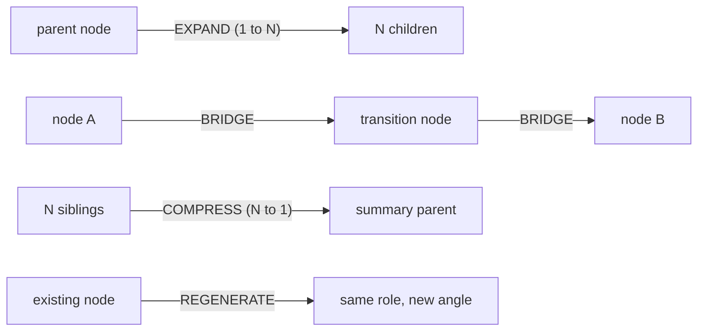

# Resolution App — cross-app insights (parked)

> **Status:** Parked — to revisit after Cookbook Library Phase B+ closes.
> **Last reviewed:** 2026-06-01.
> **Source app:** Resolution — sibling tool by the same author. A spatial story-authoring editor that started niched (storytelling), then pivoted toward a "spatial thinking platform" (Story / Product / Research / Plan modes). Cookbook is approaching the same target from the general direction.
> **Source docs (kept verbatim in `docs/Resolution app/`):**
> - [`docs/Resolution app/CONCEPT.md`](Resolution%20app/CONCEPT.md) — what Resolution was: fractal model, composable nodes, entity system, LLM assistant.
> - [`docs/Resolution app/platform-vision.md`](Resolution%20app/platform-vision.md) — what Resolution could become: five views, mode system, UX principles.
> - [`docs/Resolution app/LLM_RECIPES.md`](Resolution%20app/LLM_RECIPES.md) — every system + user prompt for the 11 LLM actions (EXPAND, BRIDGE, COMPRESS, REGENERATE, ANALYZE, ALTERNATIVES, REFLOW, SLOT REGENERATE, SYNTHESIZE, IMAGE DIRECTION, VIDEO DIRECTION).

This doc is the sibling of [`CATALOGO_E_IDEIAS_DE_NODES.md`](CATALOGO_E_IDEIAS_DE_NODES.md) — a curated cross-app idea bank, not a commitment. Each section stands alone — copy any section into another LLM to brainstorm without losing context.

---

## 1. Why this doc exists

Resolution and Cookbook share DNA: both are spatial node-graph tools authored by the same designer. Resolution started niched and grew toward a general spatial-thinking platform. Cookbook started general (recipe / workflow runtime) and is growing toward the same target from the other side.

This doc captures **what's worth porting from Resolution into Cookbook** based on a 2026-06-01 read of all three Resolution source docs, organised by adoption value. The four directions below are ordered by Cookbook-fit, not by Resolution-importance. We re-engage one at a time after the main Cookbook Library roadmap (Phase B → E) progresses, picking the direction that complements whatever Library phase ships next.

---

## 2. Summary table

| Resolution insight | Cookbook state | Adoption value | Best-fit Cookbook surface |
|---|---|---|---|
| Slot-based prompt editing (analyze → alternatives → reflow → slot regenerate) | Not present | **High** — natural extension of Library prompt inspector | Library Prompts tab |
| EXPAND / BRIDGE / COMPRESS / REGENERATE (4 universal subgraph verbs) | Partial — `propose_refactor` covers compress; the other three don't have first-class equivalents | **High** — assistant tools + 4 reusable system recipes | Assistant tool registry + system recipes |
| Five views (Canvas / Outline / Timeline / Board / Reader) — esp. **Outline view** | Canvas only | **High** for Outline; **Medium** for the rest | New left sidebar (Outline) |
| Synthesize multi-format pattern (one input, N format-switched outputs) | Validated — Seedance Prompt Director uses it | **Medium** — pure recipe additions, no code | New system recipes |
| Mode system (Story / Product / Research / Plan presets) | Recipes already serve as domain selectors | **Low** — would duplicate recipe role | (do not adopt) |
| Ambient entity nodes (Character / Location injected invisibly into every LLM prompt) | Cookbook is explicit-wiring by design | **Low** — breaks "canvas-as-interface" | (do not adopt) |
| Visual groups (Figma-style frames around nodes) | Composite recipes cover collapsed grouping | **Low-medium** — incremental quality-of-life | Future canvas polish |

---

## 3. Direction 1 — Slot-based prompt editing

### What Resolution did

Resolution segmented a logline into typed slots (`character`, `action`, `location`, `mood`, `conflict`, `object`, `time`, `other`). The user clicked any slot, got 5 alternatives, picked one, and Resolution reflowed the surrounding text for grammar.

Four LLM actions back this (full prompts in [`docs/Resolution app/LLM_RECIPES.md`](Resolution%20app/LLM_RECIPES.md) §5–8):

1. **ANALYZE** — string → typed slots that, concatenated, exactly reconstruct the input.
2. **ALTERNATIVES** — given a slot text + type + full sentence → 5 swap candidates.
3. **REFLOW** — original sentence + (oldSlot → newSlot) → grammatically natural rewrite.
4. **SLOT REGENERATE** — a set of typed elements → a fresh sentence using all of them.

### Why it's a strong fit for Cookbook

The Library Prompts tab (Phase A) currently shows prompts as monospace text blocks. That's good for inspection but does nothing for **editing**. Slot-based editing turns a prompt from a wall of text into a structured object the user can mutate semantically.

The Seedance Prompt Director already encodes a 5-slot ontology (`Subject` / `Action` / `Environment` / `Style` / `Audio`). A slot editor over those slots would let a user take any briefing, see the slots inferred, click `Subject` for 5 alternative subjects, swap, and get a cleaned-up final prompt — without touching node-graph wiring.

### Cookbook-shaped binding

- Slot ontologies are **per-recipe-type**, not global. Seedance has 5 slots; an Image Director recipe might have 6 (subject / composition / lens / lighting / mood / style); a Tone-shift recipe has 1 (`tone`).
- The slot editor lives as a **right-pane affordance** in the Library Prompts tab — read-only inspection becomes optional inline editing.
- The 4 LLM actions become **assistant tools** so the assistant can also operate the editor on the user's behalf (`analyse_prompt`, `propose_alternatives`, `reflow_prompt`, `slot_regenerate`).

### Risks / open questions

- Does the slot ontology live in code (per-recipe TypeScript constants) or in the recipe JSON? (probably the latter, so recipe authors can add ontologies without shipping new code).
- Apply to all prompts or only `purpose: "user prompt"` ones? The extractor in `src/lib/prompts/extract-from-recipe.ts` already classifies prompts.
- Token cost — every alternatives request is a new LLM call. Cache aggressively per `(prompt, slot, type)` tuple.

---

## 4. Direction 2 — EXPAND / BRIDGE / COMPRESS / REGENERATE

Resolution discovered four canonical subgraph operations the assistant can perform. They are the **operating verbs** of any fractal-zoom canvas.

### Mapped Cookbook assistant tools

| Verb | Tool signature | Behaviour |
|---|---|---|
| EXPAND | `expand_from_node({ nodeId, count, direction: "downstream" })` | Reads the node's standardised output, generates N follow-up nodes (kind chosen by inference), wires them in. |
| BRIDGE | `bridge_between_nodes({ sourceId, targetId })` | Reads both endpoints, proposes an intermediate node (likely LLM Text or a transform node) that converts source's output shape to target's input shape. |
| COMPRESS | `compress_selection_to_recipe({ selectionIds, name?, description? })` | Selection → recipe save. Auto-infers name + description + exposed I/O from the selection's structure. |
| REGENERATE | `regenerate_node({ nodeId, angle? })` | Re-runs node with a controlled prompt twist (different angle, fresh interpretation, while preserving the role in the graph). |

`compress_selection_to_recipe` is partially covered by the existing "Save Selection As Recipe" UI flow + `propose_refactor` tool. The other three are new.

### Mapped Cookbook system recipes (parallel to the assistant tools)

Same verbs, but as **droppable recipes** the user can chain manually:

- **Idea Expander** — Text input → LLM → Array → ArrayItem×N (each "child idea" available as its own output port).
- **Transition Builder** — 2 Text inputs + LLM Text → 1 Text output (the bridge).
- **Subgraph Summariser** — N Text inputs → text-concat → LLM → 1 unified summary.
- **Variation Refresh** — Text input + style-shift LLM Text → re-rolled output.

### Why both surfaces

- Tools = the assistant chooses the verb when the user describes intent.
- Recipes = the user chooses the verb when they want predictable, deterministic chaining.

Both consume the same underlying patterns. Building the tools first means we can later seed the recipes by inspecting how the assistant actually composes them.

### Source prompts

Full system + user prompts for each verb live in [`docs/Resolution app/LLM_RECIPES.md`](Resolution%20app/LLM_RECIPES.md) §1 (EXPAND), §2 (BRIDGE), §3 (COMPRESS), §4 (REGENERATE). They were tuned for storytelling but the structure (parent context + N-output JSON) is domain-neutral.

---

## 5. Direction 3 — Five views (Outline first)

Resolution's `platform-vision.md` proposed five representations of the same node graph: Canvas, Outline, Timeline, Board, Reader. **Same data store, different reads.** Cookbook today only has Canvas.

For Cookbook the priority order differs from Resolution's:

1. **Outline view** — collapsible tree of every node in the canvas, indented by upstream→downstream relationships. Click selects the canvas node. **This is the highest-value Cookbook view because Cookbook canvases get crowded fast (composite recipes have hidden complexity, Performance Video has 12+ nodes).** Cheap to build (it's a tree projection of the existing workflow store).
2. **Reader view** — narrates the run as a story: *"First the Soul ID loads. Then the prompt is generated. Then Seedance produces the video."* Useful for sharing a finished workflow with a collaborator who shouldn't have to read a node graph.
3. **Timeline view** — useful for sequential workflows (Continuity Builder, video pipelines) but most Cookbook workflows are DAG-shaped, not strictly sequential.
4. **Board view** — Kanban grouped by run state (idle / running / done / error) or by node kind. Niche.

### Cookbook-shaped binding for Outline view

- Lives as a **left sidebar**, mirror of the right-side run panel.
- Toggle hotkey (e.g. ⌘\\) so users can show/hide.
- Reads from `useWorkflowStore` directly — no new data shape.
- Each row: kind icon + node label + small status badge.
- Click selects on canvas (already supported by `selectedNodeId`).
- Drag-to-reorder is the open question — Cookbook canvases are DAGs with explicit edges, so "reorder" doesn't have the natural semantic Resolution's `parent_id` tree had. May simply be reordering for *display* without touching graph structure.

Resolution's `platform-vision.md` §The Five Views has full per-view UX descriptions worth re-reading when this direction is picked up.

---

## 6. Direction 4 — Synthesize multi-format pattern (recipe additions)

Resolution's SYNTHESIZE action: same source content × N format templates (screenplay / prose / treatment / pitch / shotlist / outline). **Cookbook already has the pattern working** — Seedance Prompt Director uses 5 templates (Freeform / Single-Shot / Multi-Shot Commercial / Transformation / Orb POV) selected via List node.

This direction is **content-only** (new system recipes via SQL migrations, no code). Three candidates:

- **Output-format Synthesiser** — N text inputs (any structured content) → choose template: `executive summary` / `bullet outline` / `email draft` / `social post` / `slack message` / `presentation outline` → unified single output.
- **Tone-shift Recipe** — text input → choose tone: `formal` / `casual` / `enthusiastic` / `concise` / `sarcastic` / `academic` → reformatted output.
- **Image-prompt Director** (parallel of Seedance Prompt Director) — briefing → choose visual style: `Photographic` / `Anime` / `Cinematic` / `Painterly` / `3D render` / `Architectural` → optimised image-gen prompt with style-appropriate keywords.

Each is a SQL migration shaped like [`supabase/migrations/20260601_seedance_prompt_director_recipe.sql`](../supabase/migrations/20260601_seedance_prompt_director_recipe.sql) — copy the structure, swap the templates and system prompt.

The format-specific system prompts in [`docs/Resolution app/LLM_RECIPES.md`](Resolution%20app/LLM_RECIPES.md) §9 are a starting library for the Output-format Synthesiser (screenplay, prose, treatment, pitch, shotlist, outline templates already written).

---

## 7. What NOT to bring (and why)

- **Mode system (Story / Product / Research / Plan presets)** — Cookbook is deliberately domain-agnostic. **Recipes already serve as domain selectors** — a "Story" mode would just be a curated bundle of story-relevant recipes pinned to the Library. Adding a "mode" dimension on top of recipes duplicates the role. Curated recipe collections (a possible Phase E item) cover the same need without a new concept.
- **Ambient entity nodes** — Resolution injected `Character`/`Location`/`Theme`/`Prop` invisibly into every LLM prompt. That works for cinematic projects with a stable cast. **Cookbook's principle is canvas-as-interface**: every dependency is a visible edge. Ambient injection breaks that contract — users can't see why a prompt produced a certain output. Variables + explicit wiring already cover the same need with full transparency.
- **Visual groups (Figma frames)** — useful but **composite recipes already collapse N nodes into 1 visual node**, which solves 80% of the problem. Frames-without-collapse would be quality-of-life polish, not a foundational primitive. Park as a future canvas-polish item, not a standalone direction.

---

## 8. Re-engagement checklist (when we come back)

When we return to this doc:

1. **Which Library phase shipped most recently?** Each direction lands cleaner against a specific phase:
   - After **Phase B (recipe edit + versioning UI)** → Slot-based prompt editing is a natural extension of "you can now edit recipes; here's a smart way to edit the prompts inside them".
   - After **Phase C (per-user prompt overrides)** → Slot-based editing leverages overrides as the storage layer.
   - After **Phase D (specialist roles — Storyboard / Timeline / Recipe Architect)** → EXPAND / BRIDGE / COMPRESS / REGENERATE become the verbs the specialists *use*.
   - Independent of Library phase → Outline view + Synthesize-pattern recipes can ship anytime.
2. **Direction depth:** small (1 PR, ~1 day) / medium (1 PR, 2-3 days) / large (multi-shipping arc).
3. **Open trade-offs that need user input before planning:**
   - Slot ontologies: code-defined or recipe-JSON-defined?
   - EXPAND / BRIDGE / COMPRESS / REGENERATE: assistant tools first, recipes first, or in parallel?
   - Outline view: full sidebar or compact mini-map widget?
4. **Should we re-read the Resolution source docs?** They're dated. The user may have evolved Resolution since 2026-06-01. Worth a quick re-read of `docs/Resolution app/` before re-engaging.

---

## 9. Cross-references

- [`docs/COOKBOOK-LIBRARY.md`](COOKBOOK-LIBRARY.md) — Library design + Phase A → E roadmap. The Future-ideas section links back here.
- [`docs/CATALOGO_E_IDEIAS_DE_NODES.md`](CATALOGO_E_IDEIAS_DE_NODES.md) — sibling cross-app idea bank (different source app, same role).
- [`docs/POTENTIAL.md`](POTENTIAL.md) — what's possible by combining current nodes; useful when deciding whether a new direction is "missing" or "already coverable via composition".
- [`docs/Resolution app/`](Resolution%20app/) — the three verbatim Resolution source docs this analysis is based on.
