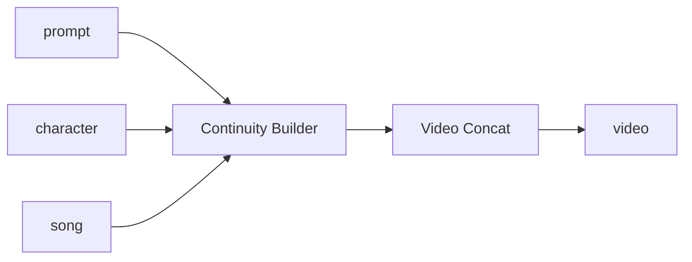

# Cookbook workflows (recipes)

Catálogo dos **workflows prontos** que já construímos — as system recipes da Library. Cada um é um subgraph empacotado como um node (Recipe): você plugá os inputs, dá Run, e recebe o output.

Registro no banco: migrations em `supabase/migrations/*_recipe.sql`.  
Nodes individuais: [`NODES.md`](./NODES.md).

---

## Como ler este doc

Para cada workflow:

- **Para quê** — o problema que resolve
- **Você entrega** — inputs
- **Recebe** — output
- **Como funciona** — cadeia interna (os nodes por baixo)
- **Quando usar** — atalho mental

---

## Índice rápido

| Workflow | Categoria | Em uma frase |
| -------- | --------- | ------------ |
| [Image Describer](#1-image-describer) | describe | Imagem → prompt rico pra gerar / editar |
| [Seedance Prompt Director](#2-seedance-prompt-director) | describe | Briefing + refs → prompt Seedance polido |
| [Storyboard Director](#3-storyboard-director) | describe | Briefing → painéis de storyboard (texto) |
| [Simple Scene Prompter](#4-simple-scene-prompter) | describe | Prompt leve de single-shot |
| [Timeline Director](#5-timeline-director) | describe | Prompt multi-beat com timestamps |
| [Image Variation Burst](#6-image-variation-burst) | image | 1 ref → 4 variações |
| [Moodboard Synthesizer](#7-moodboard-synthesizer) | image | 3 refs → 1 imagem sintetizada |
| [Character Pose Sheet](#8-character-pose-sheet) | image | Soul ID → 4 poses do mesmo personagem |
| [Performance Video](#9-performance-video) | video | Música + personagem → clipe contínuo |
| [Singer Performance (modular)](#10-singer-performance-modular) | video | Performance “aberta” em 2 chunks (pra tunar) |
| [Singer Performance (ByteDance)](#11-singer-performance-bytedance) | video | Método staged: swap → keyframes → canto |
| [Singer Performance (ByteDance · multi-chunk)](#12-singer-performance-bytedance--multi-chunk) | video | Mesmo método, janela a janela (15s) |
| [Video Lipsync Demo](#13-video-lipsync-demo) | video | Still + áudio falado → talking head |
| [Voice Memo Storyboard](#14-voice-memo-storyboard) | audio | Áudio falado → painéis de imagem |
| [Storyboard from Script](#15-storyboard-from-script) | utility | Roteiro longo → 1 imagem por parágrafo |
| [Soul Image Burst](#16-soul-image-burst-demo) | demo | Soul ID + prompt → batch de fotos (fluxo fundador) |

---

## Describe / directors

### 1. Image Describer

**Para quê.** Transformar uma imagem de referência num prompt denso — útil quando o modelo de imagem “não pega” bem a referência sozinha.

**Você entrega:** `image`  
**Recebe:** `prompt` (text)

**Como funciona:**

```text
image → LLM Text (vision, descreve a cena) → prompt
```

**Quando usar.** Antes de um Fal Image / Higgsfield, pra capturar o “DNA visual” da ref.

---

### 2. Seedance Prompt Director

**Para quê.** Do briefing (+ até 4 refs) sair um prompt Seedance 2.0 bem estruturado. Tem templates: Freeform, Single-shot, Multi-shot Commercial, Transformation, Orb-POV, Animation·Timed Segments.

**Você entrega:** `briefing`, `image-1..4` (opcionais)  
**Recebe:** `prompt`

**Como funciona:**

```text
[Base principles] + [Template escolhido via List]
        → Text Concat → LLM Text (+ refs) → prompt
```

**Quando usar.** Antes de Seedance / Continuity Builder / Performance Video — o prompt é metade do resultado.

---

### 3. Storyboard Director

**Para quê.** Briefing → texto de storyboard em N painéis (4–12, default 6), com regras de continuidade cinematográfica. Combina com o role **Storyboard Director** do assistant.

**Você entrega:** `briefing` + refs opcionais  
**Recebe:** `storyboard` (texto: PANEL N com Camera / Subject / Setting / Continuity)

**Quando usar.** Planejar um comercial / clipe antes de gerar as imagens ou o vídeo.

---

### 4. Simple Scene Prompter

**Para quê.** Prompt curto e limpo pra um único shot (Subject+Action / Camera / Audio). Knob de aspect (16:9, 9:16, …).

**Você entrega:** `briefing` + refs opcionais  
**Recebe:** `prompt`

**Quando usar.** Quando o Seedance Director é overkill e você só quer um take simples.

---

### 5. Timeline Director

**Para quê.** Prompt multi-beat pra takes contínuos de 5–15s, com slots `[mm:ss-mm:ss]`. Combina com o role **Timeline Director**.

**Você entrega:** `briefing` + refs opcionais  
**Recebe:** `timeline` (texto estruturado por beats)

**Quando usar.** Clipe contínuo com mudança de ação no tempo (sem cortar em vários takes).

---

## Image

### 6. Image Variation Burst

**Para quê.** Uma referência → 4 variações (describer + Nano Banana 2 em batch).

**Você entrega:** `image`  
**Recebe:** `variations` (image[])

```text
image → LLMText (describer) → Fal Image (×4) → variations
```

**Quando usar.** Explorar looks a partir de um still que você já gosta.

---

### 7. Moodboard Synthesizer

**Para quê.** Três referências (+ briefing opcional) → uma imagem coesa que “mistura” o mood.

**Você entrega:** 3 imagens (+ briefing)  
**Recebe:** `moodboard` (image)

**Quando usar.** Fechar um look a partir de moodboards soltos.

---

### 8. Character Pose Sheet

**Para quê.** Soul ID + 4 prompts de pose → 4 gerações Higgsfield do mesmo personagem.

**Você entrega:** `soul-id`  
**Recebe:** `poses` (image[])

```text
soul-id + Text Iterator (4 poses) → Higgsfield Soul → poses
```

**Quando usar.** Folha de personagem pra downstream (Seedance refs, storyboard, etc.).

---

## Video / performance

### 9. Performance Video

**Para quê.** O “show do cantor” empacotado: música + personagem + prompt → um vídeo contínuo.

**Você entrega:** `prompt`, `character` (image), `song` (audio)  
**Recebe:** `video`

```text
prompt + character + song
    → Continuity Builder   (fatia a música, loop Seedance com continuidade)
    → Video Concat         (junta os chunks)
    → video
```



**Quando usar.** Querer o resultado sem abrir o pipeline. Unpack pra tunar strategy / duração do chunk.

---

### 10. Singer Performance (modular)

**Para quê.** Versão “aberta” da performance em **2 chunks** — dá pra inspecionar e retocar cada etapa (slicers → Seedance → frame-extract → Seedance → concat).

**Você entrega:** personagem, música, performance ref (conforme ports expostos)  
**Recebe:** `video`

**Quando usar.** Quando Performance Video “caixa preta” não basta e você precisa debugar continuidade entre chunks.

---

### 11. Singer Performance (ByteDance)

**Para quê.** Método staged da ByteDance num **único chunk**:

1. **Swap** — coloca o personagem no vídeo de performance  
2. **Keyframes** — extrai frames + áudio vira silent video (`@Video` só pro som)  
3. **Sing** — Seedance ancora nos keyframes e canta

**Você entrega:** `character`, performance video, song  
**Recebe:** `video`

**Quando usar.** Identity swap + lip-sync de qualidade num trecho curto (~15s).

---

### 12. Singer Performance (ByteDance · multi-chunk)

**Para quê.** Mesmo método staged, **janela a janela** (index Number → slicers/Lists em lockstep). Expõe a janela cantada + first/last frames pra costurar.

**Você entrega:** song, performance, character, `chunk-index`  
**Recebe:** singing window (+ frames de continuidade)

**Quando usar.** Música inteira com o método ByteDance, chunk por chunk.

---

### 13. Video Lipsync Demo

**Para quê.** Still do personagem + áudio falado → talking head com lip-sync (HeyGen).

**Você entrega:** `character` (image), `audio`  
**Recebe:** `video`

```text
character → Seedance (first-frame, idle ~5s) → HeyGen Lipsync (+ audio) → video
```

**Quando usar.** Fala / narração, não necessariamente música.

---

## Audio → imagem / utility

### 14. Voice Memo Storyboard

**Para quê.** Você fala a cena no celular → vira painéis de imagem.

**Você entrega:** `audio`  
**Recebe:** `panels` (image[])

```text
audio → Scribe V2 → LLMText (beats) → Array → Fal Image → panels
```

**Quando usar.** Idear storyboard sem digitar.

---

### 15. Storyboard from Script

**Para quê.** Roteiro longo → uma imagem por parágrafo.

**Você entrega:** `script`  
**Recebe:** `panels` (image[])

```text
script → Array (split \\n\\n) → LLMText (scene prompt) → Fal Image → panels
```

**Quando usar.** Adaptar um texto escrito em storyboard visual.

---

## Demo fundador

### 16. Soul Image Burst (demo)

**Para quê.** O fluxo original do M0a: Soul ID + prompt → batch de fotos com a sua cara (Higgsfield). Ainda é o exemplo mental do produto (“drop a Soul ID, get curated personal media”).

**Você entrega:** Soul ID + prompt  
**Recebe:** imagens (batch)

```text
prompt + soul-id → Higgsfield Soul (batch) → [Export / Library]
```

**Quando usar.** Provar likeness / identity. Aparece no welcome do canvas e nos testes de integração.

---

## Padrões que se repetem

Três “receitas mentais” que voltam o tempo todo:

1. **Director pattern** — Templates → Array → List (cursor) → Text Concat → LLMText  
   Usado por Seedance / Storyboard / Simple Scene / Timeline Directors.

2. **Continuity loop** — Audio/Video Slicer → Seedance (chunk) → Frame Extract → próximo Seedance → Video Concat  
   Usado por Performance Video e pelas Singer Performance.

3. **Describe → generate** — LLM vision descreve → gerador (Fal / Higgsfield) regenera  
   Usado por Image Describer, Variation Burst, Moodboard.

---

## Roles do assistant (não são recipes, mas andam juntos)

| Role | Combina com |
| ---- | ----------- |
| Storyboard Director | recipe Storyboard Director |
| Timeline Director | recipe Timeline Director |
| Recipe Architect | criar / forkar / editar recipes |
| Prompt Engineer | craft de prompt em geral |

---

## Manutenção

Quando criar uma system recipe nova:

1. Migration SQL em `supabase/migrations/`
2. Entrada neste doc (nome, inputs, cadeia, quando usar)
3. Mencionar no [`CHANGELOG.md`](./CHANGELOG.md)
